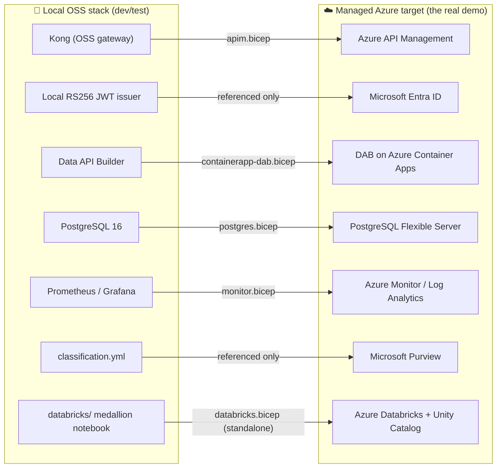
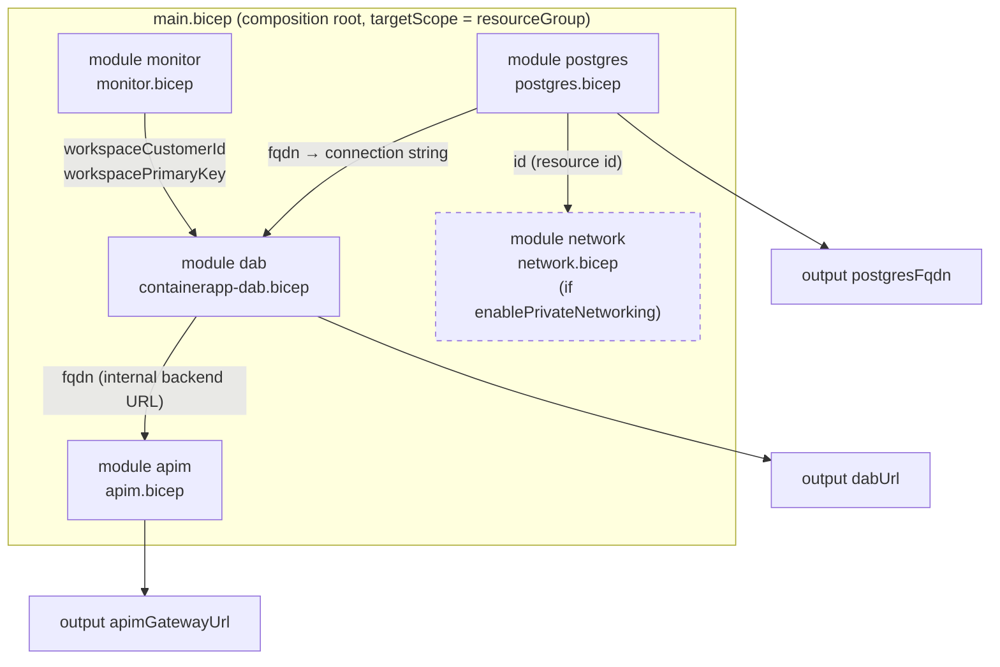

# ☁️ infra/azure — Deploy the demo to Azure (Bicep reference IaC)

[🏠 Home](../../README.md) › **infra/azure**

> [!NOTE]
> **TL;DR** — This folder is the *Azure-first* story of the POC: the same zero-move,
> API-first pattern you run locally with `docker compose`, expressed as **managed Azure
> services** in [Bicep](#-what-is-bicep). One composition root (`main.bicep`) wires five
> always-on modules (monitor, Postgres, DAB-on-Container-Apps, APIM) plus one
> opt-in module (private networking); a sixth module (Databricks) ships as a
> *standalone reference* you can deploy on its own. CI never deploys any of it and needs
> no Azure subscription — but everything here is real, compilable IaC you can stand up in
> your own tenant to show "the full art of the possible."

This is the document that teaches an engineer **who has never touched Azure** how this
POC becomes a managed cloud deployment: what each Bicep module provisions, *why* it
exists, how the modules wire together, which knobs (parameters) you turn, and — crucially —
the difference between what `main.bicep` actually deploys versus what is shipped as a
reference for you to read and adapt.

---

## 📋 Contents

- [Why Azure first (the enterprise story)](#-why-azure-first-the-enterprise-story)
- [What is Bicep?](#-what-is-bicep)
- [OSS → managed Azure mapping](#-oss--managed-azure-mapping)
- [How the modules wire together (composition)](#-how-the-modules-wire-together-composition)
- [Referenced vs. provisioned: read this before you deploy](#-referenced-vs-provisioned-read-this-before-you-deploy)
- [The modules, one by one](#-the-modules-one-by-one)
  - [monitor.bicep](#1--monitorbicep--observability)
  - [postgres.bicep](#2--postgresbicep--the-system-of-record)
  - [containerapp-dab.bicep](#3--containerapp-dabbicep--the-auto-api)
  - [apim.bicep](#4--apimbicep--the-gateway)
  - [network.bicep](#5--networkbicep--true-zero-move-opt-in)
  - [databricks.bicep](#6--databricksbicep--the-lakehouse-standalone-reference)
- [Deployment parameters (the knobs)](#-deployment-parameters-the-knobs)
- [Worked example: deploy it](#-worked-example-deploy-it)
- [Gotchas & troubleshooting](#-gotchas--troubleshooting)
- [Where to next](#-where-to-next)

---

## 🎯 Why Azure first (the enterprise story)

The whole POC answers one enterprise question: *how do you let many consumers query a
sensitive system of record — Artemis SAP-procurement data — without ever copying that
data out of its home?* That pattern is called **zero-move** (the data stays put; only
governed answers leave). Locally you prove it with open-source software so anyone can run
it on a laptop. But the *real* demo — the one that shows leadership the production destiny
of this pattern — is **Azure with managed services**, where Microsoft operates the
gateway, the database, the compute, the identity provider, and the observability stack for
you.

> **In plain terms:** the local Docker stack is your *dev/test loop* — fast, free, runs
> offline. Azure is the *show-and-tell environment* — it's how the same architecture looks
> when a federal data platform actually operates it at scale with managed services and
> compliance posture. Lead with Azure; reach for Docker when you're iterating.

> **Why this matters:** every local component in this repo has a managed Azure twin. When
> a reviewer asks "okay, but how does this run in production?", this folder is the answer —
> and because it's Bicep, the answer is *executable*, not a slide.

---

## 🧱 What is Bicep?

**Bicep** is Azure's domain-specific language for **Infrastructure-as-Code (IaC)** —
you describe the cloud resources you want in `.bicep` files, and Azure makes reality match
the description. It's a friendlier syntax that compiles down to **ARM templates** (Azure
Resource Manager JSON, the underlying deployment format).

A few terms you'll meet below, defined once:

| Term | Plain-English meaning |
|---|---|
| **Resource** | One thing Azure creates (a database server, a gateway, a workspace). |
| **Module** | A reusable `.bicep` file describing a group of related resources. |
| **Parameter** (`param`) | An input you pass in at deploy time (e.g. region, admin password). |
| **Output** (`output`) | A value a module hands back (e.g. a hostname) so another module can use it. |
| **Resource group** | The Azure "folder" all these resources live in; the unit you delete to tear everything down. |
| **`targetScope`** | Where the deployment lands. Here it's `resourceGroup` — everything deploys into one resource group. |

> [!TIP]
> You don't need an Azure account to *read* or even *validate* these files. Running
> `az bicep build --file infra/azure/main.bicep` compiles them to JSON and reports errors
> without deploying anything. That's the cheapest way to confirm the IaC is sound.

---

## 🗺️ OSS → managed Azure mapping

Every piece of the local OSS stack has a managed Azure equivalent. This is the mental
model for the entire folder: read each local component as "the laptop version of" its
Azure twin.



| Local OSS component | Managed Azure service | Provisioned by | Why the swap is faithful |
|---|---|---|---|
| Kong (OSS) gateway | **Azure API Management (APIM)** | `apim.bicep` | Same governance pattern — validate JWT, rate-limit per caller, emit correlation id. |
| Local RS256 JWT issuer | **Microsoft Entra ID** | *referenced only* | Entra issues real OAuth2/JWT tokens; the local issuer mimics it. App registration is a separate manual step. |
| Data API Builder container | **DAB on Azure Container Apps** | `containerapp-dab.bicep` | Identical DAB engine; ACA runs the same image as a managed service. |
| PostgreSQL 16 | **PostgreSQL Flexible Server** | `postgres.bicep` | Same engine and version, managed by Azure. |
| Prometheus / Grafana | **Azure Monitor / Log Analytics** | `monitor.bicep` | Centralized metrics & logs, queryable and alertable. |
| `classification.yml` | **Microsoft Purview** | *referenced only* | The data-governance/cataloging layer; documented, not provisioned here. |
| `databricks/` notebook | **Azure Databricks + Unity Catalog** | `databricks.bicep` *(standalone)* | The lakehouse/analytics arc; deployable on its own, not wired into `main.bicep`. |

> [!NOTE]
> "Referenced only" means the README and docs *explain* the mapping, but **no Bicep in
> this folder provisions it.** Entra app registration and Purview are deliberately left as
> separate, tenant-specific steps. See [Referenced vs. provisioned](#-referenced-vs-provisioned-read-this-before-you-deploy).

---

## 🔌 How the modules wire together (composition)

`main.bicep` is the **composition root** — the single file that declares every module and,
critically, *passes one module's outputs into the next module's inputs*. That output→input
chain is what makes the pieces a system rather than a pile of parts.



Reading the diagram top to bottom, this is the actual dependency story encoded in
`main.bicep`:

1. **`monitor`** stands up the Log Analytics workspace first and hands back its
   `workspaceCustomerId` and `workspacePrimaryKey`.
2. **`postgres`** stands up the system-of-record server and hands back its `fqdn`
   (hostname) and `id` (Azure resource id).
3. **`dab`** consumes *both* — the monitor keys (so its container logs flow to Log
   Analytics) and the Postgres `fqdn` (baked into the database connection string) — and
   hands back its own internal `fqdn`.
4. **`network`** (only if you opt in) consumes the Postgres `id` to attach a private
   endpoint. The dashed border marks it conditional.
5. **`apim`** consumes the DAB `fqdn` as its backend URL, so the gateway forwards
   validated requests to DAB.

> **In plain terms:** Bicep figures out the deploy order automatically from these
> output→input references. You never write "deploy Postgres before DAB" — by *using*
> `postgres.outputs.fqdn` inside the DAB module, you've already told Bicep the order.

> [!IMPORTANT]
> Notice what is **absent** from this graph: **`databricks.bicep` is not a module in
> `main.bicep` at all.** It is a standalone reference you deploy separately. The next
> section explains why that distinction matters.

---

## 🧭 Referenced vs. provisioned: read this before you deploy

This folder mixes three categories of thing. Confusing them is the #1 source of "wait,
why didn't that get created?" — so internalize the table before you deploy.

| Category | What it means | Examples in this folder |
|---|---|---|
| ✅ **Provisioned by `main.bicep`** | Deployed every time you run the main deployment. | `monitor`, `postgres`, `dab`, `apim` |
| 🔀 **Conditionally provisioned** | Deployed only when you flip a parameter. | `network` (needs `enablePrivateNetworking=true`) |
| 📦 **Standalone reference** | Compilable Bicep you deploy *on its own*, not wired into `main.bicep`. | `databricks.bicep` |
| 📝 **Referenced only (no Bicep)** | Explained in docs as the Azure twin, but not provisioned here. | Microsoft Entra ID (app registration), Microsoft Purview |

> [!WARNING]
> **`databricks.bicep` is intentionally *not* wired into `main.bicep`.** The lakehouse
> is the analytics layer of the story, not the API-first core, and it's the most expensive
> resource (a premium Databricks workspace plus storage). Keeping it standalone means the
> core API-first deployment stays lean and cheap, and you opt into the lakehouse only when
> you want to demo the analytics arc. To deploy it, target the module file directly rather
> than `main.bicep`.

> **Why this matters:** the demo's *functional* claim — zero-move API-first access through
> a managed gateway — is fully satisfied by the four always-on modules. Everything else
> (private networking, the lakehouse, Entra, Purview) is hardening or extension you layer
> on when the audience asks for it.

---

## 🧩 The modules, one by one

Each module is a small, single-purpose `.bicep` file under `modules/`. Below, each one
leads with the *problem it solves*, then the *what*, then the *how* — including the exact
resources it declares and the parameters/outputs that connect it to the rest.

### 1. 📊 `monitor.bicep` — observability

**The problem it solves.** Locally, Prometheus scrapes metrics and Grafana charts them. In
Azure you want one managed place where every service's logs and metrics land, queryable and
alertable. That place is a **Log Analytics workspace** (the storage/query engine behind
**Azure Monitor**).

**What it provisions.** A single `Microsoft.OperationalInsights/workspaces` resource named
`<namePrefix>-logs`, on the `PerGB2018` pricing SKU (pay per GB ingested) with 30-day
retention.

**How it connects.** It emits three outputs: `workspaceId`, `workspaceCustomerId`, and a
`@secure()` `workspacePrimaryKey`. `main.bicep` feeds the customer id + primary key into the
DAB module so the Container Apps environment ships its logs here.

> **In plain terms:** this is the "where do the logs go" decision. Everything else points
> its diagnostics at this one workspace — the Azure analogue of "Grafana reads from one
> Prometheus."

### 2. 🗄️ `postgres.bicep` — the system of record

**The problem it solves.** The Artemis procurement data has to *live* somewhere managed,
versioned, and locked down — and it must never be reachable by clients directly (that's
zero-move). This is the managed twin of the local PostgreSQL container.

**What it provisions.**
- `Microsoft.DBforPostgreSQL/flexibleServers` named `<namePrefix>-pg`, PostgreSQL **version
  16**, on a `GeneralPurpose` / `Standard_D2ds_v5` SKU with 32 GB storage, HA disabled
  (it's a POC).
- A child `databases` resource named **`procurement`** — the database the POC queries.

**The zero-move-critical line.** In `properties.network`, **`publicNetworkAccess: 'Disabled'`**.
The server has no public endpoint. Clients cannot reach it; only the gateway path can.

**How it connects.** Outputs `fqdn` (the hostname, baked into DAB's connection string),
`name`, and `id` (the resource id `network.bicep` needs to attach a private endpoint).

> [!NOTE]
> With `publicNetworkAccess: 'Disabled'` and **no** private endpoint, the server is
> reachable only from inside the same managed environment's networking — which is exactly
> what keeps the SoR private in the default deployment. The `network` module takes this one
> step further; see [§5](#5--networkbicep--true-zero-move-opt-in).

### 3. ⚙️ `containerapp-dab.bicep` — the auto-API

**The problem it solves.** Something has to turn the Postgres tables into a REST/GraphQL
API automatically, without anyone hand-writing endpoints. That's **Data API Builder (DAB)**,
a Microsoft tool that reads your schema and serves it. This module runs the *same DAB image*
locally and in Azure — on **Azure Container Apps (ACA)**, a managed container runtime.

**What it provisions.**
- `Microsoft.App/managedEnvironments` (`<namePrefix>-cae`) — the ACA "environment" (the
  shared boundary apps run in), wired to send logs to the Log Analytics workspace from §1.
- `Microsoft.App/containerApps` (`<namePrefix>-dab`) — the DAB app itself, running the
  image `mcr.microsoft.com/azure-databases/data-api-builder:latest`, listening on port
  **5000**, scaled 1–3 replicas, 0.5 vCPU / 1 GiB.

**The zero-move-critical line.** `configuration.ingress.external: false` — **internal
ingress only.** DAB is reachable by APIM inside the environment, **not** by the public
internet. The database connection string is stored as a Container Apps **secret**
(`dab-connection-string`) and injected via `secretRef`, never as a plain env value.

**How it connects.** Consumes the monitor keys and the Postgres `fqdn` (via the connection
string `main.bicep` assembles). Emits `fqdn` — the internal HTTPS URL APIM uses as its
backend.

> **Why this matters:** internal ingress is the second padlock on zero-move. Even though
> DAB *can* read the database, nobody can reach DAB except through APIM — so every request
> is forced through the governed gateway path.

### 4. 🚪 `apim.bicep` — the gateway

**The problem it solves.** You need one front door that authenticates every caller,
rate-limits them, tags requests with a correlation id, and routes to the backend. Locally
that's Kong; in Azure it's **Azure API Management (APIM)** — the managed enterprise gateway.

**What it provisions.**
- `Microsoft.ApiManagement/service` (`<namePrefix>-apim`) on the **Developer** SKU
  (single unit) — fine for a POC; the comment notes Standard/Premium or the v2 tiers for
  production.
- An `apis` child (`artemis-procurement`) at path `api`, HTTPS-only, pointing
  `serviceUrl` at the DAB backend URL, with `subscriptionRequired: false`.
- A `policies` child carrying the governance XML.

**The policy — Kong parity, in APIM's language.** The inbound policy does three things,
mirroring the local Kong config:
1. `<validate-azure-ad-token>` — verifies the **Entra** JWT for audience `api://artemis-api`.
2. `<rate-limit-by-key calls="60" renewal-period="60" ...>` — 60 calls/minute per
   subscription (or per IP if no subscription).
3. `<set-header name="X-Correlation-ID">` — stamps each request with `context.RequestId`
   for traceability.

> [!TIP]
> The tenant id in the policy is injected at deploy time. The module declares a
> `tenantId` parameter that **defaults to `subscription().tenantId`**, and the policy XML
> uses a `replace(policyXml, '__TENANT_ID__', tenantId)` trick because Bicep multi-line
> strings are verbatim (no inline interpolation). `main.bicep` does **not** override this
> parameter, so by default the APIM lands in — and validates tokens from — the same tenant
> you deploy into. Override it only for cross-tenant scenarios.

> [!NOTE]
> The module's *comment* mentions APIM's **AI-gateway** policies
> (`llm-token-limit` / `llm-emit-token-metric`) as the natural extension to meter LLM
> traffic — but those policies are **not** part of the shipped XML. Treat them as the
> documented "where this goes next," not something this module deploys. See
> [`APIM-CAPABILITIES.md`](../../docs/APIM-CAPABILITIES.md).

### 5. 🔒 `network.bicep` — true zero-move (opt-in)

**The problem it solves.** The default deployment keeps the SoR private by using internal
ingress and disabled public access. The *hardened* posture goes further: give the data
**no public path whatsoever** by putting everything on a private virtual network. This is
the "true zero-move" production story — the data can't move because there's nowhere
off-VNet for it to go, and the only route in is APIM → DAB *inside* the VNet.

**What it provisions** (only when `enablePrivateNetworking=true`):
- `Microsoft.Network/virtualNetworks` (`<namePrefix>-vnet`, `10.20.0.0/16`) with two
  subnets:
  - `snet-cae` (`10.20.0.0/23`) — **delegated** to `Microsoft.App/environments` so a
    VNet-injected Container Apps environment can live there (ACA needs a /23 or larger).
  - `snet-pe` (`10.20.2.0/24`) — holds private-endpoint NICs, with
    `privateEndpointNetworkPolicies: 'Disabled'`.
- `Microsoft.Network/privateDnsZones` (`privatelink.postgres.database.azure.com`) + a VNet
  link, so the Postgres hostname resolves to the *private* IP from inside the VNet.
- `Microsoft.Network/privateEndpoints` (`<namePrefix>-pg-pe`) on the Postgres server
  (`groupIds: ['postgresqlServer']`), plus a `privateDnsZoneGroups` association.

**How it connects.** `main.bicep` declares it conditionally —
`module network 'modules/network.bicep' = if (enablePrivateNetworking) { ... }` — and passes
in `postgres.outputs.id`. It emits `caeSubnetId`, `peSubnetId`, and `vnetId`.

> [!WARNING]
> **The subnet outputs are not auto-consumed.** As the module's header comment states, the
> functional ACA demo uses public ingress; to *complete* the hardened posture you must wire
> the outputs in yourself — point the Container Apps environment at `caeSubnetId` and set
> the Postgres server's `delegatedSubnetResourceId` / private-endpoint association. Flipping
> `enablePrivateNetworking=true` deploys the *network plumbing*; it does **not** by itself
> re-home the existing `postgres`/`dab` modules onto that plumbing. This is deliberate —
> the network module is a documentation-grade reference for the production hardening step,
> not a one-click rewire.

> **In plain terms:** the default deploy is "private enough to prove the pattern"; this
> module is "the diagram you hand your network team to make it *audit*-grade." See
> [`ZERO-MOVE.md`](../../docs/ZERO-MOVE.md).

### 6. 🧊 `databricks.bicep` — the lakehouse (standalone reference)

**The problem it solves.** The analytics arc — turning raw procurement data into curated,
shareable marts — is the lakehouse layer. Locally that's the medallion notebook under
`databricks/`. In Azure it's **Azure Databricks** with **Unity Catalog** (governance),
**Delta Lake** (open table format), and **Delta Sharing** (zero-copy sharing), on
**ADLS Gen2** storage.

**What it provisions** (deploy this module *directly*, not via `main.bicep`):
- `Microsoft.Storage/storageAccounts` — ADLS Gen2 (`isHnsEnabled: true` gives the
  hierarchical namespace Delta needs), TLS 1.2 minimum, public blob access off.
- `Microsoft.Databricks/workspaces` (`<namePrefix>-dbx`) on the **`premium`** SKU —
  premium is *required* for Unity Catalog.
- `Microsoft.Databricks/accessConnectors` with a system-assigned identity, so the
  workspace can reach the storage account securely.

**Why it's standalone.** As [covered above](#-referenced-vs-provisioned-read-this-before-you-deploy),
this is the priciest part of the stack and orthogonal to the API-first core, so it is
deliberately kept out of `main.bicep`.

> [!NOTE]
> **Compliance posture (important for the federal story).** The managed lakehouse — managed
> Unity Catalog + Databricks SQL + Delta Lake + Delta Sharing — is positioned to run in
> **commercial Azure at FedRAMP High** as the *default*. The managed-UC/Databricks-SQL gap
> is the **Azure Government (ITAR / strict-CUI) exception only**, not the baseline. And
> **Microsoft Fabric / OneLake are explicitly excluded** (not available in Azure
> Government / GCC) — the data-platform answer here is Databricks + Unity Catalog + Delta +
> ADLS Gen2. See [`DATABRICKS-WALKTHROUGH.md`](../../docs/DATABRICKS-WALKTHROUGH.md).

---

## 🎛️ Deployment parameters (the knobs)

These are the inputs `main.bicep` accepts. Defaults come from the file; secrets are
supplied at deploy time via `main.bicepparam`.

| Parameter | Type | Default | What it controls |
|---|---|---|---|
| `location` | string | `resourceGroup().location` | Azure region. **For ITAR/strict-CUI, use a US Gov region** (`usgovvirginia` / `usgovarizona`). |
| `namePrefix` | string | `artemis` | Prefix for every resource name (`artemis-pg`, `artemis-apim`, …). |
| `pgAdminUser` | string | `artemis` | PostgreSQL administrator login. |
| `pgAdminPassword` | string (`@secure()`) | *(none — required)* | PostgreSQL admin password. **Never committed**; read from the `PG_ADMIN_PASSWORD` env var. |
| `apimPublisherEmail` | string | `ocio-data-platform@example.gov` | Publisher contact APIM requires. |
| `dabImage` | string | `mcr.microsoft.com/azure-databases/data-api-builder:latest` | DAB container image to run on ACA. |
| `enablePrivateNetworking` | bool | `false` | Flip to `true` to deploy [`network.bicep`](#5--networkbicep--true-zero-move-opt-in). |

**How secrets flow.** `main.bicepparam` is the parameter file. Its key line is:

```bicep
param pgAdminPassword = readEnvironmentVariable('PG_ADMIN_PASSWORD', '')
```

`readEnvironmentVariable` pulls the password from your shell environment at deploy time, so
it lives in `@secure()` parameters and Container Apps secrets — **never in git, never in
deployment outputs.** If you forget to export it, the value is empty and the deployment
fails the password policy (see [troubleshooting](#-gotchas--troubleshooting)).

> [!WARNING]
> 🔬 **Synthetic data only.** Everything this IaC stands up is for demonstrating the
> *pattern* on **synthetic Artemis procurement data** — no real NASA data, ITAR/CUI-safe.
> See [`docs/DISCLAIMER.md`](../../docs/DISCLAIMER.md).

---

## 🧪 Worked example: deploy it

> [!NOTE]
> CI never runs these commands and they need no subscription to *validate*. You only need
> an Azure account for the final `az deployment` step. The canonical, fuller walkthrough is
> [`AZURE-DEPLOYMENT.md`](../../docs/AZURE-DEPLOYMENT.md); this is the quick path.

**Step 1 — validate the IaC compiles (no subscription needed).**

```bash
az bicep build --file infra/azure/main.bicep
```

*Expected output:* no errors, and a `main.json` appears next to the Bicep (it's gitignored).

*What it did:* compiled the Bicep + all referenced modules to an ARM template. A clean
build proves the modules wire together and every type/reference resolves — the cheapest
possible confidence check.

**Step 2 — create a resource group (one-time).**

```bash
az group create -n artemis-poc-rg -l eastus
```

*Expected output:* JSON describing the group with `"provisioningState": "Succeeded"`.

*What it did:* created the Azure "folder" everything deploys into — and the single thing you
delete to tear it all down.

**Step 3 — deploy the core stack, passing the secret via env var.**

```bash
PG_ADMIN_PASSWORD='<choose-a-strong-secret>' \
  az deployment group create -g artemis-poc-rg \
    -f infra/azure/main.bicep -p infra/azure/main.bicepparam
```

*Expected output:* a long JSON deployment result ending in `"provisioningState": "Succeeded"`,
with an `outputs` block containing `apimGatewayUrl`, `dabUrl`, and `postgresFqdn`.

*What it did:* `main.bicepparam` read `PG_ADMIN_PASSWORD` from the environment via
`readEnvironmentVariable` and passed it into the `@secure()` parameter; Bicep then deployed
monitor → postgres → dab → apim in dependency order. The `apimGatewayUrl` output is the
front door clients call.

**Step 4 (optional) — deploy with the hardened network.**

```bash
PG_ADMIN_PASSWORD='<strong-secret>' \
  az deployment group create -g artemis-poc-rg \
    -f infra/azure/main.bicep -p infra/azure/main.bicepparam \
    -p enablePrivateNetworking=true
```

*What it did:* additionally deployed the VNet, subnets, private DNS zone, and Postgres
private endpoint. Remember from [§5](#5--networkbicep--true-zero-move-opt-in): this lays
the plumbing; fully re-homing the apps onto it is a manual wiring step.

**Step 5 — tear everything down (stop the meter).**

```bash
az group delete -n artemis-poc-rg --yes --no-wait
```

*What it did:* deleted the whole resource group — every resource, billing stops. APIM and
(if deployed) Databricks are the expensive ones, so don't leave the stack running.

---

## 🧯 Gotchas & troubleshooting

| Symptom | Likely cause | Fix |
|---|---|---|
| `az bicep build` → "command not found" | Bicep tooling not installed | `az bicep install` (or upgrade the Azure CLI). |
| Deployment fails: `pgAdminPassword` empty / password-policy error | `PG_ADMIN_PASSWORD` not exported | Prefix the deploy command with `PG_ADMIN_PASSWORD='…'` so `main.bicepparam` can read it. |
| "Why didn't Databricks deploy?" | It's a **standalone reference**, not in `main.bicep` | Deploy `modules/databricks.bicep` directly; see [§6](#6--databricksbicep--the-lakehouse-standalone-reference). |
| Private networking "on" but apps still public | Subnet outputs aren't auto-wired | Manually consume `caeSubnetId` / the PG private-endpoint association; see [§5](#5--networkbicep--true-zero-move-opt-in). |
| APIM rejects all tokens | Wrong tenant or audience | The policy validates audience `api://artemis-api` against `tenantId` (defaults to `subscription().tenantId`); confirm your Entra app registration matches. |
| Costs still accruing after the demo | Stack still deployed (APIM/Databricks) | `az group delete -n artemis-poc-rg --yes --no-wait`. |

---

## 🧭 Where to next

- 📘 **Full deploy walkthrough** — [`docs/AZURE-DEPLOYMENT.md`](../../docs/AZURE-DEPLOYMENT.md)
  (and the live, end-to-end run in
  [`docs/AZURE-LIVE-DEPLOYMENT.md`](../../docs/AZURE-LIVE-DEPLOYMENT.md)).
- 🔒 **The zero-move guarantee** — [`docs/ZERO-MOVE.md`](../../docs/ZERO-MOVE.md).
- 🚪 **What APIM can do beyond this POC** — [`docs/APIM-CAPABILITIES.md`](../../docs/APIM-CAPABILITIES.md)
  and [`docs/APIM-EDITION.md`](../../docs/APIM-EDITION.md).
- 🧊 **The lakehouse / analytics arc** — [`docs/DATABRICKS-WALKTHROUGH.md`](../../docs/DATABRICKS-WALKTHROUGH.md).
- 🏛️ **System architecture** — [`docs/ARCHITECTURE.md`](../../docs/ARCHITECTURE.md).
- 📖 **Unfamiliar term?** — [`docs/GLOSSARY.md`](../../docs/GLOSSARY.md).

> [!NOTE]
> 🔬 All data is **synthetic** — see [`docs/DISCLAIMER.md`](../../docs/DISCLAIMER.md).
> This Bicep is documentation-grade reference IaC; CI does not deploy it and requires no
> Azure subscription.
