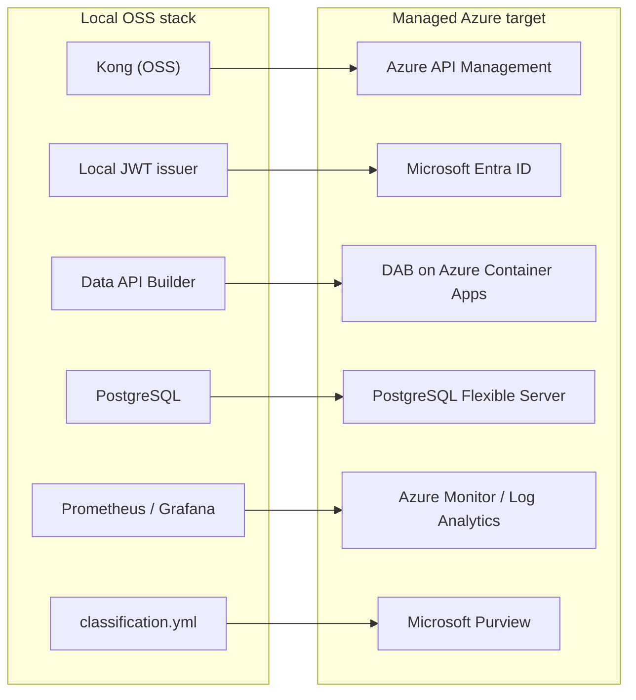

# ☁️ infra/azure — Azure deployment reference (Bicep)

[Home](../../README.md) > **infra/azure**

Reference IaC for the managed Azure target: APIM, Entra, Postgres Flexible Server /
Azure SQL, Data API Builder on Container Apps, Purview, and Databricks at FedRAMP High
in commercial Azure.

> [!NOTE]
> This is **documentation-grade** Infrastructure-as-Code that maps the local OSS stack
> to managed Azure services. CI does **not** deploy it and does **not** require an Azure
> subscription. The POC itself runs entirely locally via `docker compose`.

## 🗺️ OSS → managed Azure mapping

The local OSS stack maps to managed Azure services as follows:

## 📦 Modules

| Module | Purpose |
|---|---|
| `main.bicep` | Composition root — wires the modules below |
| `modules/postgres.bicep` | PostgreSQL Flexible Server (the SoR; public access disabled) |
| `modules/containerapp-dab.bicep` | Data API Builder on Container Apps |
| `modules/apim.bicep` | API Management gateway + Entra JWT validation policy |
| `modules/monitor.bicep` | Log Analytics workspace |
| `modules/databricks.bicep` | Databricks workspace (lakehouse path) |
| `modules/network.bicep` | **Production hardening:** spoke VNet + private endpoint on the SoR for *true zero-move* (no public path). Enable with `enablePrivateNetworking=true`. |

> [!WARNING]
> **NOT** required to run the POC; CI must not need an Azure subscription.

## 🔗 References

> [!NOTE]
> See [`docs/AZURE-DEPLOYMENT.md`](../../docs/AZURE-DEPLOYMENT.md) + PRP §12.
