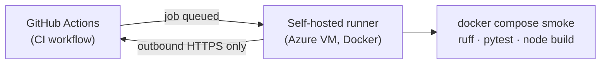

# 🏃 Self-hosted GitHub Actions runner (Azure)

[Home](../../../README.md) > [infra/azure](../) > **Runner**

-0078D4)


> [!NOTE]
> **TL;DR** — GitHub-hosted runners are billing-blocked on this account, so CI runs on a
> small Azure VM we own instead. The VM has **no public IP and no inbound ports** — the
> runner only calls **out** to GitHub, and we manage it via `az vm run-command`. One script
> deploys + registers it: [`deploy-runner.sh`](deploy-runner.sh).

---

## 📑 Contents

- [Why self-hosted](#-why-self-hosted)
- [Security model](#-security-model)
- [Prerequisites](#-prerequisites)
- [Deploy](#-deploy)
- [Point CI at the runner](#-point-ci-at-the-runner)
- [Operate (start / stop / cost)](#-operate-start--stop--cost)
- [Teardown](#-teardown)
- [Cheaper / scale-to-zero alternative](#-cheaper--scale-to-zero-alternative)

---

## 🎯 Why self-hosted

The GitHub Actions hosted-runner minutes are blocked on this account (billing), so
`runs-on: ubuntu-latest` jobs never start. Rather than pay GitHub, we run the same jobs on
**our own Azure compute** — cost lands on the chosen Azure subscription, which is acceptable.
The repo is **private**, so there are no untrusted fork PRs that could execute on the runner
(the main risk with self-hosted runners on public repos).



---

## 🔐 Security model

| Control | Choice |
|---|---|
| Public IP | **None** (`--public-ip-address ""`) |
| Inbound ports | **None** (`--nsg-rule NONE`) — no SSH, no RDP |
| Management | `az vm run-command` over the Azure control plane (no inbound needed) |
| Registration token | Minted just-in-time by `gh`, **never** baked into cloud-init |
| Runner identity | Non-root `runner` user; Docker via group membership |
| Repo exposure | Private repo → no fork-PR code execution |

---

## ✅ Prerequisites

These two are **interactive and yours to run** (the agent can't log you in):

```bash
# 1) Azure: log into the tenant/subscription that should bear the cost
az login --tenant <limitlessdata-tenant>

# 2) GitHub: must have repo admin (to mint a runner registration token)
gh auth status
```

---

## 🚀 Deploy

```bash
SUBSCRIPTION="<limitlessdata-sub-id-or-name>" \
  ./infra/azure/runner/deploy-runner.sh
```

Optional overrides (env vars): `RG`, `LOCATION` (default `eastus2`), `VM_NAME`, `VM_SIZE`
(default `Standard_B2s`), `LABELS`, `REPO`.

What it does:

1. Creates resource group `rg-ghrunner-nasa-poc`.
2. Creates an Ubuntu 22.04 **B2s** VM (no public IP / no inbound) with
   [`cloud-init.yaml`](cloud-init.yaml) → installs Docker + downloads the latest runner.
3. Mints a registration token via `gh` and registers the runner as a **systemd service**
   (labels `self-hosted, linux, x64, azure, nasa-poc`).
4. Prints the runner's online status from the GitHub API.

---

## 🎛️ Point CI at the runner

After the runner shows **online**, change the workflows you want self-hosted. In
[`.github/workflows/ci.yml`](../../../.github/workflows/ci.yml):

```diff
- runs-on: ubuntu-latest
+ runs-on: [self-hosted, linux, x64]
```

> [!WARNING]
> Only switch **after** the runner is online — a self-hosted job with no matching online
> runner queues indefinitely. Keep the runner started (or use the
> [scale-to-zero alternative](#-cheaper--scale-to-zero-alternative)).

Both CI jobs work on this host: `lint-test` (Python/ruff/pytest via `setup-python`) and
`compose-smoke` (Docker is preinstalled).

---

## ⚙️ Operate (start / stop / cost)

`Standard_B2s` runs ~24×7 (~US$30/mo list, region-dependent). To stop billing when idle:

```bash
az vm deallocate -g rg-ghrunner-nasa-poc -n gh-runner-nasa-poc   # stop (no compute charge; CI offline)
az vm start      -g rg-ghrunner-nasa-poc -n gh-runner-nasa-poc   # resume
```

Optional nightly auto-shutdown (stops, doesn't deallocate — use a Logic App/Automation for
true deallocate):

```bash
az vm auto-shutdown -g rg-ghrunner-nasa-poc -n gh-runner-nasa-poc --time 0200
```

Check runner health anytime:

```bash
gh api repos/fgarofalo56/nasa-api-first-poc/actions/runners --jq '.runners[] | {name,status}'
```

---

## 🧹 Teardown

```bash
SUBSCRIPTION="<sub>" ./infra/azure/runner/teardown-runner.sh
```

Deregisters the runner from GitHub and deletes the resource group.

---

## 💸 Cheaper / scale-to-zero alternative

For truly usage-based cost, run **ephemeral** runners that scale to zero when no jobs are
queued, instead of an always-on VM:

- **Azure Container Apps jobs** with the
  [`gha-runner-scale-set`](https://github.com/actions/actions-runner-controller) pattern, or
- **actions-runner-controller (ARC)** on AKS.

These cost more to set up (and ARC needs an AKS control plane) but bill ~nothing while idle.
The always-on B2s VM here is the simplest reliable option for a demo repo; revisit ARC if CI
volume grows.
