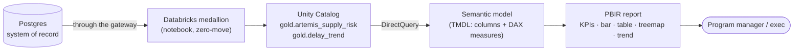

# 📊 Power BI — Artemis Supply-Chain Risk (PBIP, as code)

[Home](../README.md) > [Power BI project]

-F2C811)

-FF3621)


> [!NOTE]
> **TL;DR** — This is a complete **Power BI Project (PBIP)** authored *as code*: the
> semantic model in **TMDL** and the report in the enhanced **PBIR** format. It reads the
> curated lakehouse mart **`<catalog>.gold.artemis_supply_risk`** (+ `gold.delay_trend`)
> over **DirectQuery** — *zero copy*. Open [`ArtemisSupplyRisk.pbip`](ArtemisSupplyRisk.pbip)
> in Power BI Desktop, set 3 parameters, authenticate to Databricks, and the report renders
> the same supply-risk answer the gateway / MCP agent / UI return.

---

## 📑 Contents

- [Why this exists](#-why-this-exists)
- [Where it sits in the story](#-where-it-sits-in-the-story)
- [Folder structure](#-folder-structure)
- [Open it in Power BI Desktop](#-open-it-in-power-bi-desktop)
- [Parameters](#-parameters)
- [Measures (DAX)](#-measures-dax)
- [Pages & visuals](#-pages--visuals)
- [Regenerate from code](#-regenerate-from-code)
- [Caveats](#-caveats)

---

## 🎯 Why this exists

The rest of the proof-of-concept proves **zero-move**: humans, AI agents, and the analytics
platform all consume one governed **data product** without copying the system of record. The
Databricks notebook ([`databricks/notebooks/01_zero_move_medallion.ipynb`](../databricks/notebooks/01_zero_move_medallion.ipynb))
lands that product as a **Gold mart** in Unity Catalog. This project is the **last mile** —
the executive-facing report — kept **as code** so it lives in Git, diffs cleanly, and isn't a
binary `.pbix` black box.

> [!IMPORTANT]
> **DirectQuery = zero copy.** The report stores only the table *shape*; every visual fires a
> SQL query at the Databricks warehouse on demand, and Unity Catalog enforces access. The
> system of record never moves — the analytics layer obeys the same governance as every other
> consumer.

---

## 🗺️ Where it sits in the story



---

## 🗂️ Folder structure

```text
powerbi/
├── ArtemisSupplyRisk.pbip                     # open this in Power BI Desktop
├── ArtemisSupplyRisk.SemanticModel/
│   ├── definition.pbism
│   └── definition/
│       ├── database.tmdl
│       ├── model.tmdl
│       ├── expressions.tmdl                   # the 3 connection parameters
│       └── tables/
│           ├── artemis_supply_risk.tmdl       # columns + 6 DAX measures + DirectQuery M
│           └── delay_trend.tmdl
└── ArtemisSupplyRisk.Report/
    ├── definition.pbir                        # binds to the model byPath
    └── definition/
        ├── report.json · version.json
        └── pages/
            ├── pages.json
            ├── overview/                      # "Artemis Supply-Chain Risk"
            │   └── visuals/ (4 KPI cards, slicer, stacked bar, table, treemap)
            └── delay_trend/                   # "Delay Trend"
                └── visuals/ (slicer, line chart)
```

---

## ▶️ Open it in Power BI Desktop

> [!WARNING]
> PBIP with TMDL + PBIR are **preview** formats. Enable both preview features **once** before
> opening, or Desktop won't load the folder-based report.

1. **Power BI Desktop → File → Options and settings → Options → Preview features**, enable:
   - ✅ *Store semantic model using TMDL format*
   - ✅ *Store reports using enhanced metadata format (PBIR)*
2. Open **`ArtemisSupplyRisk.pbip`**.
3. When prompted for parameters (or via **Transform data → Edit parameters**), set the three
   [parameters](#-parameters) for your workspace.
4. Authenticate the **Azure Databricks** source with your **Microsoft Entra ID** account
   (same tenant as the rest of the demo).
5. The two report pages render over DirectQuery.

> [!TIP]
> To validate the numbers, run [`databricks/sql/dbsql_samples.sql`](../databricks/sql/dbsql_samples.sql)
> in a Databricks SQL warehouse — each visual mirrors one of those queries.

---

## ⚙️ Parameters

Set these in **Transform data → Edit parameters**. They feed the DirectQuery M expression
(`Databricks.Catalogs(...)`) in each table partition.

| Parameter | What it is | Example |
|---|---|---|
| `DatabricksServerHostname` | The warehouse **Server hostname** (SQL warehouse → *Connection details*) | `adb-7405607213468698.18.azuredatabricks.net` |
| `DatabricksHttpPath` | The warehouse **HTTP path** | `/sql/1.0/warehouses/<warehouse-id>` |
| `CatalogName` | The Unity Catalog the notebook wrote to | `dbw_btfabric_dev` |

---

## 🧮 Measures (DAX)

Defined on `artemis_supply_risk` (see [`tables/artemis_supply_risk.tmdl`](ArtemisSupplyRisk.SemanticModel/definition/tables/artemis_supply_risk.tmdl)):

| Measure | Meaning | Mirrors SQL |
|---|---|---|
| `High Risk Materials` | Count of `risk_tier = "High"` | #2 |
| `Critical Slips >30d` | Critical **and** sole-source **and** avg delay > 30 — the headline | #1 |
| `Sole-Source Exposure ($)` | Committed $ where `sole_source = TRUE` | #3 |
| `Pad Anomalies` | Total launch-pad anomalies | #4 |
| `Avg Delay (days)` | Average per-material slip | — |
| `Material Count` | `COUNTROWS` (the bar/treemap value) | #2 |

---

## 🖼️ Pages & visuals

**Page 1 — "Artemis Supply-Chain Risk"**

| Visual | Fields | Mirrors SQL |
|---|---|---|
| KPI cards (4) | the four measures above | #1, #3, #4 |
| Slicer | `program` (default **Artemis-3**) | — |
| Stacked column | axis `program`, legend `risk_tier`, value `Material Count` | #2 |
| Table | `material_name`, `vendor_name`, `risk_tier`, `risk_score`, `avg_delay_days`, `total_committed_usd` | #1 |
| Treemap | group `vendor_name`, value `Sole-Source Exposure ($)` | #3 |

**Page 2 — "Delay Trend"**

| Visual | Fields | Mirrors SQL |
|---|---|---|
| Slicer | `program` | — |
| Line chart | X `order_month`, Y `avg_delay_days` + `slipped_pos`, legend `program` | #5 |

> [!TIP]
> **Conditional formatting** to match the marketplace UI: color `risk_tier` — **High =
> `#FC3D21`** (NASA red), **Medium = amber**, **Low = green**. Apply in Desktop on the table's
> `risk_tier` column (Format → Cell elements → Background color → rules), so the colour
> language carries across every consumer of the data product.

---

## ☁️ Publish to the Power BI Service

The project is published as code with [`tools/publish_powerbi.py`](../tools/publish_powerbi.py)
(via [`fabric-cicd`](https://learn.microsoft.com/power-bi/developer/projects/projects-deploy-fabric-cicd)),
no Desktop required:

```bash
pip install fabric-cicd
az login --use-device-code          # into the workspace tenant (limitlessdata.ai)
WORKSPACE_ID=46c42501-e97a-4295-8cdb-b1c7000cce1f python tools/publish_powerbi.py
```

Deployed to the **`csa-loom`** workspace (Limitless Data tenant):
[**ArtemisSupplyRisk report**](https://app.powerbi.com/groups/46c42501-e97a-4295-8cdb-b1c7000cce1f/reports/553df6af-bfba-45a7-9c77-56aae5128d33).

> [!IMPORTANT]
> **One-time connection setup in the Service** (the publish carries the *definition*, not
> credentials). On the **ArtemisSupplyRisk** semantic model → **Settings**:
> 1. **Parameters** → set `DatabricksServerHostname`, `DatabricksHttpPath` (your SQL
>    warehouse's HTTP path), `CatalogName` = `dbw_btfabric_dev`.
> 2. **Data source credentials** → sign in to the **Azure Databricks** source with your
>    **Entra ID** (DirectQuery — zero copy). The report renders once this is bound.

---

## 🔁 Regenerate from code

The entire project is emitted by [`tools/make_powerbi_pbip.py`](../tools/make_powerbi_pbip.py)
(stable GUIDs, so re-runs don't churn Git):

```bash
python tools/make_powerbi_pbip.py
```

Edit the generator to add columns, measures, or visuals, then re-run — or edit the TMDL / PBIR
JSON directly (each file carries a public `$schema` for VS Code IntelliSense + validation).

---

## ⚠️ Caveats

> [!NOTE]
> - This PBIP is **authored as code** and validated for well-formed JSON + TMDL structure
>   against the published Fabric schemas. On **first open**, Power BI Desktop may apply minor
>   non-blocking auto-fixes (e.g. default formatting) — accept and re-save to materialize them.
> - The two fact tables are sliced **independently** by `program` (no relationship), per the
>   quick-build path; add a shared `Program` dimension if you want one slicer to filter both.
> - The guaranteed click-by-click manual build remains in
>   [`docs/POWERBI-GUIDE.md`](../docs/POWERBI-GUIDE.md) if you prefer building from a blank PBIX.

> [!WARNING]
> **SYNTHETIC DATA** — every value is generated by
> [`data/synthetic_data.py`](../data/synthetic_data.py). Not real NASA/procurement data.
> ITAR/CUI-safe. See [`docs/DISCLAIMER.md`](../docs/DISCLAIMER.md).
