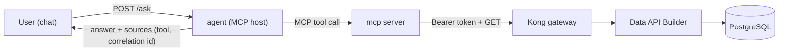

# 🤖 agent — the grounded mission agent

[Home](../../README.md) > **agent**

> [!NOTE]
> **TL;DR** — A chat agent that answers **only** from the governed Artemis data product.
> It's an **MCP host**: each question is turned into a call to the [MCP server](../mcp/README.md)'s
> tools, which reach the data **only through the Kong gateway**. So every answer is
> grounded in governed data and **cites its source** (the MCP tool + the gateway
> correlation id). Off-topic questions get a sarcastic, space-themed refusal — the point
> being that a *grounded, governed* agent only speaks to the data product it was given.
> All data is **synthetic** — see [`docs/DISCLAIMER.md`](../../docs/DISCLAIMER.md).

---

## 🎯 Why this matters (the story)

This is the Microsoft pitch made tangible: **AI grounded on your governed data, over an
open standard (MCP)** — not a model with a firehose to your database. The same MCP tools
the agent calls could be called by **Copilot, Foundry, or Claude**; the gateway still
authenticates, rate-limits, meters, and **redacts** every call. The agent can't leak what
the gateway won't serve, and it can't answer what it wasn't grounded for.

## 🔀 How it works

1. `POST /ask {question}` → the agent classifies intent (supply-risk query, a specific
   material, analytics, help, or **off-topic**).
2. On-topic → it calls an MCP tool (`query_supply_risk` or `material_detail`) on the
   [mcp server](../mcp/README.md), which calls the gateway. The structured result becomes
   a **render payload** the UI shows as cards / a bar chart / a detail card.
3. The response **cites** the MCP tool and the gateway **correlation id**.
4. Off-topic → a sarcastic refusal + "ask your Microsoft rep to build an agent for that."

## ⚙️ Configuration

| Variable | Default | Purpose |
| --- | --- | --- |
| `AGENT_PORT` | `8110` | Port the service binds + `/healthz`. |
| `MCP_URL` | `http://mcp:8090/mcp` | The MCP server endpoint the agent calls. |

> [!TIP]
> **LLM upgrade (optional).** Routing here is **deterministic** — reliable and free for a
> live demo, and it never hallucinates. To have a model phrase the *grounded* answer
> instead, wire Azure OpenAI behind an `AGENT_LLM` flag; it still only sees gateway data
> and must cite. The grounding + governance story is identical either way.

## 📡 Endpoints

- `POST /ask` → `{ answer, on_topic, grounded, tool, render, sources }`
- `GET /healthz` → `{ "status": "ok" }`

## 📂 Files

| File | Purpose |
| --- | --- |
| `agent.py` | FastAPI service: intent routing, MCP tool calls, render payloads, the sass. |
| `requirements.txt` | `fastapi`, `uvicorn`, `httpx`, `mcp`, `pydantic`. |
| `Dockerfile` | Builds the image; runs `python agent.py`, exposes `8110`. |
