# 📚 catalog — FastAPI marketplace catalog

[Home](../../README.md) > **catalog service**

  

> [!NOTE]
> **The discovery surface of the marketplace** — the Azure API Management dev-portal /
> Azure API Center analogue. It publishes the data product so it is discoverable
> without tribal knowledge: title, owner, classification, the request path, the
> public OpenAPI contract URL (via Kong), and a ready-to-run sample query.
>
> All data is **SYNTHETIC** — not real NASA procurement data, ITAR/CUI-safe. See
> [`docs/DISCLAIMER.md`](../../docs/DISCLAIMER.md).

---

## 📑 Table of contents

- [What it does](#-what-it-does)
- [Endpoints](#-endpoints)
- [How it works](#-how-it-works)
- [Configuration](#-configuration)
- [Built-in product](#-built-in-product)
- [Classification (classify-before-exposure)](#-classification-classify-before-exposure)
- [Run it](#-run-it)

---

## 🎯 What it does

`app.py` is a small FastAPI service that serves the marketplace catalog. It reads
`catalog.json` (the built-in data product) and `classification.yml` (per-table/column
sensitivity labels) at request time, and enriches each entry with **absolute,
gateway-relative URLs** so every link a consumer sees points at Kong — never directly
at the data source.

It also lists **dynamically registered sources** added at runtime through the
onboarding wizard (the [`registry`](../registry/) control-plane writes
`/shared/sources.json`), or sources pre-baked via the `SOURCES_JSON` env (used in
Azure, where there is no shared volume).

---

## 🔌 Endpoints

| Method | Path                  | Purpose                                                                 |
| ------ | --------------------- | ---------------------------------------------------------------------- |
| `GET`  | `/healthz`            | Liveness probe — returns `{"status": "ok"}`.                           |
| `GET`  | `/catalog`            | List the marketplace: `marketplace`, `count`, and a `products` array (built-in + dynamically registered). |
| `GET`  | `/catalog/{id}`       | Full enriched detail for one product (gateway URLs + classification block). Returns `404` for an unknown id. |

Each list entry includes `id`, `title`, `owner`, `domain`, `request_path`,
`openapi_url`, `origin` (`built-in` / `registered via onboarding wizard`), and a
`detail` link. The detail view of the built-in product additionally resolves
`openapi_url`, `request_url`, a fully-formed `sample_query.url`, and the
`classification` summary.

---

## ⚙️ How it works

```mermaid
flowchart LR
    A[catalog.json<br/>built-in product] --> C[catalog service<br/>FastAPI :8080]
    B[classification.yml<br/>sensitivity labels] --> C
    D[/shared/sources.json<br/>or SOURCES_JSON env/] --> C
    C -->|enrich with KONG_PUBLIC_URL| E[GET /catalog<br/>GET /catalog/&#123;id&#125;]
    E -->|openapi_url / request_url<br/>point at Kong| F((Kong gateway))
    F --> G[(Data API Builder<br/>+ Postgres SoR)]
```



> [!IMPORTANT]
> The catalog never reaches the data itself. Every URL it advertises is composed from
> `KONG_PUBLIC_URL`, so consumers can only follow links **through the gateway** — the
> zero-move pattern enforced by `tests/test_zero_move.py`.

---

## 🛠️ Configuration

All configuration is via environment variables (defaults shown):

| Variable             | Default                     | Purpose                                                                 |
| -------------------- | --------------------------- | ---------------------------------------------------------------------- |
| `CATALOG_PORT`       | `8080`                      | Port the service listens on.                                           |
| `KONG_PUBLIC_URL`    | `http://localhost:8000`     | Public base URL clients use to reach Kong; used to build OpenAPI + request links. |
| `CATALOG_JSON`       | `<app dir>/catalog.json`    | Path to the built-in product manifest.                                 |
| `CLASSIFICATION_YML` | `<app dir>/classification.yml` | Path to the sensitivity labels (copied from `data/classification.yml` at build). |
| `SOURCES_FILE`       | `/shared/sources.json`      | Runtime-registered sources written by the `registry` wizard.           |
| `SOURCES_JSON`       | _(unset)_                   | Inline JSON of pre-registered sources (Azure path, no shared volume).  |

> [!NOTE]
> CORS is wide-open (`allow_origins=["*"]`) so the local browser SPA
> ([`frontend`](../../frontend/)) can read the catalog from any local origin. This is
> a local-demo convenience, not a production posture.

---

## 📦 Built-in product

`catalog.json` ships one product — the **Artemis Supply-Chain Risk API**:

| Field                  | Value                                                                 |
| ---------------------- | --------------------------------------------------------------------- |
| `id`                   | `artemis-supply-risk`                                                  |
| `owner`                | NASA OCIO — Artemis Track-A (synthetic demo)                          |
| `domain`               | Supply Chain / Procurement                                            |
| `data_source`          | PostgreSQL (SAP-shaped) via Microsoft Data API Builder (auto REST + GraphQL + OpenAPI) |
| `request_path`         | `/api/SupplyRisk`                                                      |
| `openapi_path`         | `/api/openapi`                                                         |
| `graphql_path`         | `/graphql`                                                             |
| `entities`             | `Material`, `Vendor`, `PurchaseOrder`, `SupplyRisk`                    |
| `auth`                 | OAuth2 bearer (RS256 JWT) validated at the Kong gateway               |
| `rate_limit_per_minute`| `60`                                                                   |
| `open_standards`       | OData-style REST, OpenAPI 3, GraphQL, OAuth2/JWT, MCP                  |

The bundled `sample_query` answers the demo's headline question:

> Which Critical, sole-source materials on Artemis-3 have an average delay > 30 days?

```text
GET /api/SupplyRisk?$filter=program eq 'Artemis-3' and criticality eq 'Critical'
    and sole_source eq true and avg_delay_days gt 30&$orderby=risk_score desc
```

---

## 🏷️ Classification (classify-before-exposure)

The catalog surfaces the per-table/column sensitivity labels from
[`data/classification.yml`](../../data/classification.yml) — the "classify **before**
exposure" discipline (the Microsoft Purview pattern, applied locally). The seeder
applies these labels to Postgres columns (`COMMENT ON COLUMN`) at seed time, and the
catalog re-emits them so confidential records are governed differently from routine
ones from the first gateway call.

| Label          | Meaning (demo)                          | Example columns                          |
| -------------- | --------------------------------------- | ---------------------------------------- |
| `Routine`      | Default; non-sensitive                   | `MATNR`, `MAKTX`, `PROGRAM`              |
| `Sensitive`    | Supplier identity, criticality, risk     | `CAGE_CODE`, `SOLE_SOURCE`, `RISK_SCORE` |
| `Confidential` | Cost / price / procurement records       | `STD_UNIT_COST_USD`, `NETPR`, `NETWR`    |

> [!WARNING]
> These labels demonstrate the workflow, not real policy — all data is synthetic.

---

## ▶️ Run it

Via Docker Compose (recommended — build context is the repo root so the canonical
`data/classification.yml` is copied in):

```bash
docker compose --profile core up -d catalog
curl -fsS http://localhost:8080/healthz
curl -fsS http://localhost:8080/catalog | jq
curl -fsS http://localhost:8080/catalog/artemis-supply-risk | jq
```

Locally for development:

```bash
pip install -r requirements.txt
python app.py   # honors CATALOG_PORT / KONG_PUBLIC_URL / ...
```

> [!TIP]
> If `8080` is already bound on your machine, remap the host port via `CATALOG_PORT`
> in `.env` before `docker compose up`.
