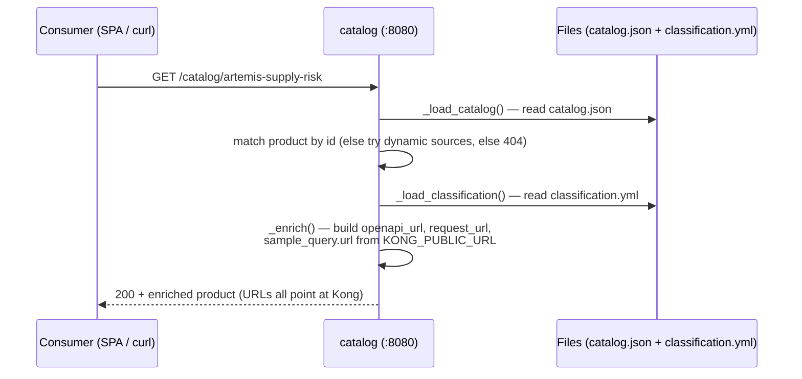

```mermaid
flowchart LR
    A[catalog.json<br/>built-in product] --> C[catalog service<br/>FastAPI :8080]
    B[classification.yml<br/>sensitivity labels] --> C
    D[/shared/sources.json<br/>or SOURCES_JSON env/] --> C
    C -->|enrich with KONG_PUBLIC_URL| E[GET /catalog<br/>GET /catalog/&#123;id&#125;]
    E -->|openapi_url / request_url<br/>point at Kong| F((Kong gateway))
    F --> G[(Data API Builder<br/>+ Postgres SoR)]
```

# 📚 catalog — the data marketplace's discovery surface

[Home](../../README.md) > [Services](../) > **catalog**

   

> [!WARNING]
> **Illustrative reference · sample/synthetic data only · not an official NASA
> document.** Everything this catalog publishes — the Artemis procurement product and any
> dynamically registered source — is **SYNTHETIC**, ITAR/CUI-safe. See
> [`docs/DISCLAIMER.md`](../../docs/DISCLAIMER.md) before sharing or adapting.

> [!NOTE]
> **TL;DR** — The catalog is a tiny FastAPI service that answers one question:
> *"What governed data products exist here, who owns them, how sensitive are they, and
> exactly how do I call one?"* It is the **storefront** of the marketplace. Crucially,
> every URL it hands out points at the **Kong gateway**, never at the database — so
> discovery and the zero-move guarantee reinforce each other. In Azure this role is
> played by the **API Management developer portal** plus **Azure API Center**.

---

## 📑 Table of contents

- [Why a catalog exists at all](#-why-a-catalog-exists-at-all)
- [Where it sits: the Azure mental model](#-where-it-sits-the-azure-mental-model)
- [What it does](#-what-it-does)
- [Endpoints](#-endpoints)
- [How it works (request walk-through)](#-how-it-works-request-walk-through)
- [The built-in product](#-the-built-in-product)
- [Dynamically registered sources](#-dynamically-registered-sources)
- [Classification: classify-before-exposure](#-classification-classify-before-exposure)
- [Configuration](#-configuration)
- [Run it (worked examples)](#-run-it-worked-examples)
- [Gotchas & troubleshooting](#-gotchas--troubleshooting)
- [Where to next](#-where-to-next)

---

## 🧭 Why a catalog exists at all

Imagine a large agency that has, over the years, built up dozens of valuable datasets:
procurement records in SAP, sensor telemetry, bridge inventories, financials. The data
exists. The problem is almost never *"can we technically read it?"* — the problem is that
**nobody outside the owning team knows it exists, who to ask, whether they're allowed to
use it, or how to actually call it.** That knowledge lives in people's heads ("oh, you want
procurement? talk to Dana, she has a script"). When Dana leaves, the dataset effectively
disappears.

> **In plain terms:** a *data catalog* is a searchable directory of the data products an
> organization offers — like a product page in an online store. It does **not** hold the
> data. It holds the *description* of the data: a title, an owner, how sensitive it is,
> and the exact address you call to get it.

A catalog turns tribal knowledge into a **self-service discovery surface**. A new analyst
can browse it, find the *Artemis Supply-Chain Risk API*, see that it's owned by the
Supply-Chain Data Product Team, see that some columns are *Confidential*, copy a
ready-to-run sample query, and be productive in minutes — without filing a ticket or
finding Dana.

> **Why this matters:** the whole pitch of this proof-of-concept is the **API-first,
> zero-move data marketplace**. A marketplace with no storefront is just a database with
> extra steps. The catalog is what makes the data *discoverable*, and — because every link
> it emits is gateway-relative — it is also what makes the data *only reachable the
> governed way*. Discoverability and governance are delivered by the same small service.

---

## ☁️ Where it sits: the Azure mental model

This repository's **primary** story is *deploy to Azure to show the full art of the
possible*; running everything locally with `docker compose` is the dev/test loop you use
to build and rehearse before that demo. So it helps to read every local component as the
**stand-in for a managed Azure service**:

| Local (this repo)                         | Azure managed equivalent                          | Shared responsibility |
| ----------------------------------------- | ------------------------------------------------- | --------------------- |
| **catalog** (this service)                | **API Management developer portal** + **Azure API Center** | Publish & discover data products |
| Kong Gateway (OSS, DB-less)               | **Azure API Management**                          | Authn, rate-limit, metering, correlation id |
| Local RS256 JWT issuer                    | **Microsoft Entra ID**                            | Token issuance / identity |
| Data API Builder on a container           | **DAB on Azure Container Apps**                   | Auto REST/GraphQL over the SoR |
| `data/classification.yml`                 | **Microsoft Purview**                             | Sensitivity classification |
| Prometheus + Grafana                      | **Azure Monitor + Microsoft Sentinel**            | Observability / SIEM |
| Postgres system-of-record                 | **Azure Database for PostgreSQL** (or the lakehouse: Azure Databricks + Unity Catalog) | The data itself |

> **In plain terms:** **Azure API Center** is Azure's inventory/registry of all your APIs
> (the catalog-of-APIs), and the **API Management developer portal** is the customer-facing
> website where consumers browse those APIs, read the docs, and get sample calls. This
> service does both jobs at once for the demo. *Acronyms:* **APIM** = Azure API Management;
> **DAB** = [Data API Builder](../dab/); **SoR** = system-of-record (the authoritative
> Postgres database); **SPA** = single-page application (the browser [frontend](../../frontend/)).

When you read the rest of this document, mentally substitute the Azure column: "the catalog
emits gateway URLs" becomes "the developer portal links to the APIM-fronted endpoint," and
"it surfaces `classification.yml`" becomes "the portal surfaces the Purview sensitivity
labels." The *pattern* is identical; only the implementation swaps from OSS to managed.

---

## 🎯 What it does

[`app.py`](app.py) is a ~150-line FastAPI service. At request time it reads two
configuration files and one optional dynamic source list, then composes a marketplace view:

1. **[`catalog.json`](catalog.json)** — the **built-in data product** manifest (one
   product: the Artemis Supply-Chain Risk API).
2. **[`data/classification.yml`](../../data/classification.yml)** (copied in at build as
   `classification.yml`) — the **per-table / per-column sensitivity labels**.
3. **`sources.json`** on a shared volume *or* a `SOURCES_JSON` environment variable —
   **dynamically registered sources** (see [below](#-dynamically-registered-sources)).

For every entry it returns, the service rewrites the contract and request URLs to be
**absolute and gateway-relative** — i.e. built from `KONG_PUBLIC_URL` — so that *every link
a consumer ever sees points at Kong, never at Data API Builder or Postgres directly.*

> [!IMPORTANT]
> The catalog is a **pure read/compose service**. It never queries the data, never holds a
> database credential, and is not on the data network. It only *describes* products and
> *points* at the gateway. This is deliberate: it can be wide-open and friendly precisely
> because it has nothing sensitive to leak.

---

## 🔌 Endpoints

| Method | Path              | Purpose |
| ------ | ----------------- | ------- |
| `GET`  | `/healthz`        | Liveness probe — returns `{"status": "ok"}`. Used by the Docker healthcheck and `depends_on: service_healthy`. |
| `GET`  | `/catalog`        | List the marketplace: a `marketplace` name, a `count`, and a `products` array (built-in **plus** any dynamically registered sources). |
| `GET`  | `/catalog/{id}`   | Full enriched detail for one product (gateway URLs + the full classification block). Returns **`404`** for an unknown id. |

**Shape of a list entry** (`GET /catalog` — built-in product), straight from
[`app.py:113`](app.py):

```json
{
  "id": "artemis-supply-risk",
  "title": "Artemis Supply-Chain Risk API",
  "owner": "NASA OCIO — Artemis Track-A (synthetic demo)",
  "domain": "Supply Chain / Procurement",
  "request_path": "/api/SupplyRisk",
  "openapi_url": "http://localhost:8000/api/openapi",
  "classification_dataset": "artemis_procurement",
  "origin": "built-in",
  "detail": "/catalog/artemis-supply-risk"
}
```

> [!NOTE]
> The list view is intentionally **lightweight** — just enough to render a marketplace grid
> and link onward. The expensive enrichment (full classification tables, resolved
> `request_url`, the ready-to-run `sample_query.url`) happens only in the **detail** view, so
> a long marketplace list stays cheap to render. This is a deliberate two-tier shape:
> *list = summary cards, detail = the full product page.*

---

## ⚙️ How it works (request walk-through)



Here is what actually happens when a consumer asks for one product's detail
(`GET /catalog/artemis-supply-risk`), tracing [`app.py`](app.py) line by line:



1. **`_load_catalog()`** ([`app.py:39`](app.py)) reads `catalog.json` fresh on every
   request. There is no caching — by design, so you can edit the manifest and see the change
   without a restart (great for a live demo).
2. The handler scans `products` for a matching `id`. If found, it calls **`_enrich()`**.
   If not found, it checks the dynamic sources, and finally raises **`404`**.
3. **`_enrich()`** ([`app.py:62`](app.py)) is the heart of the zero-move guarantee. It
   copies the product and overwrites:
   - `openapi_url = KONG_PUBLIC_URL + openapi_path` → the public OpenAPI contract, via Kong.
   - `request_url = KONG_PUBLIC_URL + request_path` → the live data endpoint, via Kong.
   - `sample_query.url = KONG_PUBLIC_URL + sample_query.path + "?" + sample_query.odata` →
     a copy-paste-ready call that already includes the OData filter.
   - `classification` → the full [classification summary](#-classification-classify-before-exposure).
4. It returns the enriched object. **Note what is *not* there:** any URL pointing at DAB
   (`:5000`) or Postgres (`:5432`). The consumer literally cannot discover the back-end
   address from the catalog.

> [!IMPORTANT]
> The catalog never reaches the data itself. Every URL it advertises is composed from
> `KONG_PUBLIC_URL`, so consumers can only follow links **through the gateway** — this is
> the zero-move pattern, and it is enforced by
> [`tests/test_zero_move.py`](../../tests/test_zero_move.py), which proves Postgres and DAB
> are unreachable from the client network.

---

## 📦 The built-in product

[`catalog.json`](catalog.json) ships exactly one product — the **Artemis Supply-Chain Risk
API** — the dataset the whole demo is built around:

| Field                   | Value |
| ----------------------- | ----- |
| `id`                    | `artemis-supply-risk` |
| `owner`                 | NASA OCIO — Artemis Track-A (synthetic demo) |
| `steward`               | Supply-Chain Data Product Team |
| `domain`                | Supply Chain / Procurement |
| `data_source`           | PostgreSQL (SAP-shaped) via Microsoft Data API Builder (auto REST + GraphQL + OpenAPI) |
| `request_path`          | `/api/SupplyRisk` |
| `openapi_path`          | `/api/openapi` |
| `graphql_path`          | `/graphql` |
| `entities`              | `Material`, `Vendor`, `PurchaseOrder`, `SupplyRisk` |
| `auth`                  | OAuth2 bearer (RS256 JWT) validated at the Kong gateway |
| `rate_limit_per_minute` | `60` |
| `open_standards`        | OData-style REST, OpenAPI 3, GraphQL, OAuth2/JWT, MCP |

> **In plain terms:** the field names borrow SAP's German-abbreviated convention (`MATNR` =
> *Materialnummer* / material number, `LIFNR` = *Lieferantennummer* / vendor number,
> `NETPR` = net price). This is intentional — the synthetic data is shaped like a real SAP
> procurement extract so the demo feels authentic. *OData* (Open Data Protocol) is the open
> URL-query standard that lets you filter/sort via `$filter` and `$orderby` parameters; DAB
> speaks it natively.

The bundled `sample_query` answers the demo's headline supply-chain question:

> Which **Critical**, **sole-source** materials on **Artemis-3** have an average delay
> **> 30 days**?

```text
GET /api/SupplyRisk?$filter=program eq 'Artemis-3' and criticality eq 'Critical'
    and sole_source eq true and avg_delay_days gt 30&$orderby=risk_score desc
```

When you fetch the detail view, the catalog resolves this into a fully-formed
`sample_query.url` (prefixed with `KONG_PUBLIC_URL`) that a consumer can paste directly into
the Python client, the [MCP tool](../mcp/), or `curl` (with a valid token).

> **Why this matters:** this is the difference between a catalog that *describes* a product
> and one that lets you *use* it immediately. The sample query is the bridge from "I found
> the data" to "I answered my question."

---

## 🧩 Dynamically registered sources

The marketplace is not limited to what ships in `catalog.json`. The
[`registry`](../registry/) service — the demo's *"+ Add a data source"* onboarding wizard —
lets you register a brand-new API at runtime. It rewrites Kong's config, hot-reloads it, and
writes the new source's metadata to a shared `sources.json` file. The catalog reads that
file (or the `SOURCES_JSON` env var) and **merges those sources into the same marketplace
view**, so a freshly-onboarded source appears in `/catalog` instantly — no rebuild.

> **In plain terms:** the built-in product is the demo's "factory-installed" data product;
> dynamically registered sources are the ones a user adds live during the demo to show *"see
> how fast we can publish a new governed API."* Both show up side by side.

A dynamic entry has a slightly different shape (see `_load_dynamic_sources()` at
[`app.py:80`](app.py)) — it carries `sample_url`, a `classification_label`, a `require_jwt`
flag, and `"origin": "registered via onboarding wizard"`:

```json
{
  "id": "dot-bridges",
  "title": "DOT National Bridge Inventory",
  "owner": "Unspecified",
  "domain": "Unspecified",
  "request_path": "/dot/bridges",
  "openapi_url": "http://localhost:8000/dot/bridges/api/openapi",
  "sample_url": "http://localhost:8000/dot/bridges",
  "classification_label": "Routine",
  "origin": "registered via onboarding wizard",
  "require_jwt": true,
  "detail": "/catalog/dot-bridges"
}
```

> [!NOTE]
> Two delivery mechanisms, one behaviour. **Locally**, `registry` and `catalog` share a
> Docker volume (`kong-config`, mounted at `/shared`), so `registry` writes
> `/shared/sources.json` and `catalog` reads it — a live control-plane. **In Azure**, where
> services don't share a writable volume, you instead bake the sources in via the
> `SOURCES_JSON` environment variable. The catalog code checks the file first, then falls
> back to the env var ([`app.py:84`](app.py)), so the same image works in both worlds.

---

## 🏷️ Classification: classify-before-exposure

The catalog surfaces the per-table/column sensitivity labels from
[`data/classification.yml`](../../data/classification.yml). This is the **classify-*before*-
exposure** discipline — the **Microsoft Purview** pattern, applied locally.

> **In plain terms:** *classify-before-exposure* means you decide how sensitive each
> column is **before** you ever serve it through an API — not after a leak. **Microsoft
> Purview** is Azure's data-governance service that catalogs and labels data sensitivity
> across an estate; `classification.yml` is the local stand-in for it.

The discipline has two halves, and they share one source of truth:

1. **The seeder applies the labels to Postgres** at seed time via `COMMENT ON COLUMN`, so
   the sensitivity travels *with the data* in the system-of-record.
2. **The catalog re-emits the same labels** so a consumer can see, *before* they call, that
   `STD_UNIT_COST_USD` is **Confidential**. Governance is visible from the very first
   discovery, not buried in a wiki.

The detail view's `classification` block (built by `_classification_summary()` at
[`app.py:49`](app.py)) carries the `dataset`, the `default_label`, the per-table label, the
full per-column map, and a `source` line attesting where the labels came from:

```json
"classification": {
  "dataset": "artemis_procurement",
  "default_label": "Routine",
  "source": "data/classification.yml (applied to the SoR as column comments at seed)",
  "tables": { "vendors": "Sensitive", "purchase_orders": "Confidential", ... },
  "columns": { "materials": { "STD_UNIT_COST_USD": "Confidential", ... }, ... }
}
```

The three labels, with real examples drawn from `classification.yml`:

| Label          | Meaning (demo)                            | Example columns |
| -------------- | ----------------------------------------- | --------------- |
| `Routine`      | Default; non-sensitive                    | `MATNR`, `MAKTX`, `PROGRAM` |
| `Sensitive`    | Supplier identity, criticality, risk      | `CAGE_CODE`, `SOLE_SOURCE`, `RISK_SCORE`, `CRITICALITY` |
| `Confidential` | Cost / price / procurement records        | `STD_UNIT_COST_USD`, `NETPR`, `NETWR` (and the `purchase_orders` table as a whole) |

> [!WARNING]
> These labels demonstrate the **workflow**, not real policy — all data is synthetic. In a
> real deployment, the labels would come from Purview and be governed by your data office.

---

## 🛠️ Configuration

All configuration is via environment variables (defaults from [`app.py`](app.py) shown):

| Variable             | Default                          | Purpose |
| -------------------- | -------------------------------- | ------- |
| `CATALOG_PORT`       | `8080`                           | Port the service listens on. |
| `KONG_PUBLIC_URL`    | `http://localhost:8000`          | **The most important setting.** Public base URL clients use to reach Kong; every OpenAPI/request/sample URL is built from it. Trailing slash is stripped automatically. |
| `CATALOG_JSON`       | `<app dir>/catalog.json`         | Path to the built-in product manifest. |
| `CLASSIFICATION_YML` | `<app dir>/classification.yml`   | Path to the sensitivity labels (copied from `data/classification.yml` at build). |
| `SOURCES_FILE`       | `/shared/sources.json`           | Runtime-registered sources written by the [`registry`](../registry/) wizard (shared `kong-config` volume). |
| `SOURCES_JSON`       | *(unset)*                        | Inline JSON of pre-registered sources (the Azure path, where there is no shared volume). |

> [!TIP]
> `KONG_PUBLIC_URL` is the one knob to get right for Azure. Locally it's
> `http://localhost:8000`; in Azure you set it to your APIM gateway's public hostname (e.g.
> `https://contoso-apim.azure-api.net`) and every link the catalog emits automatically
> points at the managed gateway. Nothing else in the code needs to change.

> [!NOTE]
> CORS is wide-open (`allow_origins=["*"]`, [`app.py:31`](app.py)) so the browser SPA
> ([`frontend`](../../frontend/)) can read the catalog from any local origin. This is a
> local-demo convenience that is safe **because the catalog holds no data** — but it is not
> a production posture. In Azure, the developer portal handles this with proper origin
> policies.

---

## ▶️ Run it (worked examples)

### Via Docker Compose (recommended)

The compose build context is the repo **root** so the canonical
`data/classification.yml` is copied in (see the [Dockerfile](Dockerfile) and
[`docker-compose.yml`](../../docker-compose.yml)). The catalog is in the `core` profile.

```bash
docker compose --profile core up -d catalog
```

**Step 1 — liveness:**

```bash
curl -fsS http://localhost:8080/healthz
```

Expected output:

```json
{"status":"ok"}
```

*What this did:* hit the probe FastAPI route at [`app.py:75`](app.py). If you get this, the
service is up and the healthcheck that gates `depends_on` is green.

**Step 2 — list the marketplace:**

```bash
curl -fsS http://localhost:8080/catalog | jq
```

Expected (abridged):

```json
{
  "marketplace": "NASA OCIO API-First Data Marketplace (synthetic POC)",
  "count": 1,
  "products": [
    {
      "id": "artemis-supply-risk",
      "title": "Artemis Supply-Chain Risk API",
      "openapi_url": "http://localhost:8000/api/openapi",
      "origin": "built-in",
      "detail": "/catalog/artemis-supply-risk"
    }
  ]
}
```

*What this did:* returned the summary cards. Note `openapi_url` already points at Kong
(`:8000`), not the catalog (`:8080`) and not DAB. If you've onboarded a source via the
wizard, `count` rises and a `"origin": "registered via onboarding wizard"` entry appears.

**Step 3 — full product detail:**

```bash
curl -fsS http://localhost:8080/catalog/artemis-supply-risk | jq
```

Expected (abridged) — note the resolved `request_url`, the ready-to-run `sample_query.url`,
and the full `classification` block:

```json
{
  "id": "artemis-supply-risk",
  "request_url": "http://localhost:8000/api/SupplyRisk",
  "sample_query": {
    "question": "Which Critical, sole-source materials on Artemis-3 have an average delay > 30 days?",
    "url": "http://localhost:8000/api/SupplyRisk?$filter=program eq 'Artemis-3' ..."
  },
  "classification": { "dataset": "artemis_procurement", "default_label": "Routine", "...": "..." }
}
```

*What this did:* triggered `_enrich()`. Copy `sample_query.url`, attach a JWT from the
[identity issuer](../identity/), and you've answered the demo's headline question — through the gateway.

### Locally for development

```bash
pip install -r requirements.txt
python app.py   # honors CATALOG_PORT / KONG_PUBLIC_URL / CATALOG_JSON / ...
```

This runs the same uvicorn server ([`app.py:146`](app.py)) outside Docker — handy for fast
edit-reload cycles when you're changing the catalog shape.

---

## 🧯 Gotchas & troubleshooting

| Symptom | Likely cause | Fix |
| ------- | ------------ | --- |
| `openapi_url` points at `localhost:8080` or a wrong host | `KONG_PUBLIC_URL` not set (or set to the catalog's own URL) | Set `KONG_PUBLIC_URL` to the **gateway's** public base URL — `http://localhost:8000` locally, your APIM hostname in Azure. |
| Port `8080` already in use on your machine | Another local service holds `8080` | Remap the host port via `CATALOG_PORT` in `.env` before `docker compose up`. |
| Detail view returns `404` | Unknown `id`, or the dynamic source list isn't readable | Check the id against `GET /catalog`; verify `SOURCES_FILE`/`SOURCES_JSON` is present and valid JSON (invalid JSON is silently treated as empty — [`app.py:93`](app.py)). |
| `classification` block is empty | `classification.yml` missing at the configured path | Confirm the file copied in at build (Dockerfile line 15) or point `CLASSIFICATION_YML` at it. Missing file degrades gracefully to `{}` — [`app.py:44`](app.py). |
| A wizard-onboarded source doesn't appear | `catalog` can't see `registry`'s write | Both must share the `kong-config` volume locally; in Azure use `SOURCES_JSON` instead. |

> [!NOTE]
> The service is built to **degrade gracefully**: a missing classification file or malformed
> sources list yields an empty section rather than a crash, per the project's fail-safe
> coding convention. The catalog stays up even when a satellite file is wrong.

---

## 🧭 Where to next

- 🛰️ [`registry`](../registry/) — the control-plane behind the *"+ Add a data source"*
  wizard that writes the dynamic sources this catalog lists.
- 🚪 [`gateway` / Kong](../gateway/) — where the URLs in this catalog actually resolve, and
  where JWT + rate-limit + metering are enforced.
- ⚙️ [`dab`](../dab/) — Data API Builder, the auto-generated REST/GraphQL/OpenAPI layer over
  the Postgres system-of-record.
- 🔐 [`identity`](../identity/) — the local RS256 JWT issuer + JWKS (the **Entra ID** analogue) that
  mints the token you need to actually call the sample query.
- 🤖 [`mcp`](../mcp/) — the MCP tool that consumes this catalog and the gateway to answer the
  Artemis supply-risk question from an AI client.
- 🖥️ [`frontend`](../../frontend/) — the browser SPA that renders this catalog as a
  marketplace grid (the local **APIM developer portal** analogue).
- 🏷️ [`data/classification.yml`](../../data/classification.yml) — the sensitivity labels this
  catalog surfaces; see also [`docs/DISCLAIMER.md`](../../docs/DISCLAIMER.md).
- ☁️ [`infra/azure`](../../infra/azure/) — the Azure reference deployment (APIM, API Center,
  Container Apps, Entra ID, Azure Monitor) this service maps onto.
