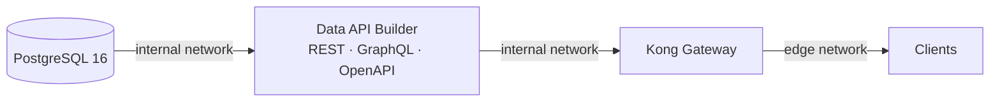

# ⚙️ dab — Microsoft Data API Builder

[Home](../../README.md) > **dab (Data API Builder)**

Auto-generates **REST + GraphQL + OpenAPI** over Postgres from
[`dab-config.json`](dab-config.json) — no hand-written API. Read-only entities with
OData-style query options.

> [!IMPORTANT]
> Reachable **ONLY** by Kong (the `internal` Docker network) — this is what makes
> zero-move real. DAB never attaches to a client-facing network.

> [!NOTE]
> Build per PRP §6 / §8 (Phase 2). All data is synthetic — see
> [`docs/DISCLAIMER.md`](../../docs/DISCLAIMER.md).

## 📑 Contents

- [📦 Entities](#-entities)
- [🔌 Endpoints](#-endpoints)
- [🐳 Build & runtime](#-build--runtime)

## 📦 Entities

Defined in [`dab-config.json`](dab-config.json) (all `read`-only):

| Entity          | Source table      | Notes                                                              |
| --------------- | ----------------- | ------------------------------------------------------------------ |
| `Material`      | `materials`       | Anonymous role excludes `std_unit_cost_usd`; authenticated reads all |
| `Vendor`        | `vendors`         | Anonymous read                                                     |
| `PurchaseOrder` | `purchase_orders` | Composite key `(ebeln, ebelp)`; anonymous excludes `netpr`, `netwr` |
| `SupplyRisk`    | `supply_risk`     | Anonymous read                                                     |

## 🔌 Endpoints

DAB listens on `http://0.0.0.0:5000` (see `ASPNETCORE_URLS` in `docker-compose.yml`):

| Surface | Path           | Notes                                       |
| ------- | -------------- | ------------------------------------------- |
| REST    | `/api`         | OData-style query options                   |
| GraphQL | `/graphql`     | Introspection enabled                       |
| OpenAPI | `/api/openapi` | Spec endpoint; also used by the healthcheck |

## 🐳 Build & runtime

The [`Dockerfile`](Dockerfile) extends the official image only to add `curl` (for the
compose healthcheck) and to bake in `dab-config.json`. The connection string is injected
at runtime via `@env('DAB_CONNECTION_STRING')`.

```dockerfile
FROM mcr.microsoft.com/azure-databases/data-api-builder:latest
```


