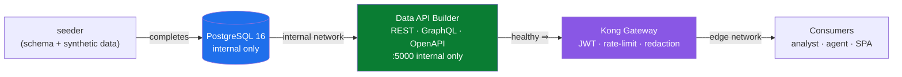

# ⚙️ dab — Microsoft Data API Builder (the zero-code API layer)

[🏠 Home](../../README.md) › [services](../) › **dab (Data API Builder)**

> [!NOTE]
> **TL;DR** — This service turns a Postgres database into a governed **REST + GraphQL + OpenAPI**
> data product **without anyone writing API code**. You describe your tables, the fields each
> caller may see, and the read rules in a single JSON file ([`dab-config.json`](dab-config.json));
> Data API Builder (DAB) does the rest. In this proof-of-concept DAB lives on a private network and
> is reachable **only through the Kong gateway** — which is what makes the "zero-move" claim real.
> In Azure, this exact pattern is **Data API Builder running in Azure Container Apps**, fronted by
> **Azure API Management**. Everything here is synthetic data — see
> [`docs/DISCLAIMER.md`](../../docs/DISCLAIMER.md).

---

## 📑 Contents

- [🎯 Why this service exists](#-why-this-service-exists)
- [☁️ The Azure story first](#️-the-azure-story-first)
- [🧠 What Data API Builder actually does](#-what-data-api-builder-actually-does)
- [📄 The config file, line by line](#-the-config-file-line-by-line)
- [📦 Entities: the four data products](#-entities-the-four-data-products)
- [🔐 The redaction boundary (the most important part)](#-the-redaction-boundary-the-most-important-part)
- [🔌 Endpoints DAB exposes](#-endpoints-dab-exposes)
- [🐳 Build & runtime](#-build--runtime)
- [🧪 Worked example: prove redaction end-to-end](#-worked-example-prove-redaction-end-to-end)
- [⚠️ Gotchas & troubleshooting](#️-gotchas--troubleshooting)
- [➡️ Where to next](#️-where-to-next)

---

## 🎯 Why this service exists

Imagine you have a database of record — here, a synthetic SAP-style procurement system for the
Artemis program — and you want to let other teams, partners, and AI agents *query* it safely. The
traditional answer is "write a REST API": stand up a web framework, hand-code controllers for every
table, wire up serialization, paging, filtering, and field-level permissions, then maintain all of
that forever. That is weeks of work and a permanent source of bugs and drift between "what the API
says" and "what the database actually contains."

**Data API Builder (DAB)** replaces all of that with a configuration file. You point it at a
database, list the tables (DAB calls them **entities**), and declare *who can read what*. DAB then
generates a full REST API, a GraphQL API, **and** an OpenAPI description — automatically, kept in
sync with your declaration. No controllers, no serializers, no hand-written paging.

> **In plain terms:** DAB is "your database, but with a safe, documented front door — and you got
> the door by filling out a form instead of building it plank by plank."

**Why this matters for the enterprise story:** the entire point of this proof-of-concept is the
**API-first, zero-move data marketplace**. "Zero-move" means consumers get answers *without a copy
of the data ever leaving the system of record* — no nightly extract, no shadow data lake, no
spreadsheet emailed around. For that to be credible you need a data-access layer that is (a) cheap
to stand up over an existing database, (b) read-only and field-aware, and (c) easy to put behind a
gateway. DAB is exactly that layer. It is the component that makes "expose the database as a product"
a config change rather than a project.

---

## ☁️ The Azure story first

This repository is a **local development and test harness** for a pattern whose real home is Azure.
Run it locally with `docker compose` to develop and test the flow on your laptop; **deploy the same
shape to Azure to demonstrate the full art of the possible.** Each open-source component here is a
stand-in for a managed Azure service:

| This local component | Azure managed equivalent | What you gain in Azure |
| --- | --- | --- |
| **Data API Builder container** (this service) | **Data API Builder on [Azure Container Apps](https://learn.microsoft.com/azure/container-apps/)** | Serverless scale-to-zero hosting, revisions, managed identity to the database |
| Postgres 16 (the `postgres` service) | **[Azure Database for PostgreSQL — Flexible Server](https://learn.microsoft.com/azure/postgresql/flexible-server/)** | Managed backups, HA, private endpoints, FedRAMP-High posture |
| Kong OSS gateway | **[Azure API Management](https://learn.microsoft.com/azure/api-management/)** (APIM) | Managed JWT validation, products/subscriptions, quotas, portal |
| Local RS256 JWT issuer | **[Microsoft Entra ID](https://learn.microsoft.com/entra/identity/)** | Real identity provider, app registrations, conditional access |
| `data/classification.yml` labels | **[Microsoft Purview](https://learn.microsoft.com/purview/)** | Catalog-wide classification, lineage, scanning |
| Prometheus + Grafana | **[Azure Monitor](https://learn.microsoft.com/azure/azure-monitor/) + Microsoft Sentinel** | Hosted metrics, alerting, SIEM |

> [!TIP]
> The crucial takeaway: **the `dab-config.json` you write locally is the same artifact you ship to
> Azure.** DAB is a Microsoft product (`mcr.microsoft.com/azure-databases/data-api-builder`) designed
> to run identically on a laptop and in Container Apps. There is no rewrite between dev and prod — you
> change the connection string (and in Azure, let managed identity supply it) and move on.

The one detail to carry from local to Azure is the **authentication provider** DAB is configured with.
Locally it is `StaticWebApps`; in Azure you would typically switch to `EntraID` (formerly
`AzureAD`) or keep `StaticWebApps` if DAB sits behind Azure Static Web Apps / Container Apps auth.
We explain why the provider choice matters in [The redaction boundary](#-the-redaction-boundary-the-most-important-part)
below — it is the single most important configuration decision in this service.

---

## 🧠 What Data API Builder actually does

When the container starts, DAB reads [`dab-config.json`](dab-config.json), connects to Postgres, and
for **each entity** stands up:

1. **A REST collection** at `/api/<EntityName>` supporting **OData-style** query options. *OData*
   (Open Data Protocol) is an open standard for querying data over HTTP — instead of inventing custom
   query parameters, you use a documented vocabulary like `$filter`, `$select`, `$orderby`, and
   `$first`. This is what lets the demo's headline supply-risk question be expressed as a URL.
2. **A GraphQL type and queries** at `/graphql`, so a consumer who prefers GraphQL can fetch exactly
   the fields they want in one round trip.
3. **An OpenAPI description** at `/api/openapi`. *OpenAPI* is the open standard (formerly "Swagger")
   that machine-describes a REST API: every path, parameter, and response shape. The catalog service
   and tooling read this to make the data product **discoverable** without tribal knowledge.

> **In plain terms:** you declare four tables; DAB hands you back twelve things (REST + GraphQL +
> OpenAPI for each), all consistent with each other and with the database.

Critically for this PoC, **every entity here is read-only**. DAB supports create/update/delete, but
this is a *data marketplace* — consumers read; they never write to the system of record. We enforce
that by granting only the `read` action in every permission block (see below).

---

## 📄 The config file, line by line

The whole service is one JSON file. Here is the structure of [`dab-config.json`](dab-config.json),
explained in the order DAB reads it.

### Data source

```json
"data-source": {
  "database-type": "postgresql",
  "connection-string": "@env('DAB_CONNECTION_STRING')",
  "options": {}
}
```

`database-type` tells DAB which dialect to speak (DAB also supports SQL Server, MySQL, Cosmos DB).
The connection string is **not hard-coded** — `@env('DAB_CONNECTION_STRING')` tells DAB to read it
from an environment variable at runtime. In [`docker-compose.yml`](../../docker-compose.yml) that
variable points at the internal `postgres` host:

```text
Host=postgres;Port=5432;Database=procurement;Username=artemis;Password=artemis_local_demo
```

> [!TIP]
> The `@env(...)` indirection is exactly what lets the same config file run unchanged in Azure: in
> Container Apps you set `DAB_CONNECTION_STRING` as a secret, or better, use a passwordless connection
> string and **managed identity** so there is no password to store at all. The committed config never
> contains a credential.

### Runtime block — global API behavior

```json
"runtime": {
  "rest":    { "enabled": true, "path": "/api" },
  "graphql": { "enabled": true, "path": "/graphql", "allow-introspection": true },
  "host": {
    "cors": { "origins": ["*"], "allow-credentials": false },
    "authentication": { "provider": "StaticWebApps" },
    "mode": "development"
  }
}
```

- `rest.path` / `graphql.path` set the base paths. These match exactly what Kong routes to (the
  gateway sends `/api/...` and `/graphql` straight through), so changing them here without updating
  [`services/gateway/kong.yml`](../gateway/kong.yml) would break routing.
- `allow-introspection: true` lets GraphQL clients ask the schema "what types and fields do you
  have?" — convenient for a demo. In a hardened production deployment you would usually turn this off.
- `authentication.provider: "StaticWebApps"` is the linchpin of the redaction boundary — see its own
  section below. It governs **how DAB decides whether a request is `anonymous` or `authenticated`.**
- `mode: "development"` makes DAB return detailed errors (helpful while building). **In production you
  would set `"production"`** so internal error details aren't leaked.

> [!NOTE]
> `cors.origins: ["*"]` here is permissive because, in this PoC, **clients never reach DAB directly** —
> they reach Kong, and Kong owns the real CORS policy (see the `cors` plugin in
> [`kong.yml`](../gateway/kong.yml)). DAB's CORS setting is effectively dead code from the client's
> perspective; the gateway is the boundary. We note this so a reader doesn't mistake it for the
> security control — it isn't.

### Entities block — your tables, as products

Each entity maps a database object to an API resource and declares its permissions. The next two
sections cover the entities and their permissions in detail.

---

## 📦 Entities: the four data products

DAB exposes four read-only entities, each backed by a table the seeder creates from
[`services/seeder/schema.sql`](../seeder/schema.sql). The table below is **verified against the
schema** — these are the real column names DAB serves.

| Entity (API name) | Source table | Key | Models (SAP analogue) | Redacted from `anonymous` |
| --- | --- | --- | --- | --- |
| `Material` | `materials` | `matnr` | Material master (MARA) | `std_unit_cost_usd` |
| `Vendor` | `vendors` | `lifnr` | Vendor master (LFA1) | *(none — fully public)* |
| `PurchaseOrder` | `purchase_orders` | composite `(ebeln, ebelp)` | PO header+line (EKKO/EKPO) | `netpr`, `netwr` |
| `SupplyRisk` | `supply_risk` | `matnr` | Derived per-material risk view | *(none — public)* |

A few things worth understanding:

- **The composite key on `PurchaseOrder`.** SAP purchase orders are identified by a header number
  `ebeln` and a line item `ebelp`; one row needs both. DAB must be told this explicitly via
  `source.key-fields: ["ebeln", "ebelp"]`, because Postgres' composite primary key isn't something
  DAB infers for addressing a single record by URL. Without it, "get one PO line" has no stable URL.
- **`SupplyRisk` is a precomputed table, not a live view.** The schema comment calls it a "derived
  per-material supply-risk view (materialized as a table for the demo)." The seeder computes
  `risk_score`, `risk_tier`, `avg_delay_days`, etc. once and stores them, so the demo's headline
  query is a fast, simple read. The columns the OData query filters on — `program`, `criticality`,
  `sole_source`, `avg_delay_days` — all live on this table.
- **Lowercase field names are deliberate.** `schema.sql` keeps every column lowercase so DAB exposes
  lowercase REST/GraphQL fields, which the demo's headline OData query uses literally:
  `$filter=program eq 'Artemis-3' and criticality eq 'Critical' and sole_source eq true and avg_delay_days gt 30`.
  If columns were mixed-case, the query string would have to match exactly, which is brittle.

> [!NOTE]
> There is a **second** DAB-style data source in this stack — the `transportation` service
> ([`services/transportation`](../transportation)), a small API standing in for "an existing
> department API you didn't build." It exists to demonstrate the onboarding wizard adding a *new*
> source to the marketplace at runtime. This README documents the primary procurement DAB; the
> transportation service has its own.

---

## 🔐 The redaction boundary (the most important part)

This is the concept most worth slowing down on, because it is where DAB's permission model and the
Kong gateway cooperate to produce a real, **provable** field-level security guarantee.

### Two roles, two views of the same row

Look at the `Material` entity's permissions:

```json
"permissions": [
  { "role": "anonymous",
    "actions": [ { "action": "read", "fields": { "exclude": ["std_unit_cost_usd"] } } ] },
  { "role": "authenticated",
    "actions": ["read"] }
]
```

DAB has a built-in notion of roles. Two matter here:

- **`anonymous`** — the role for a request that carries **no proven identity**. For `Material`, the
  anonymous role can `read` every field **except** `std_unit_cost_usd` (standard unit cost). For
  `PurchaseOrder`, anonymous is denied `netpr` (net price) and `netwr` (net order value). Those are
  the commercially sensitive numbers.
- **`authenticated`** — the role for a request DAB *trusts* as carrying a verified principal. For
  these entities the authenticated role gets `read` with **no field exclusions** — it sees the
  redacted price columns too.

> **In plain terms:** the same table can show two different shapes depending on who's asking — a
> public, price-redacted view and a privileged, full view — and you got both by writing two lines of
> JSON, not by building two endpoints.

### So how does DAB decide which role you are?

This is where `authentication.provider: "StaticWebApps"` comes in. With the **StaticWebApps**
provider, DAB treats a request as `authenticated` if it arrives carrying a specific Microsoft header —
`X-MS-CLIENT-PRINCIPAL` (a base64 blob describing the signed-in user), optionally with `X-MS-API-ROLE`
naming the role to use. That header is normally injected by Azure Static Web Apps / Container Apps
*after* the platform has authenticated the user. **DAB itself does not verify the header** — it trusts
whatever upstream component put it there.

That trust is fine *when DAB sits behind a platform that strips and re-injects the header*. It is a
**liability** when DAB sits behind a gateway, because any client could simply *send* an
`X-MS-CLIENT-PRINCIPAL` header and DAB would happily promote them to `authenticated` and hand over the
redacted price columns.

### Kong closes the gap — and that's the whole design

We deliberately do **not** rely on DAB's auth here. Instead, the gateway guarantees that **every**
request reaches DAB as `anonymous`, by stripping any client-supplied identity headers at the edge.
From [`services/gateway/kong.yml`](../gateway/kong.yml):

```yaml
- name: request-transformer
  config:
    remove:
      headers:
        - X-MS-CLIENT-PRINCIPAL
        - X-MS-CLIENT-PRINCIPAL-ID
        - X-MS-CLIENT-PRINCIPAL-NAME
        - X-MS-CLIENT-PRINCIPAL-IDP
        - X-MS-API-ROLE
```

So the flow is:

1. The consumer authenticates to **Kong** with a real RS256 JWT (issued by the identity service /
   Entra ID). Kong's `jwt` plugin verifies the signature and maps the `client_id` claim to a Kong
   consumer for metering and rate-limiting. **This is the real authentication.**
2. Kong then **strips** any `X-MS-*` identity headers before forwarding to DAB.
3. DAB, behind the private network, sees no principal header, so it serves the **`anonymous`** role —
   **field-level redaction is guaranteed, not accidental.**

> [!IMPORTANT]
> The redaction boundary is real precisely *because* DAB's own `authenticated` role is, by design,
> **unreachable** in this deployment. Authentication happens at the gateway (JWT); field redaction
> happens at DAB (anonymous role); the two never collide. The `authenticated` permission block stays
> in the config to document *what an elevated view would look like* and to make the Azure path obvious —
> in Azure you'd let APIM forward a verified principal and DAB would honor it — but in the PoC the
> gateway ensures it never fires.

```mermaid
sequenceDiagram
    autonumber
    participant C as Consumer<br/>(analyst / agent)
    participant K as Kong Gateway<br/>(edge)
    participant D as Data API Builder<br/>(internal only)
    participant P as PostgreSQL<br/>(internal only)

    C->>K: GET /api/Material<br/>Authorization: Bearer &lt;RS256 JWT&gt;<br/>(maybe a forged X-MS-CLIENT-PRINCIPAL)
    Note over K: jwt plugin verifies signature,<br/>maps client_id → consumer
    Note over K: request-transformer STRIPS<br/>all X-MS-* identity headers
    K->>D: GET /api/Material<br/>(no principal header)
    Note over D: provider=StaticWebApps sees<br/>no principal ⇒ role = anonymous
    D->>P: SELECT (all columns EXCEPT std_unit_cost_usd)
    P-->>D: rows
    D-->>K: JSON, std_unit_cost_usd redacted
    K-->>C: 200 + X-Correlation-ID
```

**Why this matters:** in a federal / ITAR / CUI context, "we redact sensitive columns" is only
credible if you can *prove* a client cannot talk itself into the privileged view. Here you can — the
sensitive columns are excluded by config, the privileged role is unreachable by network design, and
[`tests/test_zero_move.py`](../../tests/test_zero_move.py) proves DAB and Postgres are not even on a
network the client can reach.

---

## 🔌 Endpoints DAB exposes

DAB listens on `http://0.0.0.0:5000` inside its container (set via `ASPNETCORE_URLS` in
[`docker-compose.yml`](../../docker-compose.yml)). Remember: these are reachable **only from inside
the `internal` Docker network** — you call them through Kong, not directly.

| Surface | Path | What it's for |
| --- | --- | --- |
| **REST** | `/api/<Entity>` | OData-style reads: `$filter`, `$select`, `$orderby`, `$first` |
| **GraphQL** | `/graphql` | Typed queries; introspection enabled for the demo |
| **OpenAPI** | `/api/openapi` | Machine-readable contract; **also the container healthcheck target** |

> [!NOTE]
> Kong routes the **public** `/api/openapi` path *without* a token (discovery is meant to be open),
> but the **governed data routes** (`/api/Material`, `/api/Vendor`, `/api/PurchaseOrder`,
> `/api/SupplyRisk`, `/graphql`) require a valid JWT. See the route split in
> [`kong.yml`](../gateway/kong.yml) — the more specific `/api/openapi` route is matched before the
> general data routes precisely so the contract is findable without credentials.

---

## 🐳 Build & runtime

The [`Dockerfile`](Dockerfile) is intentionally tiny — it extends Microsoft's official image and adds
exactly two things: `curl` (so the compose healthcheck can probe the API) and the baked-in config.

```dockerfile
FROM mcr.microsoft.com/azure-databases/data-api-builder:latest
USER root
# The base image is Azure Linux (tdnf) or Debian (apt) depending on tag — try both.
RUN (tdnf install -y curl && tdnf clean all) \
    || (apt-get update && apt-get install -y --no-install-recommends curl && rm -rf /var/lib/apt/lists/*)
COPY dab-config.json /App/dab-config.json
```

The `tdnf || apt-get` fallback handles the fact that Microsoft has shipped this image on both Azure
Linux (which uses the `tdnf` package manager) and Debian (which uses `apt-get`) across tags — the
build works regardless of which base the `:latest` tag currently points at.

**Startup ordering (from `docker-compose.yml`):** DAB does not start until the one-shot `seeder` job
has finished successfully (`depends_on: seeder: condition: service_completed_successfully`). That
guarantees the schema and synthetic data exist before DAB tries to introspect them. In turn, Kong
waits for DAB to report **healthy** before it starts, so the gateway never points at a cold backend.



The healthcheck itself just curls the OpenAPI endpoint — if DAB can render its own contract, it has
connected to the database and introspected the entities, which is a solid "ready" signal:

```bash
curl -fsS http://localhost:5000/api/openapi >/dev/null || exit 1
```

---

## 🧪 Worked example: prove redaction end-to-end

This shows the redaction boundary working. You run these from your host; the demo's `make` targets or
the [identity service](../identity) mint the token. (Ports below assume defaults from
[`.env.example`](../../.env.example); remap if your machine already uses 8000/8081.)

**1) Get a JWT for the `analyst` consumer** (the identity service issues it):

```bash
curl -s -X POST http://localhost:8081/token \
  -H 'Content-Type: application/json' \
  -d '{"consumer":"analyst"}'
```

**Expected output** (shape; the token is long and will differ each run):

```json
{ "access_token": "eyJhbGciOiJSUzI1NiIsIn...", "token_type": "Bearer", "expires_in": 3600 }
```

*What just happened:* the issuer signed an RS256 token whose `client_id` claim is `analyst`. Kong
trusts this issuer's public key and will map the call to the `analyst` consumer.

**2) Call `Material` through Kong with that token:**

```bash
TOKEN="<paste access_token>"
curl -s http://localhost:8000/api/Material?\$first=1 \
  -H "Authorization: Bearer $TOKEN" | head -c 600
```

**Expected output** — a material row **with no `std_unit_cost_usd` field present** (it's redacted by
DAB's anonymous role):

```json
{ "value": [ { "matnr": "...", "maktx": "...", "matkl": "...", "program": "Artemis-3",
  "criticality": "...", "std_lead_time_days": 0, "uom": "EA" } ] }
```

*What just happened:* you authenticated to the gateway, the gateway stripped any identity headers and
forwarded you as anonymous, and DAB returned every column **except** the redacted cost. There is no
header you can add to your `curl` to get `std_unit_cost_usd` back — Kong removes the `X-MS-*` headers
that would elevate you.

**3) Prove no-token is rejected at the edge** (the request never reaches DAB):

```bash
curl -s -o /dev/null -w "%{http_code}\n" http://localhost:8000/api/Material
```

**Expected output:**

```text
401
```

*What just happened:* Kong's `jwt` plugin rejected the unauthenticated call before it could touch the
internal network. This is the zero-move guarantee in action.

---

## ⚠️ Gotchas & troubleshooting

> [!WARNING]
> **Do not expose port 5000 to the host.** DAB has no port mapping in `docker-compose.yml` on purpose.
> Publishing it would create a path to the data that bypasses Kong — breaking zero-move and the
> redaction boundary, and failing [`tests/test_zero_move.py`](../../tests/test_zero_move.py).

| Symptom | Likely cause | Fix |
| --- | --- | --- |
| DAB container unhealthy / restart loop | Started before the seeder finished, or wrong connection string | Confirm `seeder` exited 0; check `DAB_CONNECTION_STRING` host is `postgres` |
| `/api/openapi` 404 | REST or an entity disabled in config, or `rest.path` changed | Verify `rest.enabled` and that the path still matches Kong's routes |
| A field you expected is missing | It's excluded from the `anonymous` role by design | That's the redaction boundary working — it's intended, not a bug |
| Single-record URL for a PO doesn't resolve | Missing/incorrect `key-fields` for the composite key | Ensure `source.key-fields: ["ebeln","ebelp"]` |
| OData `$filter` returns nothing | Case mismatch on a column name | Field names are lowercase (e.g. `criticality`, not `Criticality`) |
| Detailed errors leaking in prod | `runtime.host.mode` left as `development` | Set `"mode": "production"` for hardened deployments |

---

## ➡️ Where to next

- **[`services/gateway/README.md`](../gateway/README.md)** — Kong: JWT verification, rate-limiting,
  the OWASP guard, and the header-stripping that enforces the redaction boundary (APIM in Azure).
- **[`services/identity/README.md`](../identity/README.md)** — the RS256 JWT issuer whose `client_id`
  claim Kong keys on (Entra ID in Azure).
- **[`services/seeder/README.md`](../seeder/README.md)** — the schema and synthetic-data loader that
  creates the four tables DAB serves, plus the classification labels.
- **[`docs/`](../../docs/)** — the architecture, the demo script, the Azure deployment path, and the
  synthetic-data disclaimer.
- **[Data API Builder docs](https://learn.microsoft.com/azure/data-api-builder/)** — Microsoft's
  official reference for the config schema, providers, and the Container Apps deployment path.
