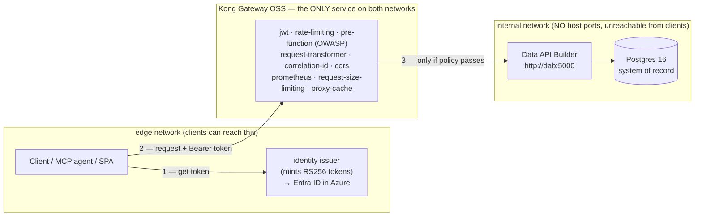
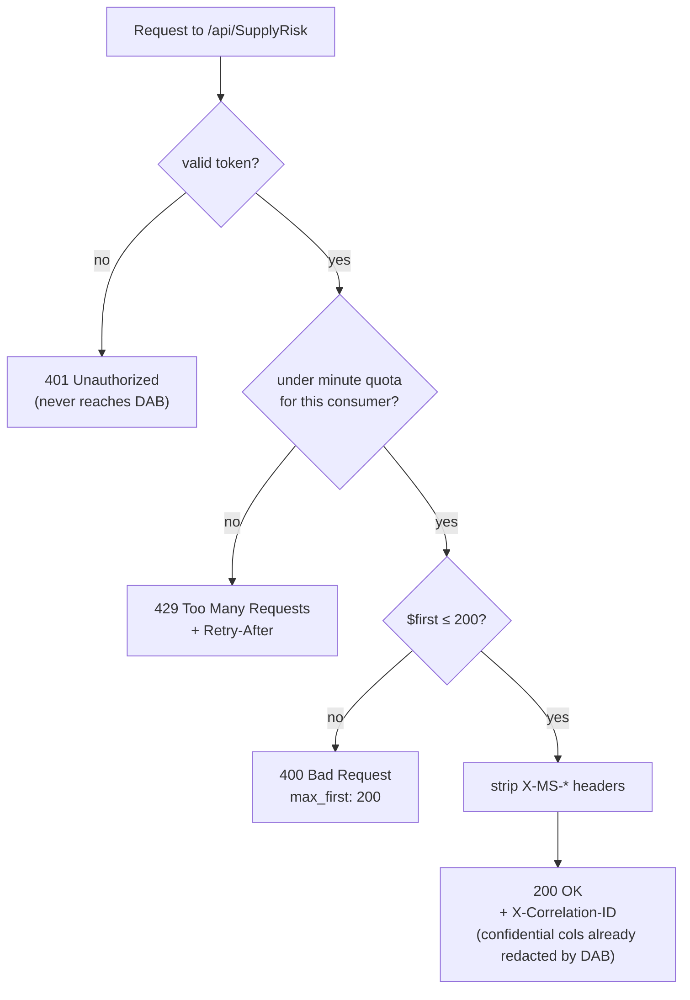

# 🛡️ gateway — the policy enforcement point (Kong OSS locally, Azure API Management in Azure)

[Home](../../README.md) › [services](../) › **gateway**

> [!NOTE]
> **TL;DR** — This service is the **single front door** to the data. Every client request
> is forced through it, and here it is checked, throttled, sanitized, and measured before
> a single byte of the system of record is touched. Locally it is **Kong Gateway 3.x OSS**
> running DB-less from a committed `kong.yml`; in the cloud the **identical pattern** is
> **Azure API Management (APIM)** (`infra/azure/modules/apim.bicep`). If you only read one
> thing: the gateway is *why* "zero-move" is true — clients can reach Data API Builder and
> Postgres **only** through this hop, never directly.

---

## 📑 Contents

- [🎯 Why a gateway exists (the problem it solves)](#-why-a-gateway-exists-the-problem-it-solves)
- [☁️ Azure-first: what this becomes in the cloud](#️-azure-first-what-this-becomes-in-the-cloud)
- [🗺️ Where the gateway sits (request flow)](#️-where-the-gateway-sits-request-flow)
- [⚙️ How the config is loaded (identity renders the template)](#️-how-the-config-is-loaded-identity-renders-the-template)
- [🔌 The plugin chain, explained](#-the-plugin-chain-explained)
- [🧪 The behavior matrix: 401 / 200 / 429 / 400](#-the-behavior-matrix-401--200--429--400)
- [👥 Consumers and per-consumer metering](#-consumers-and-per-consumer-metering)
- [🔭 Worked example: drive every outcome by hand](#-worked-example-drive-every-outcome-by-hand)
- [🧯 Gotchas & troubleshooting](#-gotchas--troubleshooting)
- [➡️ Where to next](#️-where-to-next)
- [📖 Glossary](#-glossary)

---

## 🎯 Why a gateway exists (the problem it solves)

Imagine you have a valuable database — here, synthetic Artemis SAP-procurement data — and
several teams want to query it: a human analyst, an AI agent, a browser app. The naive
approach is to hand each consumer a database connection string or point them at the API in
front of the database. The moment you do that, you have lost control:

- **Anyone with the address can read everything.** There is no place to check *who* is
  asking or *whether they are allowed*.
- **A single greedy query can drain the whole dataset** (or the whole server's capacity).
- **You cannot tell consumers apart**, so you cannot meter usage, charge back cost, or
  spot abuse.
- **Sensitive columns leak** unless every backend remembers to hide them, every time.

> **In plain terms:** without a gateway, every consumer is standing inside your data center
> with a key to the vault. A **gateway** (also called an *API gateway* or *policy
> enforcement point*) is a single guarded doorway that every request must pass through. At
> that doorway you do the things you only want to do **once, consistently, for everyone**:
> authenticate the caller, enforce quotas, block dangerous requests, strip spoofed
> headers, and record metrics.

**Why this matters (the enterprise story):** the whole point of this proof-of-concept is
the **API-first, zero-move data marketplace** pattern. "Zero-move" means consumers get
**governed answers** from data that **never leaves its system of record** — no copies, no
extracts, no shadow datasets to secure. That promise is only credible if there is exactly
**one** controllable path to the data and that path enforces policy. This gateway *is* that
path. Everything else in the repo (identity, the catalog, observability) exists to feed,
secure, or observe this single chokepoint.

---

## ☁️ Azure-first: what this becomes in the cloud

This POC is built to **show the art of the possible in Azure**. Running it locally with
Docker is the **develop/test loop**; the headline demo is **deployed to Azure**, where each
local open-source component is replaced by its **managed Azure equivalent** — same pattern,
no servers to babysit. Read the gateway through that lens: Kong is a faithful local
*stand-in* for **Azure API Management**.

| What you see locally (this service) | Azure managed equivalent | Where it lives in the repo |
| --- | --- | --- |
| **Kong Gateway OSS** (`kong.yml`) | **Azure API Management (APIM)** | `infra/azure/modules/apim.bicep` |
| `jwt` plugin (verify RS256 token) | `validate-azure-ad-token` policy | `apim.bicep` inbound policy |
| `rate-limiting` plugin | `rate-limit-by-key` policy | `apim.bicep` inbound policy |
| `correlation-id` plugin | `set-header` with `context.RequestId` | `apim.bicep` inbound policy |
| Local RS256 JWT **issuer** service | **Microsoft Entra ID** | `services/identity` → Entra |
| Data API Builder behind the gateway | **Azure Container Apps** running DAB | `infra/azure` |
| `prometheus` plugin + Grafana | **Azure Monitor** (+ Microsoft Sentinel) | `observability/` → Azure Monitor |

> [!TIP]
> The mapping is deliberately **1:1 at the policy level**. When you explain the local
> `jwt` + `rate-limiting` + `correlation-id` plugin chain, you are also explaining the APIM
> `validate-azure-ad-token` + `rate-limit-by-key` + `set-header` policy block in
> `apim.bicep`. The local issuer mints tokens that look like Entra tokens (RS256, `aud`,
> `exp`, a `client_id` claim) precisely so the *governance logic* is identical in both
> environments — only the **token authority** changes (your laptop vs. Entra).

> [!NOTE]
> **Vendor-neutral framing.** Kong (OSS) is the path we *build* here; **Azure API
> Management** (managed) is the documented Azure equivalent. The pattern — a managed
> enterprise gateway as the single policy enforcement point — is what matters, not the
> brand.

---

## 🗺️ Where the gateway sits (request flow)

Kong is the **only** service attached to *both* Docker networks. Postgres and Data API
Builder live on the `internal` network (no host ports, no egress); clients live on the
`edge` network. Because Kong straddles both, it is the **sole bridge** — there is no other
route from a client to the data. (`tests/test_zero_move.py` proves Postgres/DAB are
unreachable from the client side.)



```mermaid
sequenceDiagram
    autonumber
    participant C as Client
    participant I as identity issuer
    participant K as Kong gateway
    participant D as Data API Builder
    C->>I: POST /token {consumer:"analyst"}
    I-->>C: RS256 access_token (client_id=analyst)
    C->>K: GET /api/SupplyRisk  Authorization: Bearer <token>
    Note over K: jwt verifies signature + exp, maps client_id → consumer
    Note over K: rate-limiting checks this consumer's minute quota
    Note over K: pre-function rejects $first > 200
    Note over K: request-transformer strips X-MS-* identity headers
    K->>D: forwarded request (as anonymous role)
    D-->>K: rows (confidential columns already excluded by DAB)
    Note over K: correlation-id stamps X-Correlation-ID; prometheus records the call
    K-->>C: 200 + data + X-Correlation-ID
```

---

## ⚙️ How the config is loaded (identity renders the template)

Kong here runs **DB-less** (declarative): instead of an admin API mutating a database, the
entire gateway is described by one YAML file that Kong reads at boot. The header of
`kong.yml` declares this:

```yaml
_format_version: "3.0"
_transform: true
```

But the committed `kong.yml` is a **template**, not the file Kong ultimately loads. It
contains two placeholders that **must not be committed as real values**:

| Placeholder in `kong.yml` | Rendered to | Why it is dynamic |
| --- | --- | --- |
| `__RSA_PUBLIC_KEY__` | The issuer's live RS256 **public** key | Generated fresh per stack; never committed (no key material in git). |
| `__RATE_LIMIT__` | `RATE_LIMIT_PER_MINUTE` from `.env` (default `60`) | Tunable per environment without editing YAML. |

### How identity renders the template (the exact mechanism)

The **identity** service (`services/identity/issuer.py`) does the rendering at startup, in
its FastAPI `lifespan` hook — *before* Kong starts (Kong `depends_on` identity being
healthy). The flow is:

1. **Load or create the RSA keypair** (`_load_or_create_keys`). If `JWT_PRIVATE_KEY_PEM`
   is set (the Azure path — a baked secret so no shared volume is needed), it is used;
   otherwise a 2048-bit key is generated and persisted to the shared volume.
2. **Render** (`_render_kong`): read `kong.yml.tmpl` (the committed `kong.yml` mounted as a
   template), then string-replace:
   - `__RSA_PUBLIC_KEY__` → the public PEM, **with newlines escaped to `\n`** so it sits on
     one YAML line, and
   - `__RATE_LIMIT__` → the numeric per-minute cap.
3. **Write two files** to the shared `kong-config` volume:
   - `/shared/kong.base.yml` — the canonical base (template + identity values), and
   - `/shared/kong.yml` — the **effective** config Kong actually loads
     (`KONG_DECLARATIVE_CONFIG=/shared/kong.yml`).

> [!IMPORTANT]
> There is a second writer of `/shared/kong.yml`: the **registry** control-plane service
> (the "add a source" onboarding wizard). It reads `kong.base.yml`, merges any
> dynamically-registered upstreams (e.g. the `transportation` second source) plus their
> routes/plugins, and re-writes `/shared/kong.yml`. Identity writes the **base**; the
> registry writes the **effective** file so wizard-added sources survive a Kong restart.
> This is why `kong.yml` in this folder shows the *built-in* Artemis service only —
> additional sources arrive at runtime, not in the committed file.

> **In plain terms:** the file in this directory is the *blueprint*. The real, running
> gateway config is assembled at boot from that blueprint plus a live public key, a live
> rate-limit number, and any sources someone registered through the wizard.

---

## 🔌 The plugin chain, explained

A Kong **plugin** is a small policy module that runs on a request as it passes through the
gateway. Plugins attach at three scopes, and **scope determines what they apply to**:

| Scope | Attaches to | Applies to |
| --- | --- | --- |
| **Route-level** | One specific route | Only requests matching that route's paths |
| **Service-level** | The upstream service | Every route of that service |
| **Global** | The whole gateway | Every service and route |

The single upstream service is **`artemis-dab`** (`url: http://dab:5000`). It has **two
routes** and the plugins below. Understanding *which scope a plugin is at* is the key to
reading the config — it explains, for example, why the public OpenAPI route needs no token
(the `jwt` plugin is route-level on the *other* route) but still gets a correlation id
(`correlation-id` is service-level).

### 🚏 The two routes

| Route | Paths | Token required? | Why it is split out |
| --- | --- | --- | --- |
| `artemis-openapi` | `/api/openapi` | ❌ No | The OpenAPI contract is **public discovery metadata** — a consumer must be able to *find and read the API's shape* before they have credentials. Listed first and more specific than the data paths, so `/api/openapi` matches here, not the governed route. |
| `artemis-procurement-api` | `/api/Material`, `/api/Vendor`, `/api/PurchaseOrder`, `/api/SupplyRisk`, `/graphql` | ✅ Yes | The **governed data route**. The JWT, rate-limit, OWASP guard, and header-stripping plugins are attached **here only**, on the explicit entity collections — so there is no path overlap with the public discovery route. |

> [!NOTE]
> Both routes set `strip_path: false`, so the matched path (e.g. `/api/SupplyRisk`) is
> forwarded to DAB **unchanged**. DAB expects the full `/api/...` path, so Kong must not
> trim it.

### 🔐 Route-level plugins (governed data route only)

These four run **in order** on every governed data request. Think of them as a gauntlet —
a request must survive all four to reach DAB:

| Order | Plugin | What it does | What stops the request | Maps to (Azure) |
| --- | --- | --- | --- | --- |
| 1 | **`jwt`** | Verifies the RS256 signature against the consumer's public key, checks `exp`, and maps the token's `client_id` claim to a Kong consumer (`key_claim_name: client_id`). `run_on_preflight: false` lets the CORS plugin answer browser preflights first. | Missing/garbage/expired token → **401** at the edge; the request never reaches DAB. | `validate-azure-ad-token` |
| 2 | **`rate-limiting`** | Per-**consumer** quota (`limit_by: consumer`), `__RATE_LIMIT__` calls/minute, `policy: local` (in-memory counter per Kong worker). `hide_client_headers: false` so `RateLimit-*` headers are returned. | Over the cap → **429** with a `Retry-After` header. | `rate-limit-by-key` |
| 3 | **`pre-function`** | A tiny Lua snippet implementing an **OWASP API4:2023** (Unrestricted Resource Consumption) control: read the `$first` query arg; if it exceeds **200**, reject. This blocks a "siphon the whole dataset in one call" attempt **before** it touches DAB/Postgres. | `$first > 200` → **400** with `{message, max_first: 200}`. | inbound policy / `validate-content` |
| 4 | **`request-transformer`** | **Strips client-supplied identity headers** so the redaction boundary cannot be spoofed (see callout). Removes `X-MS-CLIENT-PRINCIPAL`, `-ID`, `-NAME`, `-IDP`, and `X-MS-API-ROLE`. | (Does not reject — it sanitizes, then forwards.) | `set-header`/`delete` policy |

> [!WARNING]
> **The `request-transformer` is load-bearing security, not cosmetics.** DAB's
> StaticWebApps auth provider *would honor* an inbound `X-MS-CLIENT-PRINCIPAL` /
> `X-MS-API-ROLE` header and serve the privileged `authenticated` role — which returns the
> **un-redacted** confidential columns (`std_unit_cost_usd`, `netpr`, `netwr`). By stripping
> those headers at the gateway, **every** call reaches DAB as the default `anonymous` role,
> so DAB's field-level redaction is *guaranteed*, not accidental.
> `tests/test_redaction.py::test_redaction_holds_against_role_header_injection` proves a
> caller cannot un-redact by spoofing that header.

### 🧩 Service-level plugins (both routes of `artemis-dab`)

| Plugin | What it does | Why it is service-level |
| --- | --- | --- |
| **`correlation-id`** | Stamps and echoes `X-Correlation-ID` (`echo_downstream: true`, `generator: uuid#counter`). Its presence on a response is **proof the call went through Kong**. | You want a correlation id on *every* call — including the public OpenAPI route — for tracing. |
| **`cors`** | Lets the browser SPA call the gateway (`origins: *`, `methods: GET, OPTIONS`), answers the preflight before `jwt` runs (recall `run_on_preflight: false`), and exposes `X-Correlation-ID`, `Retry-After`, `RateLimit-Remaining` to JavaScript. | Browser preflight (`OPTIONS`) hits both routes; CORS must apply broadly. |

### 🌐 Global plugins (every service and route)

| Plugin | What it does | Why global |
| --- | --- | --- |
| **`prometheus`** | Emits per-consumer call/latency/status/bandwidth metrics (`per_consumer: true`) on Kong's status `/metrics` endpoint (port `8100`). This is what makes **per-consumer metering** visible in Grafana → Azure Monitor. | Observability should cover the whole gateway. |
| **`request-size-limiting`** | OWASP API4 — caps the request body at **10 MB** (`size_unit: megabytes`), rejecting oversized payloads at the edge. | A blanket guardrail for every route. |
| **`proxy-cache`** | Briefly caches `GET` `200` JSON responses (`strategy: memory`, `cache_ttl: 30`s) to cut load/cost on the system of record. **`vary_headers: ["Authorization"]`** ensures cached data is **never shared across consumers**. | A performance/cost win applied uniformly. |

> [!TIP]
> Read the plugins as **three concentric rings**: a small, strict inner ring (route-level)
> around the *data*; a middle ring (service-level) around the *service*; and an outer ring
> (global) around the *whole gateway*. A request earns its way inward, ring by ring.

---

## 🧪 The behavior matrix: 401 / 200 / 429 / 400

This is the heart of the demo — four observable outcomes that *prove* the gateway is
governing, not just proxying. Each is asserted by `tests/test_gateway_auth.py` against the
live stack.

| Outcome | Trigger | Plugin responsible | Response detail | Test |
| --- | --- | --- | --- | --- |
| **401 Unauthorized** | No token, or an invalid/expired token | `jwt` (route-level) | Rejected **at the edge** — request never reaches DAB | `test_no_token_is_rejected_at_edge`, `test_invalid_token_is_rejected` |
| **200 OK** | Valid RS256 token within quota, `$first ≤ 200` | (passes the whole chain) | Body has `value`; **`X-Correlation-ID` is echoed** (proof of Kong) | `test_valid_token_passes_with_correlation_id` |
| **429 Too Many Requests** | Same consumer exceeds `RATE_LIMIT_PER_MINUTE` | `rate-limiting` (route-level) | Carries a **`Retry-After`** header | `test_over_rate_limit_returns_429_with_retry_after` |
| **400 Bad Request** | `$first > 200` (over-broad extraction) | `pre-function` (route-level, OWASP API4) | `{message: "...", max_first: 200}` | `test_over_broad_query_is_blocked` |

> **Why this matters:** these four codes are the *visible evidence* of governance. 401 says
> "you must be authenticated"; 429 says "you have a quota and I am enforcing it
> per-consumer"; 400 says "I block abusive shapes before they touch the data"; and the 200
> response carrying `X-Correlation-ID` says "every successful answer came through *this*
> controlled hop, and I can trace it." In the Azure demo the same four outcomes come from
> APIM's `validate-azure-ad-token`, `rate-limit-by-key`, and policy logic — identical story,
> managed substrate.



---

## 👥 Consumers and per-consumer metering

A Kong **consumer** is a named identity the gateway recognizes. Two are defined so that
metering is *visibly per-consumer* (one human-style caller, one agent):

| Consumer (`username`) | JWT `key` | Algorithm | Stands in for |
| --- | --- | --- | --- |
| `analyst` | `analyst` | RS256 | A human data analyst |
| `artemis-agent` | `artemis-agent` | RS256 | An automated MCP/AI agent |

Both trust the **same** issuer public key (`rsa_public_key: "__RSA_PUBLIC_KEY__"`). Kong
tells them apart by the token's **`client_id` claim** (`key_claim_name: client_id`, set on
the `jwt` plugin). The issuer puts `client_id` = the consumer name into every token it
mints (`issuer.py`, `issue_token`).

> **Why two consumers matter for the demo:** because `rate-limiting` is `limit_by: consumer`
> and `prometheus` is `per_consumer: true`, the analyst and the agent have **independent
> quotas** and **independent metrics**. That is exactly why
> `test_over_rate_limit_returns_429_with_retry_after` bursts as `artemis-agent` — so it
> exhausts the agent's quota without disturbing the analyst quota other tests rely on. In
> Grafana (→ Azure Monitor) you can then chart traffic *per consumer*, which is the
> foundation of usage-based chargeback in a real data marketplace.

---

## 🔭 Worked example: drive every outcome by hand

> [!NOTE]
> Prerequisites: the core stack is up and healthy (`cp .env.example .env && make demo`, or
> `docker compose --profile core up -d`). Commands below assume default host ports — Kong
> proxy on **8000**, issuer on **8081**. If those collide on your box, remap via `.env`
> (`KONG_PROXY_PORT`, `ISSUER_PORT`) and substitute. `jq` is optional (used only to
> pretty-print).

### 1) Get a token from the issuer (Entra ID, locally)

```bash
TOKEN=$(curl -s -X POST http://127.0.0.1:8081/token \
  -H 'Content-Type: application/json' \
  -d '{"consumer":"analyst"}' | jq -r .access_token)
echo "${TOKEN:0:32}..."
```

Expected (truncated): a long RS256 JWT, e.g. `eyJhbGciOiJSUzI1NiIsImtpZ...`.
**What this did:** asked the local issuer to mint a short-lived (1 hour) RS256 token whose
`client_id` claim is `analyst` — the same shape Entra would hand you in Azure.

### 2) No token → **401** (rejected at the edge)

```bash
curl -s -o /dev/null -w '%{http_code}\n' http://127.0.0.1:8000/api/SupplyRisk
```

Expected output: `401`.
**Why:** the `jwt` plugin runs first on the governed route and rejects an unauthenticated
request before it can reach DAB. This is the literal proof that the door is locked.

### 3) Valid token → **200** with a correlation id

```bash
curl -s -D - -o /dev/null \
  -H "Authorization: Bearer $TOKEN" \
  'http://127.0.0.1:8000/api/SupplyRisk?$first=1' | grep -i 'HTTP/\|X-Correlation-ID'
```

Expected output (values vary):

```text
HTTP/1.1 200 OK
X-Correlation-ID: 1a2b3c4d-...#42
```

**Why:** the request survived the full chain. The `X-Correlation-ID` header proves it
traversed Kong — and is what you would search on in Azure Monitor to trace the call
end-to-end.

### 4) Over-broad query → **400** (OWASP API4 guard)

```bash
curl -s -o /dev/null -w '%{http_code}\n' \
  -H "Authorization: Bearer $TOKEN" \
  'http://127.0.0.1:8000/api/Material?$first=99999'
```

Expected output: `400`.
**Why:** the `pre-function` Lua guard sees `$first=99999 > 200` and rejects the
data-siphoning attempt before it ever reaches DAB/Postgres.

### 5) Burst the quota → **429** with `Retry-After`

```bash
AGENT=$(curl -s -X POST http://127.0.0.1:8081/token \
  -H 'Content-Type: application/json' -d '{"consumer":"artemis-agent"}' | jq -r .access_token)
for i in $(seq 1 90); do
  curl -s -o /dev/null -w '%{http_code} ' \
    -H "Authorization: Bearer $AGENT" \
    'http://127.0.0.1:8000/api/Material?$first=1'
done; echo
```

Expected output: a run of `200`s followed by `429`s once the per-minute cap (default 60) is
exceeded, e.g. `200 200 ... 200 429 429 429`.
**Why:** `rate-limiting` is per-consumer; the agent's quota is exhausted while the analyst's
remains intact. Inspect one 429's `Retry-After` with `curl -s -D - ... | grep -i retry-after`.

### 6) Try to un-redact by spoofing the role header → still redacted

```bash
curl -s -H "Authorization: Bearer $TOKEN" \
  -H 'X-MS-API-ROLE: authenticated' \
  'http://127.0.0.1:8000/api/Material?$first=1' | jq '.value[0] | has("std_unit_cost_usd")'
```

Expected output: `false`.
**Why:** the `request-transformer` strips the `X-MS-*` headers at the gateway, so DAB serves
the `anonymous` role and the confidential `std_unit_cost_usd` column is never returned —
even though you *asked* for the privileged role.

---

## 🧯 Gotchas & troubleshooting

> [!WARNING]
> **Port collisions.** Kong proxy (8000), admin (8001), and Manager GUI (8002) plus the
> issuer (8081) bind host ports by default. If something else owns those ports, the stack
> appears unhealthy. Remap with `KONG_PROXY_PORT`, `KONG_ADMIN_PORT`, `KONG_MANAGER_PORT`,
> `ISSUER_PORT` in `.env` and use the new values everywhere.

| Symptom | Likely cause | Fix |
| --- | --- | --- |
| Every call returns **401**, even with a fresh token | Kong loaded a stale config whose `__RSA_PUBLIC_KEY__` doesn't match the current issuer key | Ensure identity started **before** Kong and rendered `/shared/kong.yml`; restart `kong` so it reloads the file. |
| Kong won't start / "declarative config" error | `/shared/kong.yml` not yet rendered (identity unhealthy or volume not shared) | Confirm the `kong-config` volume is mounted on both services and identity's healthcheck is green. |
| **400** on a query you expected to succeed | `$first` over 200 (the OWASP guard) | Page in batches of ≤ 200, or use `$skip` to paginate. |
| Browser SPA call blocked by CORS | Method other than `GET`/`OPTIONS`, or reading a non-exposed header | The CORS plugin allows only `GET`/`OPTIONS` and exposes a fixed header set; widen `kong.yml` if you genuinely need more. |
| A registered second source isn't governed | Looking at the committed `kong.yml` instead of the rendered file | Dynamic sources live in `/shared/kong.yml` (written by the **registry**), not in this folder's template. |
| Confidential column appears | You hit DAB directly (bypassing Kong) or as a privileged role | There is **no** direct path in this stack; redaction depends on the gateway stripping `X-MS-*` headers — always go through Kong. |

> [!TIP]
> Kong ships a read-only **Kong Manager** GUI in DB-less mode at
> `http://localhost:8002` (`KONG_ADMIN_GUI_LISTEN`). It is handy for *seeing* the loaded
> routes/plugins/consumers, but you cannot edit them there (the config is declarative).

---

## ➡️ Where to next

- **`services/identity/`** — the issuer that mints tokens and renders this gateway's config
  (the local stand-in for **Microsoft Entra ID**).
- **`services/dab/`** — Data API Builder, the upstream this gateway fronts, and where
  field-level redaction is actually enforced (`data/classification.yml` → DAB role
  permissions; the **Microsoft Purview** analogue).
- **`services/registry/`** — the control-plane wizard that registers *additional* sources
  and re-writes the effective `kong.yml`.
- **`infra/azure/modules/apim.bicep`** — the **Azure API Management** translation of this
  exact plugin chain (validate-Entra-token + rate-limit + correlation header).
- **`observability/`** — how the `prometheus` plugin's per-consumer metrics flow into
  Prometheus + Grafana (the **Azure Monitor / Sentinel** analogue).
- **`tests/test_gateway_auth.py`, `tests/test_redaction.py`, `tests/test_zero_move.py`** —
  the executable proofs behind every claim on this page.

---

## 📖 Glossary

| Term | Meaning (in this repo) |
| --- | --- |
| **API gateway / policy enforcement point** | A single front door every request passes through, where auth, quotas, and other policies are enforced once for all consumers. Kong locally; **APIM** in Azure. |
| **DB-less / declarative** | Kong reads its whole config from a YAML file (`kong.yml`) at boot — no database, no live admin mutations. |
| **Plugin** | A policy module Kong runs on a request (e.g. `jwt`, `rate-limiting`). Scoped route / service / global. |
| **Consumer** | A named identity Kong recognizes (`analyst`, `artemis-agent`), used for per-consumer quotas and metrics. |
| **JWT / RS256** | JSON Web Token; RS256 signs with a private key and verifies with the public key. The issuer holds the private key; Kong holds only the public key. |
| **`client_id` claim** | The token field Kong uses (`key_claim_name`) to map a token to a consumer. |
| **Zero-move** | The pattern where consumers get governed *answers* without the data leaving its system of record — credible only because the gateway is the sole path in. |
| **OWASP API4:2023** | "Unrestricted Resource Consumption" — the API risk this gateway counters with the `$first ≤ 200` guard and the 10 MB body cap. |
| **DAB** | **Data API Builder** — Microsoft's tool that auto-generates REST/GraphQL/OpenAPI over a database; the upstream behind this gateway. |
| **APIM** | **Azure API Management** — the managed Azure gateway this Kong config maps to. |
| **Entra ID** | **Microsoft Entra ID** (formerly Azure AD) — the Azure identity provider the local issuer stands in for. |

---

> [!IMPORTANT]
> This is a self-contained demo. All data is **synthetic** — see
> [`docs/DISCLAIMER.md`](../../docs/DISCLAIMER.md). No real NASA data is used.
