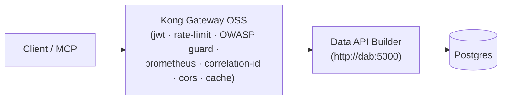

# 🛡️ gateway — Kong Gateway OSS (DB-less)

[Home](../../README.md) > **gateway**

> [!NOTE]
> Declarative `kong.yml` config for **Kong Gateway 3.x OSS** running DB-less — the
> OSS analogue of the "APIM-as-enterprise-gateway" pattern. The gateway is the
> **only** path to the data: clients reach Data API Builder (DAB) → Postgres
> exclusively through Kong. Build per **PRP §6 / §8 Phase 3**.

---

## 🗺️ Request flow



---

## ⚙️ How it loads

`kong.yml` is the canonical, committed config. It contains two placeholders that the
**identity** service renders at startup into the effective `/shared/kong.yml` that Kong
actually loads:

| Placeholder | Rendered to | Notes |
| --- | --- | --- |
| `__RSA_PUBLIC_KEY__` | The issuer's live RS256 public key | Never committed |
| `__RATE_LIMIT__` | `RATE_LIMIT_PER_MINUTE` from `.env` | Per-consumer minute cap |

```yaml
_format_version: "3.0"
_transform: true
```

---

## 🔌 Plugins

The single upstream service `artemis-dab` (`http://dab:5000`) has two routes plus
service- and global-level plugins.

### 🚏 Routes

| Route | Paths | Token required | Notes |
| --- | --- | --- | --- |
| `artemis-openapi` | `/api/openapi` | ❌ No | Public OpenAPI contract so the data product is findable. Matched before the governed route. |
| `artemis-procurement-api` | `/api/Material`, `/api/Vendor`, `/api/PurchaseOrder`, `/api/SupplyRisk`, `/graphql` | ✅ Yes | Governed data route — JWT + rate-limit + OWASP guard apply here only. |

### 🔐 Route-level plugins (governed data route)

| Plugin | Purpose |
| --- | --- |
| `jwt` | Reject no/invalid token at the edge (keyed by the `client_id` claim, verifies `exp`); request never reaches DAB. |
| `rate-limiting` | Per-consumer quota (`limit_by: consumer`, `policy: local`); `429` + `Retry-After` over the cap. |
| `pre-function` | OWASP API4:2023 control — block over-broad extraction (`$first > 200`) before it reaches DAB/Postgres. |

### 🧩 Service-level plugins (every route)

| Plugin | Purpose |
| --- | --- |
| `correlation-id` | Stamp + echo `X-Correlation-ID` (proves the call went through Kong). |
| `cors` | Lets the browser SPA call the gateway; preflight answered before `jwt` runs; exposes `X-Correlation-ID`, `Retry-After`, `RateLimit-Remaining`. |

### 🌐 Global plugins (every service/route)

| Plugin | Purpose |
| --- | --- |
| `prometheus` | Per-consumer call/latency/status/bandwidth metrics on the Kong status `/metrics` endpoint. |
| `request-size-limiting` | OWASP API4 — cap request body size (10 MB) at the edge. |
| `proxy-cache` | Cache `GET` `200` responses briefly (30s, in-memory) to cut load on the system of record; `vary_headers: Authorization` so cached data is never shared across consumers. |

---

## 👥 Consumers

Two consumers make per-consumer metering visible. Both trust the single issuer key;
Kong tells them apart by the token's `client_id` claim (`key_claim_name`).

| Consumer (`username`) | JWT key | Algorithm |
| --- | --- | --- |
| `analyst` | `analyst` | RS256 |
| `artemis-agent` | `artemis-agent` | RS256 |

---

> [!IMPORTANT]
> This is a self-contained demo. All data is **synthetic** — see
> [`docs/DISCLAIMER.md`](../../docs/DISCLAIMER.md). No real NASA data is used.
