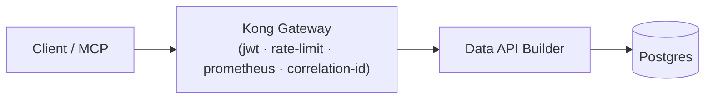

# gateway — Kong Gateway OSS (DB-less)

Declarative `kong.yml`: service → DAB, routes, plugins `jwt` + `rate-limiting` +
`prometheus` + `correlation-id` (+ one OWASP-API control). Two consumers for
per-consumer metering.

> [!NOTE]
> Build per PRP §6/§8 Phase 3.
