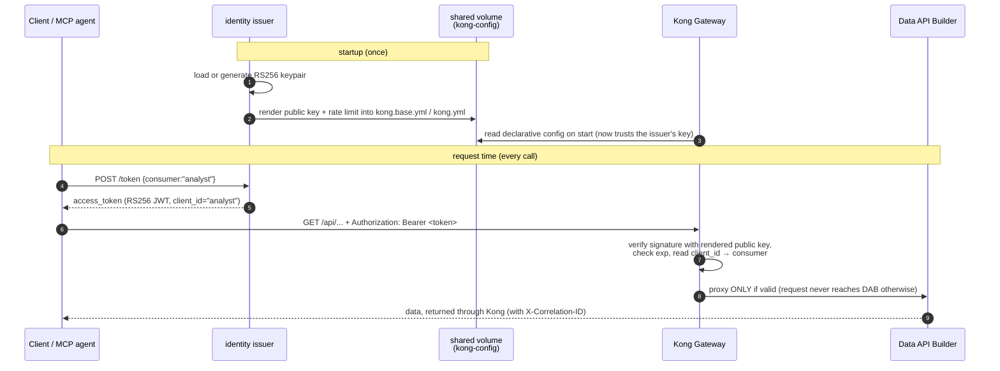

# 🔐 identity — the local stand-in for Microsoft Entra ID

[Home](../../README.md) › [Services](../) › **identity**

> [!NOTE]
> **TL;DR.** Every API in this demo is locked behind a gateway, and the gateway only lets
> a request through if it carries a valid, signed **token**. *Something* has to mint those
> tokens and *something* has to give the gateway the key it needs to check them. In a real
> Azure deployment that "something" is **Microsoft Entra ID**. On a laptop you don't want to
> stand up Entra, so this tiny service plays its part: it signs short-lived tokens with an
> **RS256** key, publishes the matching **public key** so the gateway can verify them, and —
> as a convenience — writes that public key straight into the gateway's config on startup.
> It is the *dev/test* analogue; **for the real demo you delete it and point the gateway at
> Entra.** All data in this repo is **synthetic** — see [`docs/DISCLAIMER.md`](../../docs/DISCLAIMER.md).

---

## 📑 Contents

- [Why this service exists](#-why-this-service-exists)
- [The Azure picture first: what Entra ID does](#️-the-azure-picture-first-what-entra-id-does)
- [The local analogue: what this service does](#-the-local-analogue-what-this-service-does)
- [Key concepts, defined](#-key-concepts-defined)
- [How the token is built (the `/token` shape)](#-how-the-token-is-built-the-token-shape)
- [How the public key reaches Kong (rendering `kong.yml`)](#-how-the-public-key-reaches-kong-rendering-kongyml)
- [The full flow, end to end](#-the-full-flow-end-to-end)
- [Endpoints reference](#-endpoints-reference)
- [The two demo consumers](#-the-two-demo-consumers)
- [Configuration](#️-configuration)
- [Run it: worked examples](#-run-it-worked-examples)
- [Gotchas & troubleshooting](#-gotchas--troubleshooting)
- [Where to next](#-where-to-next)

---

## 🎯 Why this service exists

The whole point of this proof-of-concept is the **API-first, zero-move** pattern: data never
leaves its system of record, and the *only* way to reach it is through a governed gateway.
A gateway that lets anyone in is not a gateway — so the gateway must be able to answer one
question on every single request: **"Who is calling, and are they allowed?"**

The standard, open way to answer that is a **bearer token**: the caller first proves its
identity to an *identity provider*, receives a signed token, and then attaches that token to
every API call. The gateway checks the signature. If the signature is valid and unexpired,
the request is trusted; otherwise it is rejected at the edge — the request never even reaches
the database.

> **In plain terms:** the token is a tamper-proof wristband. The identity service is the
> bouncer at the door who issues wristbands; the gateway (Kong) is the staff inside who
> glance at your wristband before serving you. Crucially, the staff can verify a wristband
> *without phoning the bouncer* — because the bouncer published the "what a real wristband
> looks like" reference (the public key) ahead of time.

> **Why this matters for the enterprise story:** this is exactly the OAuth2 / OpenID Connect
> pattern every enterprise already uses. By building the demo on the *same* pattern, the
> jump from "laptop" to "Azure" is a swap of *implementations*, not a redesign. You replace
> a 200-line Python file with Microsoft Entra ID and change one gateway policy. Nothing else
> about how the data is governed changes.

---

## ☁️ The Azure picture first: what Entra ID does

Because this is an Azure-first proof-of-concept, start with the real target and read the
local service as its stand-in.

In a production Azure deployment, the identity provider is **Microsoft Entra ID** (formerly
Azure Active Directory) — Azure's managed identity platform. Your API is registered as an
**app registration** with an **audience** such as `api://artemis-api`. A caller (a user, an
app, or an agent's service principal) requests a token from your **tenant** (your
organization's Entra directory), Entra signs it, and the caller presents it as a `Bearer`
token. The gateway — **Azure API Management (APIM)** — validates it with the built-in
[`validate-azure-ad-token`](https://learn.microsoft.com/azure/api-management/validate-azure-ad-token-policy)
policy, which checks the signature, issuer, audience, and expiry against Entra's published
keys.

| Concern | 🏢 Azure (the real demo) | 💻 This service (dev/test analogue) |
| --- | --- | --- |
| Identity provider | **Microsoft Entra ID** | `issuer.py` (one container) |
| App / audience | App registration, `aud = api://artemis-api` | `JWT_AUDIENCE`, default `artemis-api` |
| Who can call | Users, groups, app registrations, conditional access | A hardcoded set of two `consumer` names |
| Token signing | Entra's managed keys (rotated for you) | A local RS256 keypair (generated once) |
| Gateway validates with | APIM `validate-azure-ad-token` policy | Kong `jwt` plugin + the rendered public key |
| Key discovery | Entra's published OIDC/JWKS metadata | This service's `/.well-known/jwks.json` |

> [!TIP]
> Everything below describes the *local* service in detail. Each time you read "issuer,"
> mentally substitute "Entra ID"; each time you read "Kong," substitute "APIM." The shapes
> line up on purpose. See [`docs/AZURE-DEPLOYMENT.md` §5 — Microsoft Entra ID](../../docs/AZURE-DEPLOYMENT.md)
> for the production wiring.

---

## 🧩 The local analogue: what this service does

The implementation lives in a single file, [`issuer.py`](issuer.py), and has four jobs:

| Job | What happens | Where in the code |
| --- | --- | --- |
| **Key management** | Generate an RS256 keypair on first start and persist it; or, in Azure, load a key handed in via `JWT_PRIVATE_KEY_PEM`. | [`_load_or_create_keys()`](issuer.py) |
| **Key publication** | Expose the *public* half so anything that needs to verify a token can fetch it — as a JWKS at `/.well-known/jwks.json` and as raw PEM at `/public.pem`. | [`_jwks()`](issuer.py), `/public.pem` |
| **Token minting** | `POST /token` mints a short-lived RS256 bearer token for a named consumer. | [`issue_token()`](issuer.py) |
| **Kong config rendering** | On startup, bake the live public key (and the rate limit) into Kong's declarative config so the gateway trusts exactly these tokens. | [`_render_kong()`](issuer.py) |

The private key **never leaves the service** and **is never committed** to the repo — it is
generated at runtime into a Docker volume (or supplied at deploy time as a secret). Only the
*public* key is ever shared, which is the entire security premise of asymmetric signing.

---

## 📚 Key concepts, defined

Read this once and the rest of the document is easy. Every term below is used later.

- **JWT (JSON Web Token).** A compact, URL-safe token made of three dot-separated parts —
  `header.payload.signature`. The header and payload are just base64-encoded JSON; the
  signature is what makes it trustworthy. Anyone can *read* a JWT; only the holder of the
  private key can *forge a valid signature*.

- **Claim.** A single fact inside the token's payload, e.g. `"exp": 1718700000` ("expires
  at this time") or `"sub": "analyst"` ("the subject is the analyst"). The gateway makes
  decisions by inspecting claims.

- **RS256 (asymmetric signing).** "RSA signature with SHA-256." A **keypair**: a *private*
  key signs, a *public* key verifies. *In plain terms:* the issuer keeps the private key
  secret and uses it to stamp tokens; it hands out the public key freely so others can check
  the stamp is genuine — but the public key cannot be used to *create* a valid stamp. This
  is why Kong can validate tokens without ever holding a secret, and why this is the right
  pattern for a distributed system. (Contrast with HS256, a *symmetric* scheme where the
  same secret both signs and verifies — which would force you to share the signing secret
  with the gateway.)

- **`kid` (key ID).** A label in the JWT header naming *which* key signed it
  (here, `artemis-local-key-1`). It lets a verifier pick the right public key when several
  exist — essential during key rotation. Set in [`issue_token()`](issuer.py) via
  `headers={"kid": KID}`.

- **JWKS (JSON Web Key Set).** A small JSON document, served at the conventional URL
  `/.well-known/jwks.json`, that lists the public keys (each tagged with its `kid`) a
  verifier should trust. It is how an OIDC identity provider advertises its keys. *In plain
  terms:* "here are the public keys for the wristbands I issue — verify against these."

- **OIDC (OpenID Connect).** The open standard layered on OAuth2 that defines exactly these
  conventions (the JWKS URL, the token shape, the discovery metadata). Entra ID speaks OIDC;
  this service mimics the slice of OIDC the demo needs.

- **Consumer.** The gateway's name for a distinct caller it meters separately. Here there are
  exactly two (`analyst`, `artemis-agent`) so per-consumer traffic is visible in Grafana.

---

## 🔧 How the token is built (the `/token` shape)

A client asks for a token by POSTing a consumer name:

```bash
curl -s -X POST http://localhost:8081/token \
  -H 'Content-Type: application/json' \
  -d '{"consumer": "analyst"}'
```

`issue_token()` validates the consumer against the allow-list, then assembles the claims and
signs them. The exact claim set ([`issuer.py`](issuer.py)) is:

```python
now = int(time.time())
claims = {
    "iss": ISSUER,            # JWT_ISSUER, default https://issuer.local — who minted it
    "aud": AUDIENCE,          # JWT_AUDIENCE, default artemis-api — who it's meant for
    "sub": req.consumer,      # the subject (the consumer identity)
    "client_id": req.consumer,# ← Kong maps the call to a consumer via THIS claim
    "iat": now,               # issued-at (epoch seconds)
    "nbf": now,               # not-before (token isn't valid until now)
    "exp": now + TOKEN_TTL,   # expiry (default now + 3600s)
}
token = jwt.encode(claims, private_key, algorithm="RS256", headers={"kid": KID})
```

The HTTP response wraps the token in the standard OAuth2 shape:

```json
{
  "access_token": "<RS256 JWT — header.payload.signature>",
  "token_type": "Bearer",
  "expires_in": 3600,
  "consumer": "analyst"
}
```

> [!IMPORTANT]
> The **`client_id` claim is the load-bearing one.** Kong's `jwt` plugin is configured with
> `key_claim_name: client_id` (see [`services/gateway/kong.yml`](../gateway/kong.yml)), so
> Kong reads `client_id` from the token to decide *which consumer* made the call. That is how
> the gateway attributes traffic for per-consumer rate-limiting and Grafana metering. Change
> the claim name in one place and you must change it in both.

An **unknown consumer returns HTTP 400** with a helpful message listing the valid names —
the allow-list lives in `ALLOWED_CONSUMERS = {"analyst", "artemis-agent"}`.

> **Decode it yourself.** A JWT is not encrypted, just signed. Paste the `access_token` into
> [jwt.io](https://jwt.io) (or `python -c "import jwt,sys;print(jwt.decode(sys.argv[1], options={'verify_signature':False}))"`)
> to see the claims above in plain JSON. You'll see `client_id: "analyst"`, `aud: "artemis-api"`,
> and an `exp` one hour out. This is exactly what Kong inspects.

**The Entra analogue:** Entra builds a structurally identical token. Its `aud` is your app
registration's identifier URI (`api://artemis-api`), its `iss` is your tenant's authority
URL, and its `kid` points into Entra's published JWKS. The local service uses `client_id`
for the consumer because that is the simplest claim Kong can key on; with Entra you would
map APIM products/subscriptions or an app-role claim to the same purpose.

---

## 🗝️ How the public key reaches Kong (rendering `kong.yml`)

This is the cleverest — and most often misunderstood — part of the service, so walk through
it slowly.

Kong runs **DB-less**: it reads one declarative YAML file at startup and that file *is* its
entire configuration. To validate RS256 tokens, that file must contain the issuer's **public
key**, pasted in as a string. But the public key only exists *after* the issuer generates its
keypair — and we refuse to commit key material to git. So the public key has to be injected
into Kong's config at runtime. That injection is what `_render_kong()` does.

The repo ships a **canonical template**, [`services/gateway/kong.yml`](../gateway/kong.yml),
which is the real Kong config with two placeholders left as blanks:

| Placeholder in the template | Replaced at startup with |
| --- | --- |
| `__RSA_PUBLIC_KEY__` | The issuer's live public key (PEM, newlines escaped to `\n`) |
| `__RATE_LIMIT__` | `RATE_LIMIT_PER_MINUTE` from `.env` (default `60`) |

The placeholder appears twice in the template — once for each consumer's `jwt_secrets`:

```yaml
consumers:
  - username: analyst
    jwt_secrets:
      - key: analyst                       # ← must equal the token's client_id claim
        algorithm: RS256
        rsa_public_key: "__RSA_PUBLIC_KEY__" # ← filled in by _render_kong()
```

Note `key: analyst` — that is what ties the consumer entry to the token whose `client_id`
is `analyst`. The two consumers share the *same* public key (one issuer signs both); Kong
tells them apart purely by `client_id`.

`_render_kong()` ([`issuer.py`](issuer.py)) does the substitution and writes the result to a
**shared Docker volume** (`kong-config`, mounted at `/shared`) that Kong also mounts:

```python
escaped = public_pem.strip().replace("\n", "\\n")   # PEM newlines → literal \n for YAML
rendered = (
    KONG_TEMPLATE.read_text("utf-8")
    .replace("__RSA_PUBLIC_KEY__", escaped)
    .replace("__RATE_LIMIT__", str(RATE_LIMIT))
)
KONG_BASE.write_text(rendered)            # canonical base config
if not KONG_RENDERED.exists():
    KONG_RENDERED.write_text(rendered)    # initial effective config Kong loads
```

It writes **two** files on purpose:

- **`kong.base.yml`** — the canonical, "no dynamic sources" config.
- **`kong.yml`** — the *effective* config Kong actually loads. The issuer writes an initial
  copy so Kong has something valid to start with.

> [!NOTE]
> Why two files? Because a *second* service — the **registry** (the onboarding wizard,
> [`services/registry/README.md`](../registry/README.md)) — later adds new data sources at
> runtime. The registry reads `kong.base.yml`, merges in any dynamically-registered sources,
> and rewrites `kong.yml`. Splitting "base" from "effective" means registry-added sources
> survive a Kong restart instead of being clobbered by the issuer's startup render. The
> issuer only owns the public-key + rate-limit substitution; the registry owns source merges.

**The Azure analogue:** there is no rendering step on Azure. APIM doesn't need a copy of a
key pasted into a file — its `validate-azure-ad-token` policy fetches Entra's public keys
from Entra's published OIDC metadata automatically and caches them, handling rotation
transparently. The local render exists *only* because Kong is DB-less and the keypair is
generated at runtime. It is dev-loop plumbing, not part of the production pattern.

---

## 🔄 The full flow, end to end



> [!WARNING]
> **The issuer is on the `edge` network, not a path to data.** Minting a token does nothing
> on its own — the token is just a signed claim. The *only* way to reach Postgres/DAB is by
> presenting a valid token to **Kong**. The issuer never touches the data plane. This is the
> zero-move guarantee in action; see [`docs/ZERO-MOVE.md`](../../docs/ZERO-MOVE.md).

---

## 🌐 Endpoints reference

| Method | Path | Purpose | Notes |
| --- | --- | --- | --- |
| `GET` | `/healthz` | Liveness probe | Returns `{"status":"ok","issuer":...}`; Kong's `depends_on` waits on this. |
| `GET` | `/.well-known/jwks.json` | Published JWKS | The public key(s), tagged by `kid`, a verifier should trust. |
| `GET` | `/public.pem` | Raw public key (PEM) | `text/plain`; handy for manual inspection or scripting. |
| `POST` | `/token` | Mint a bearer token | Body `{"consumer":"analyst"}`. Unknown consumer → **400**. |

Minted token claims: `iss`, `aud`, `sub`, `client_id`, `iat`, `nbf`, `exp` — signed **RS256**
with `kid=artemis-local-key-1`.

> The service also enables permissive **CORS** (`allow_origins=["*"]`) so the local browser
> SPA can request tokens directly. This is a *local demo* convenience only — Entra + APIM
> handle browser auth with proper redirect flows in production.

---

## 👥 The two demo consumers

Exactly two callers are allowed, so per-consumer metering at the gateway is visible and the
supply-chain story has both a human and an agent persona:

| Consumer | Role in the demo | Azure analogue |
| --- | --- | --- |
| `analyst` | The Python / human client persona (the default). | A user or APIM subscription. |
| `artemis-agent` | The MCP (Model Context Protocol) agent persona. | An app registration / service principal. |

Both are hardcoded in `ALLOWED_CONSUMERS` and both have a matching entry in
[`kong.yml`](../gateway/kong.yml). To add a third, you must update **both** places.

---

## ⚙️ Configuration

All configuration is environment variables (defaults shown). In Compose these are set on the
`identity` service in [`docker-compose.yml`](../../docker-compose.yml).

| Variable | Default | Purpose |
| --- | --- | --- |
| `ISSUER_PORT` | `8081` | Port the issuer listens on. |
| `JWT_ISSUER` | `https://issuer.local` | The `iss` claim (and reported by `/healthz`). |
| `JWT_AUDIENCE` | `artemis-api` | The `aud` claim — who the token is meant for. |
| `TOKEN_TTL_SECONDS` | `3600` | Token lifetime in seconds (drives `exp` and `expires_in`). |
| `RATE_LIMIT_PER_MINUTE` | `60` | Per-consumer rate limit rendered into Kong's config. |
| `KEY_DIR` | `/shared/keys` | Where the RS256 keypair is generated/persisted (a Docker volume). |
| `JWT_PRIVATE_KEY_PEM` | _(unset)_ | Optional supplied key (raw **or** base64 PEM). Takes precedence over `KEY_DIR`. |
| `KONG_TEMPLATE` | `/app/kong.yml.tmpl` | The Kong render template (baked from `services/gateway/kong.yml` at image build). |
| `KONG_RENDERED` | `/shared/kong.yml` | The effective Kong config written to the shared volume. |
| `KONG_BASE` | `/shared/kong.base.yml` | The canonical base config the registry merges sources into. |

> [!TIP]
> **`JWT_PRIVATE_KEY_PEM` is the Azure on-ramp.** On a laptop there's a shared Docker volume,
> so the issuer can generate a key and hand the public half to Kong through `/shared`. In
> Azure Container Apps there is no shared filesystem between containers, so the *same* key is
> supplied to both sides as a **secret** at deploy time: the gateway config is baked with the
> matching public key, and the issuer loads the private key from `JWT_PRIVATE_KEY_PEM`. The
> base64 form exists because ACA secrets dislike multi-line values. (In a *full* Azure
> deployment you skip the local issuer entirely and use Entra — this env var is the bridge for
> the intermediate "Kong on Azure" edition.) See [`docs/AZURE-DEPLOYMENT.md`](../../docs/AZURE-DEPLOYMENT.md).

---

## 🚀 Run it: worked examples

The issuer is part of the **`core`** Compose profile, and Kong's `depends_on` waits on the
issuer's healthcheck, so you never start it by hand — just bring the stack up:

```bash
cp .env.example .env
make demo
```

### Example 1 — mint a token

```bash
curl -s -X POST http://localhost:8081/token \
  -H 'Content-Type: application/json' \
  -d '{"consumer": "analyst"}'
```

Expected output (the token is long; truncated here):

```json
{"access_token":"eyJhbGciOiJSUzI1NiIsImtpZCI6ImFydGVtaXMtbG9jYWwta2V5LTEifQ.eyJpc3M...","token_type":"Bearer","expires_in":3600,"consumer":"analyst"}
```

**What happened:** the issuer validated `analyst` against the allow-list, signed a JWT with
its private key, and returned it. The token is valid for one hour. Note the header segment
decodes to `{"alg":"RS256","kid":"artemis-local-key-1"}` — proof of the signing algorithm
and key id.

### Example 2 — see the public key Kong trusts

```bash
curl -s http://localhost:8081/.well-known/jwks.json
```

Expected output:

```json
{"keys":[{"kty":"RSA","use":"sig","alg":"RS256","kid":"artemis-local-key-1","n":"<big base64url modulus>","e":"AQAB"}]}
```

**What happened:** the issuer exposed its *public* key in JWKS form. `n` is the RSA modulus
and `e` (`AQAB` = 65537) the public exponent. This is the same key, in a different encoding,
that `_render_kong()` pasted into `kong.yml` so Kong can verify the token from Example 1.

### Example 3 — use the token through the gateway (the actual point)

```bash
TOKEN=$(curl -s -X POST http://localhost:8081/token \
  -H 'Content-Type: application/json' -d '{"consumer":"analyst"}' \
  | python -c "import sys,json;print(json.load(sys.stdin)['access_token'])")

curl -s -i http://localhost:8000/api/Material \
  -H "Authorization: Bearer $TOKEN" | head -20
```

Expected: an **HTTP 200** with an `X-Correlation-ID` header (proof the call went through
Kong) and a JSON page of materials. Drop the `Authorization` header and the same call
returns **401** — the request is rejected at the gateway and never reaches DAB.

**Stack:** Python 3.11 · FastAPI · PyJWT (`pyjwt[crypto]`) · cryptography · uvicorn, on
`python:3.11-slim`. The image is built from the **repo root** so the canonical
`services/gateway/kong.yml` can be baked in as the render template (see [`Dockerfile`](Dockerfile)).

---

## 🩹 Gotchas & troubleshooting

> [!WARNING]
> Most "401 from Kong" problems trace back to a key mismatch or an expired token. Work down
> this list.

| Symptom | Likely cause | Fix |
| --- | --- | --- |
| `POST /token` → **400** | Consumer name isn't `analyst` or `artemis-agent`. | Use one of the two allowed names; the 400 body lists them. |
| Kong returns **401** on every call | The public key in `kong.yml` doesn't match the issuer's current private key — usually a stale keypair after a volume reset, or the issuer regenerated a key while Kong kept the old config. | `docker compose down -v && make demo` to regenerate the keypair *and* re-render Kong together. |
| Kong returns **401** after a while on a token that *used* to work | The token expired (`exp` past — default TTL 3600s). | Mint a fresh token. Raise `TOKEN_TTL_SECONDS` for longer demos. |
| Kong **429** | You exceeded `RATE_LIMIT_PER_MINUTE` for that consumer. This is the rate-limit demo working. | Wait for the window, or raise `RATE_LIMIT_PER_MINUTE` and restart. |
| `kong.yml` never appears in `/shared` | The render template wasn't found at `KONG_TEMPLATE`; the issuer logs `kong template ... not found; skipping render`. | Ensure the image was built from the repo root so `kong.yml.tmpl` is baked in. |
| Registry-added source vanished after Kong restart | Something overwrote `kong.yml` from base without the source. | The base/effective split prevents this; confirm the registry is running and re-merging. See [`services/registry/README.md`](../registry/README.md). |

---

## 🧭 Where to next

- **[`services/gateway/kong.yml`](../gateway/kong.yml)** — the template this service renders;
  see where `__RSA_PUBLIC_KEY__` lands and how the `jwt` plugin uses `client_id`.
- **[`services/gateway/README.md`](../gateway/README.md)** — the gateway side of the auth story
  (JWT, rate-limit, correlation-id, OWASP guards).
- **[`services/registry/README.md`](../registry/README.md)** — why there are two Kong config
  files and who owns the merge.
- **[`docs/ZERO-MOVE.md`](../../docs/ZERO-MOVE.md)** — why the issuer is never a data path.
- **[`docs/AZURE-DEPLOYMENT.md`](../../docs/AZURE-DEPLOYMENT.md)** — replacing this service with
  Microsoft Entra ID + APIM for the real demo.
- **[`docs/GLOSSARY.md`](../../docs/GLOSSARY.md)** — every term used here, defined in one place.
