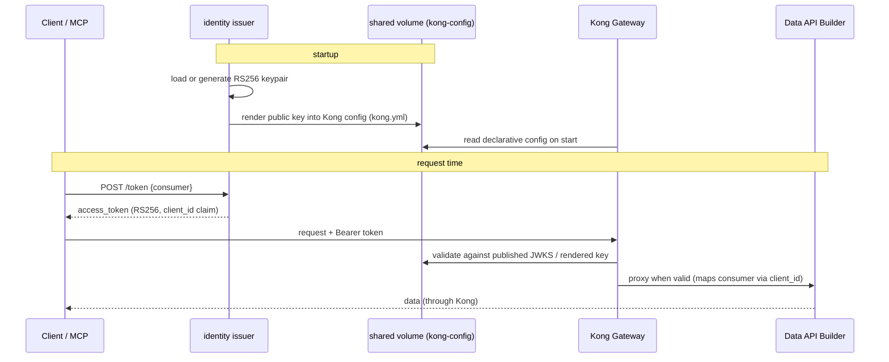

# 🔐 identity — local OIDC/JWT issuer (stands in for Microsoft Entra ID)

[Home](../../README.md) > **identity**

Minimal RS256 issuer that mints short-lived bearer tokens for the demo consumers and
publishes the public key Kong uses to validate them. It stands in for Microsoft Entra ID
in this fully-local proof-of-concept, and **never commits any key material**.

> [!NOTE]
> Built per **PRP §3 / §8 Phase 3**. All data in this repo is **synthetic** — see
> [`docs/DISCLAIMER.md`](../../docs/DISCLAIMER.md).

## 📑 Contents

- [What it does](#-what-it-does)
- [Endpoints](#-endpoints)
- [How tokens flow to Kong](#-how-tokens-flow-to-kong)
- [Consumers](#-consumers)
- [Configuration](#-configuration)
- [Run it](#-run-it)

## 🎯 What it does

| Responsibility | Detail |
| --- | --- |
| Key management | Generates (or loads) an RS256 keypair; persists it to `KEY_DIR` (default `/shared/keys`), or loads a provided key from `JWT_PRIVATE_KEY_PEM` (raw or base64 PEM — used for Azure). |
| JWKS publication | Serves the public key as a JWKS at `/.well-known/jwks.json` and as raw PEM at `/public.pem`. |
| Token minting | `POST /token` mints short-lived RS256 bearer tokens (TTL `TOKEN_TTL_SECONDS`, default 3600s) for the demo consumers. |
| Kong config rendering | On startup, renders the live public key and rate limit into Kong's declarative config so the gateway validates these exact tokens. |

The token's `client_id` claim carries the consumer id; Kong's `jwt` plugin uses it
(`key_claim_name=client_id`) to map each call to a consumer for per-consumer metering.

## 🌐 Endpoints

| Method | Path | Purpose |
| --- | --- | --- |
| `GET` | `/healthz` | Liveness probe — returns `{"status": "ok", "issuer": ...}`. |
| `GET` | `/.well-known/jwks.json` | Published JWKS (the public key Kong validates against). |
| `GET` | `/public.pem` | Raw public key in PEM form (`text/plain`). |
| `POST` | `/token` | Mint a bearer token. Body: `{"consumer": "analyst"}`. |

A successful `POST /token` returns:

```json
{
  "access_token": "<RS256 JWT>",
  "token_type": "Bearer",
  "expires_in": 3600,
  "consumer": "analyst"
}
```

An unknown consumer returns **HTTP 400**.

Minted token claims: `iss`, `aud`, `sub`, `client_id`, `iat`, `nbf`, `exp` — signed
RS256 with `kid=artemis-local-key-1`.

## 🔄 How tokens flow to Kong



> [!NOTE]
> The issuer writes the canonical base config (`kong.base.yml`) and an initial effective
> config (`kong.yml`) to the shared volume. The **registry** service later merges
> dynamic sources into `kong.yml`, so registry-added sources survive a Kong restart.

## 👥 Consumers

Exactly two demo consumers are allowed (per-consumer metering at the gateway):

| Consumer | Role in the demo |
| --- | --- |
| `analyst` | The Python/human client persona (default). |
| `artemis-agent` | The MCP agent persona. |

## ⚙️ Configuration

Environment variables (defaults shown):

| Variable | Default | Purpose |
| --- | --- | --- |
| `ISSUER_PORT` | `8081` | Port the issuer listens on. |
| `JWT_ISSUER` | `https://issuer.local` | `iss` claim. |
| `JWT_AUDIENCE` | `artemis-api` | `aud` claim. |
| `TOKEN_TTL_SECONDS` | `3600` | Token lifetime. |
| `RATE_LIMIT_PER_MINUTE` | `60` | Rate limit rendered into Kong's config. |
| `KEY_DIR` | `/shared/keys` | Where the RS256 keypair is persisted. |
| `JWT_PRIVATE_KEY_PEM` | _(unset)_ | Optional provided key (raw or base64 PEM); takes precedence over `KEY_DIR`. |
| `KONG_TEMPLATE` | `/app/kong.yml.tmpl` | Kong config render template (baked from `services/gateway/kong.yml`). |
| `KONG_RENDERED` | `/shared/kong.yml` | Effective Kong config written to the shared volume. |
| `KONG_BASE` | `/shared/kong.base.yml` | Canonical base config the registry merges sources into. |

## 🚀 Run it

The issuer is part of the `core` Compose profile and Kong waits on its healthcheck —
just bring the stack up:

```bash
cp .env.example .env
make demo
```

Mint a token directly against the issuer:

```bash
curl -s -X POST http://localhost:8081/token \
  -H 'Content-Type: application/json' \
  -d '{"consumer": "analyst"}'
```

Stack: **Python 3.11 · FastAPI · PyJWT · cryptography · uvicorn** (`python:3.11-slim`).
