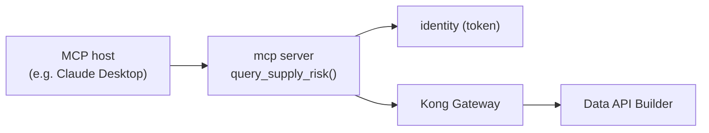

# mcp — MCP server (agent consumer)

One MCP tool `query_supply_risk(program, min_delay)`: gets a token from identity,
calls Kong, returns the ranked rows. Document how to point an MCP host
(e.g. Claude Desktop) at it.

> [!NOTE]
> Build per PRP §6/§8 Phase 5.
