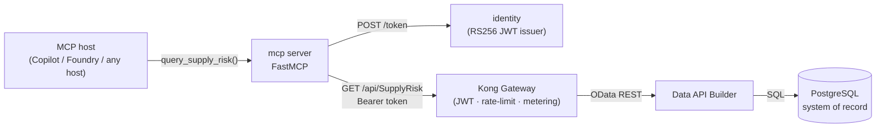

# 🤖 mcp — MCP server (agent consumer)

[Home](../../README.md) > **mcp**

[](https://modelcontextprotocol.io)
[](https://www.python.org)
[](../../docs/ZERO-MOVE.md)

> [!NOTE]
> **TL;DR** — This service exposes a single MCP tool, `query_supply_risk`, that lets an
> MCP host (GitHub Copilot, Azure AI Foundry, …) answer the Artemis supply-chain
> question by reaching the **governed gateway surface**: it fetches a bearer token from
> the local identity issuer and calls **Kong**, never the database. The same governed
> answer a human gets is the answer the agent gets. All data is **synthetic** — see
> [`docs/DISCLAIMER.md`](../../docs/DISCLAIMER.md).

---

## 📑 Table of contents

- [What it does](#-what-it-does)
- [Flow](#-flow)
- [The tool: `query_supply_risk`](#-the-tool-query_supply_risk)
- [Configuration](#-configuration)
- [Transports](#-transports)
- [Pointing an MCP host at it](#-pointing-an-mcp-host-at-it)
- [Smoke client](#-smoke-client)
- [Files](#-files)

---

## 🎯 What it does

The MCP server registers one tool — `query_supply_risk(program, min_delay, criticality,
sole_source_only)` — that builds an OData `$filter`/`$orderby` query, obtains a token from
the identity issuer, and calls Kong's `/api/SupplyRisk` route. The gateway authenticates,
rate-limits, and meters the call; the ranked rows are returned to the agent along with the
gateway correlation id, so an agent's answer is provably the same governed surface a human
consumer sees.

> [!IMPORTANT]
> The tool only ever talks to **identity** and **Kong** — both on the `edge` network. It
> has no route to Postgres or Data API Builder (those live on the `internal` network).
> This is the zero-move guarantee in action; see [`docs/ZERO-MOVE.md`](../../docs/ZERO-MOVE.md).

---

## 🔀 Flow



---

## 🛠 The tool: `query_supply_risk`

Find high supply-risk materials for an Artemis program, through the gateway — e.g.
"which `Critical`, sole-source materials on `Artemis-3` have an average delay > 30 days?".

| Argument | Type | Default | Meaning |
| --- | --- | --- | --- |
| `program` | `str` | `"Artemis-3"` | Artemis program (e.g. `"Artemis-3"`, `"Gateway"`, `"Moon-Base"`). |
| `min_delay` | `int` | `30` | Minimum average delay in days (exclusive). |
| `criticality` | `str` | `"Critical"` | `"Critical"` \| `"Essential"` \| `"Routine"`; empty string for any. |
| `sole_source_only` | `bool` | `true` | Restrict to single-source materials. |

The tool returns a structured payload:

```json
{
  "question": "Critical sole-source materials on Artemis-3 with average delay > 30 days",
  "consumer": "artemis-agent",
  "gateway_correlation_id": "…",
  "count": 0,
  "materials": [],
  "note": "Answered through the Kong gateway; data never left Postgres."
}
```

Under the hood it composes an OData query against the `SupplyRisk` entity and orders by
`risk_score desc`:

```text
GET {KONG}/api/SupplyRisk?$filter=program eq 'Artemis-3' and avg_delay_days gt 30 and criticality eq 'Critical' and sole_source eq true&$orderby=risk_score desc
```

---

## ⚙️ Configuration

Read from environment variables (defaults shown match `docker-compose.yml`):

| Variable | Default | Purpose |
| --- | --- | --- |
| `MCP_PORT` | `8090` | Port the server binds (streamable-http) and `/healthz` listen. |
| `KONG_INTERNAL_URL` | `http://kong:8000` | Gateway proxy URL the tool calls. |
| `IDENTITY_INTERNAL_URL` | `http://identity:8081` | Identity issuer for `POST /token`. |
| `MCP_CONSUMER` | `artemis-agent` | Consumer identity requested from the issuer / metered by Kong. |
| `MCP_TRANSPORT` | `streamable-http` | Transport at startup (`streamable-http` or `stdio`). |
| `MCP_URL` | `http://localhost:8090/mcp` | Used by `smoke_client.py` to reach the server. |

---

## 🚇 Transports

| Transport | When | Endpoint |
| --- | --- | --- |
| `streamable-http` (default) | How the container runs under Docker Compose. | `/mcp`; also serves `GET /healthz`. |
| `stdio` | How a desktop MCP host launches it locally. | stdio pipes (set `MCP_TRANSPORT=stdio`). |

---

## 🔌 Pointing an MCP host at it

For a desktop MCP host that launches servers over **stdio**, run
the server with `MCP_TRANSPORT=stdio` and point the host's config at the command. A host
config entry looks like:

```json
{
  "mcpServers": {
    "artemis-supply-chain": {
      "command": "python",
      "args": ["services/mcp/server.py"],
      "env": {
        "MCP_TRANSPORT": "stdio",
        "KONG_INTERNAL_URL": "http://localhost:8000",
        "IDENTITY_INTERNAL_URL": "http://localhost:8081"
      }
    }
  }
}
```

> [!TIP]
> When the stack is up via `docker compose --profile core up -d`, the server is already
> running over streamable-http on `${MCP_PORT:-8090}`. Hosts that speak streamable-http
> can connect directly to `http://localhost:8090/mcp` with no extra process.

---

## 🔥 Smoke client

`smoke_client.py` connects over streamable-http to the server's `/mcp` endpoint, lists the
advertised tools, calls `query_supply_risk` for `Artemis-3` / `min_delay=30`, and prints
the ranked materials with the gateway correlation id. `make demo` uses it to prove an
agent gets the **same** governed answer over MCP. It exits non-zero if no materials are
returned.

```bash
python services/mcp/smoke_client.py
```

---

## 📂 Files

| File | Purpose |
| --- | --- |
| `server.py` | FastMCP server; defines `query_supply_risk` and `/healthz`. |
| `smoke_client.py` | Streamable-http client used by `make demo` to verify the tool. |
| `requirements.txt` | `mcp`, `httpx`, `uvicorn`, `starlette`. |
| `Dockerfile` | Builds the service image; runs `python server.py`, exposes `8090`. |

> [!NOTE]
> Build per PRP §6/§8 Phase 5.
