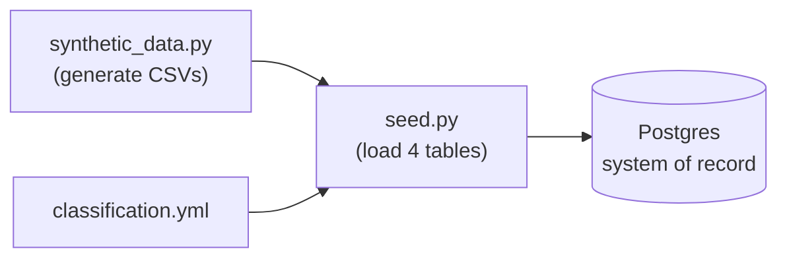

# seeder

Builds the synthetic Artemis CSVs (via `data/synthetic_data.py`), applies
`data/classification.yml` as Postgres column comments, and loads the four tables.

> [!NOTE]
> Build per PRP §4 (`schema.sql`, `seed.py`, `Dockerfile`) + §7 Phase 1.
