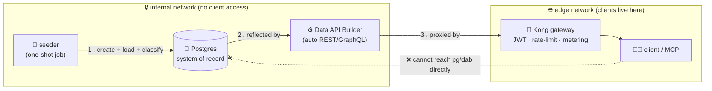
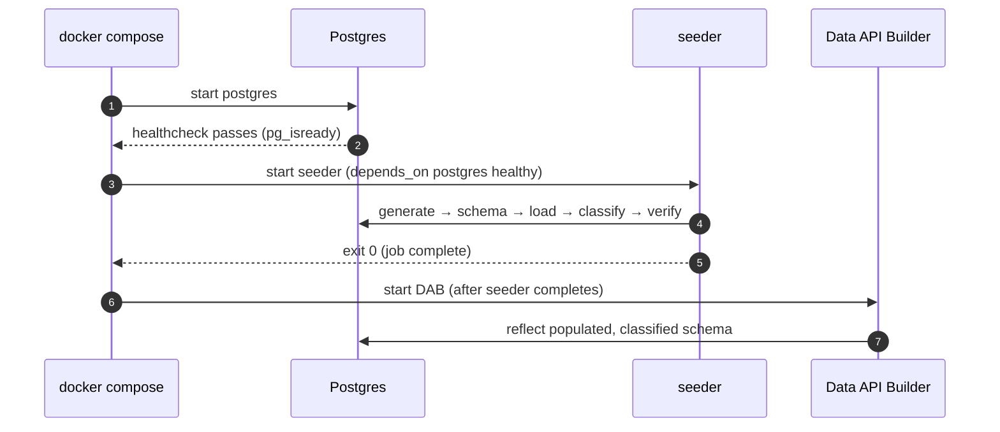
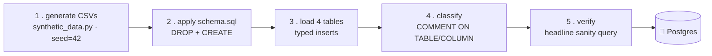
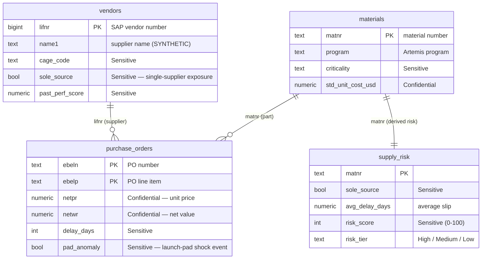

# 🌱 seeder — load the system of record, classify *before* you expose it

[Home](../../README.md) › [services](../) › **seeder**

> [!NOTE]
> **TL;DR** — The `seeder` is a **one-shot job** (it runs once, prints a summary, then
> exits). It generates the **synthetic** Artemis procurement dataset, creates the four
> Postgres tables, loads them, and — critically — **stamps every table and column with a
> sensitivity label _before_ any API ever sees the data**. That last step is the whole
> point: in a real enterprise you *classify data before you expose it*, never after. By
> the time Data API Builder (the auto-API) starts, the system of record is populated,
> typed, and governed. All data is synthetic — see
> [`docs/DISCLAIMER.md`](../../docs/DISCLAIMER.md).

---

## 📑 Contents

- [Why this service exists](#-why-this-service-exists)
- [Where it sits in the bigger picture](#-where-it-sits-in-the-bigger-picture)
- [The pipeline, step by step](#-the-pipeline-step-by-step)
- [The schema you are loading](#-the-schema-you-are-loading)
- [Classification: classify *before* exposure](#-classification-classify-before-exposure)
- [The headline sanity query](#-the-headline-sanity-query)
- [Files in this service](#-files-in-this-service)
- [Configuration](#-configuration)
- [Run it yourself](#-run-it-yourself)
- [Gotchas & troubleshooting](#-gotchas--troubleshooting)
- [Where to next](#-where-to-next)

---

## 🎯 Why this service exists

Every data platform needs a **system of record (SoR)** — the one authoritative, durable
copy of the data that everything else reads from. In this proof-of-concept that SoR is a
PostgreSQL database standing in for an SAP procurement system. But an empty database
proves nothing. Something has to:

1. **put data in it** (so the demo has something to query), and
2. **govern that data** (so we can prove the "classify-before-exposure" discipline that
   enterprise data teams live by).

The `seeder` does both, exactly once, at stack startup. It is deliberately a **batch /
one-shot job** rather than a long-running service: it builds the world, verifies it, and
gets out of the way.

> **In plain terms:** think of the seeder as the stage crew that sets up the set before
> the play begins. It runs before the audience (the API consumers) arrives, arranges
> everything, double-checks one key prop is in place, and then leaves. The actors (Data
> API Builder, Kong, the catalog) take it from there.

> **Why this matters:** the headline claim of this whole POC is **zero-move** — clients
> never get a copy of the data; they query it in place through a gateway. For that claim
> to be credible, the data has to be *real data in a real database with real governance
> labels attached*, not a mock. The seeder is what makes the SoR real.

### ☁️ The Azure framing (read this first)

This POC's **primary story is Azure**. You run it locally with Docker so you can develop
and test fast, but the local OSS pieces are stand-ins for managed Azure services. The
seeder maps cleanly onto an Azure-native pattern:

| Local (this service) | Azure equivalent | What it does in the enterprise story |
| --- | --- | --- |
| One-shot Docker `seeder` job | An **Azure Container Apps job** or deployment pipeline step | Runs schema + load once, on demand or on a schedule |
| PostgreSQL container (the SoR) | **Azure Database for PostgreSQL — Flexible Server** | The durable, governed source of truth |
| `classification.yml` → `COMMENT ON COLUMN` | **Microsoft Purview** sensitivity labels & data map | Classify columns *before* they are published to consumers |
| `synthetic_data.py` generator | A controlled **synthetic-data** or ETL ingestion step | Lands data into the SoR without touching real CUI/ITAR records |

> [!TIP]
> When you read "applies a sensitivity label as a Postgres `COMMENT`", mentally translate
> it to "**this is what Purview classification would do** in Azure." The local mechanism
> is humble (a SQL comment); the *discipline* it demonstrates is exactly the enterprise
> one. **Microsoft Purview** is Azure's unified data-governance service — it catalogs data
> assets and attaches sensitivity classifications to them.

---

## 🗺️ Where it sits in the bigger picture

The seeder lives on the **`internal`** Docker network alongside Postgres and Data API
Builder (DAB). That network has `internal: true` set in `docker-compose.yml`, meaning it
has **no route to the outside world** and is unreachable from the client-facing `edge`
network. This is the structural guarantee behind zero-move: the *only* path from a client
to the data is through the Kong gateway.



The startup ordering is enforced by Docker Compose health conditions, so the steps always
happen in the right order:



> [!IMPORTANT]
> DAB intentionally starts **only after the seeder finishes**. If DAB started against an
> empty database it would reflect an empty schema, and the auto-generated API would have
> nothing to serve. The one-shot ordering guarantees the API always reflects a populated,
> classified SoR.

---

## 🔁 The pipeline, step by step

The seeder runs five phases in a strict order. The order *is* the lesson:
**you classify before you expose, never after.**



Walk through what each phase does and *why* it is where it is — every numbered step below
corresponds to a section of [`seed.py`](seed.py):

1. **Generate the deterministic CSVs.** `main()` calls
   `generate_artemis_procurement(OUT_DIR, seed=42)` from
   [`data/synthetic_data.py`](../../data/synthetic_data.py). The seed makes generation
   **deterministic** — the same seed always produces byte-identical data, so the demo is
   reproducible and the headline answer is stable. The seeder **does not rewrite** this
   generator; it only calls it.
   *In plain terms: "make the world, and make it the same world every time."*

2. **Apply the schema, idempotently.** It executes [`schema.sql`](schema.sql), which is
   `DROP TABLE IF EXISTS …` followed by `CREATE TABLE …`. Because it drops first, you can
   run the seeder any number of times and always land in a clean, known state — that is
   what **idempotent** means (running it once or ten times gives the same result).

3. **Load the four tables with correct typing.** `load_table()` reads each CSV with
   Python's `csv.DictReader` and converts each value through a small per-column converter
   (`_int`, `_num`, `_date`, `_bool`, `_text`) before a batched `executemany` insert.
   This is where SAP's text conventions become real Postgres types — e.g. SAP's `"X"`/`""`
   boolean flag becomes a real `BOOLEAN` via `_bool` (`v.strip().upper() == "X"`), and an
   empty string becomes `NULL` rather than `""`.

4. **Classify — apply sensitivity labels.** `apply_classification()` reads
   [`data/classification.yml`](../../data/classification.yml) and writes the labels into
   Postgres as `COMMENT ON TABLE` / `COMMENT ON COLUMN` statements. **This happens inside
   the same transaction, before the data is ever exposed.** (Details below.)

5. **Verify with the headline sanity query.** Before committing, the seeder runs the exact
   supply-risk question the demo is built to answer and prints the result, so a human can
   confirm at a glance that the data is right. (Details below.)

All of steps 2–5 run inside a **single transaction** (`conn.autocommit = False`): the
seeder commits only if every step succeeds, and rolls back the whole thing on any error.
So you never end up with a half-loaded or partially-classified database.

> [!IMPORTANT]
> This is a **one-shot job**, wired into Compose as the `seeder` service (or `make seed`).
> It exits as soon as it finishes — a healthy seeder is a *stopped* seeder with exit code
> `0`, not a running container.

---

## 🧱 The schema you are loading

Four tables model an SAP procurement system. The shapes deliberately mirror real SAP
tables (the names in parentheses are SAP's own table names) so the example feels authentic
to anyone who has worked with SAP procurement data — but **every row is synthetic**.

| Table | CSV source | SAP analogue | What it holds |
| --- | --- | --- | --- |
| `vendors` | `artemis_vendors.csv` | **LFA1** (vendor master) | Suppliers: CAGE code, region, sole-source & small-business flags, past-performance score |
| `materials` | `artemis_materials.csv` | **MARA** (material master) | Parts by family/program/criticality, standard lead time, standard unit cost |
| `purchase_orders` | `artemis_purchase_orders.csv` | **EKKO/EKPO** (PO header+line) | Orders with promised vs. actual delivery, delay days, pad-anomaly flag |
| `supply_risk` | `artemis_supply_risk.csv` | *derived* | Per-material risk score & tier computed from sole-source + criticality + delay history |



A few design decisions worth understanding, because they ripple downstream:

- **Column names are lowercase on purpose.** SAP uses uppercase field names (`MATNR`,
  `LIFNR`). The schema lowercases them (`matnr`, `lifnr`) so that **Data API Builder
  exposes lowercase REST/GraphQL fields**, which the OData-style headline query then uses
  directly. (**OData** is an open query convention layered over REST — it lets you filter
  with URL parameters like `$filter=program eq 'Artemis-3'`.) If you renamed a column
  here, you would change the public API surface. The mapping from SAP header → DB column
  lives in the `TABLES` dict in [`seed.py`](seed.py).
- **`supply_risk` is a *materialized* table, not a database view.** In a production system
  you might compute risk on the fly with a SQL view. Here it is pre-computed by the
  generator and loaded as an ordinary table, which keeps the demo's headline query fast
  and its result deterministic.
- **`purchase_orders` has a composite primary key** `(ebeln, ebelp)` — PO number plus line
  item — matching SAP's EKKO (header) / EKPO (line) split, even though this dataset uses
  one line per order for simplicity.
- **Indexes are created for the query paths the demo actually uses** — `program`, `matnr`,
  and `risk_tier` — so the headline query and the API filters stay snappy.

---

## 🏷️ Classification: classify *before* exposure

This is the most important idea in the service, so it gets its own section.

**The principle:** in a governed enterprise you decide *how sensitive each piece of data
is* **before** you make it queryable — not after someone has already pulled it. If you
classify after exposure, you have already lost control of the data. This is the discipline
**Microsoft Purview** enforces in Azure; the seeder demonstrates the same discipline with
a deliberately simple local mechanism.

**The mechanism.** `apply_classification()` in [`seed.py`](seed.py) reads
[`data/classification.yml`](../../data/classification.yml) and, for every table and
column, writes the label into Postgres metadata:

```python
# (simplified from seed.py — uses psycopg.sql to build the statement safely)
cur.execute(
    sql.SQL("COMMENT ON TABLE {} IS {}").format(
        sql.Identifier(table),
        sql.Literal(f"Sensitivity: {label}"),
    )
)
# …then one COMMENT ON COLUMN per labelled column.
```

So the label literally travels **with the system of record**, in the database's own
catalog, where any downstream consumer (DAB, the catalog service, Purview) can read it.
`COMMENT ON TABLE`/`COMMENT ON COLUMN` is standard SQL for attaching a human-readable note
to a database object; here we repurpose it as a governance-label carrier.

**The labels.** `classification.yml` uses three levels — **Routine**, **Sensitive**,
**Confidential** — with a `default_label` of `Routine`. A column with no explicit entry
inherits its table's label; a table with no entry inherits the dataset default. Some
representative classifications, straight from the manifest:

| Object | Label | Why |
| --- | --- | --- |
| `purchase_orders` (table) | **Confidential** | Procurement records as a whole are the most sensitive asset |
| `materials.std_unit_cost_usd` | **Confidential** | Unit cost is competitively sensitive |
| `purchase_orders.netpr` / `netwr` | **Confidential** | Net price and net value per order |
| `vendors.sole_source` | **Sensitive** | Single-supplier exposure is a real supply-chain risk |
| `materials.criticality` | **Sensitive** | Mission-criticality of a part |
| `vendors.name1`, `materials.matnr` | **Routine** | Identifiers and names, safe to share broadly |

> [!NOTE]
> The label safety detail: `apply_classification()` lowercases each column name
> (`sql.Identifier(col.lower())`) before applying the comment, because `classification.yml`
> uses SAP's uppercase names (`SOLE_SOURCE`) while the actual Postgres columns are
> lowercase (`sole_source`). It also degrades gracefully — if `classification.yml` is
> missing, it logs a warning and skips labelling rather than crashing the whole load.

> **Why this matters:** later in the demo, the **catalog** service surfaces these same
> labels, and you can tell a coherent governance story end to end: "this column was marked
> Confidential at the source, before any API existed, and that label followed it all the
> way to the consumer." That is the Purview pattern, proven locally.

---

## 🔎 The headline sanity query

The final phase runs the **one business question this entire POC exists to answer**, and
prints the result so a human can verify the data immediately. It is both a self-test and a
preview of the demo's punchline.

The question, in English: *"On the **Artemis-3** program, which **Critical**,
**sole-source** materials are slipping their schedule by **more than 30 days** on
average?"* That is a textbook supply-chain risk: a mission-critical part you can only buy
from one supplier, and that supplier is consistently late.

The exact SQL the seeder runs against the SoR (from [`seed.py`](seed.py)):

```sql
SELECT matnr, maktx, risk_score, avg_delay_days
FROM supply_risk
WHERE program = 'Artemis-3' AND criticality = 'Critical'
  AND sole_source = TRUE AND avg_delay_days > 30
ORDER BY risk_score DESC;
```

Notice the four filter columns — `program`, `criticality`, `sole_source`, `avg_delay_days`
— are exactly the columns the public API's OData filter targets later:

```text
$filter=program eq 'Artemis-3' and criticality eq 'Critical'
        and sole_source eq true and avg_delay_days gt 30
```

> **Why this matters:** running the *same* logical query directly against the SoR here, and
> later through Kong as a consumer, is what proves the zero-move promise: the consumer gets
> the **identical answer** as a direct database query, but without ever copying or even
> reaching the database. The seeder's printout is your "ground truth" to check the gateway
> answer against.

### Worked example: run the seeder and read the output

Bring up the core stack (which runs the seeder as part of startup):

```bash
cp .env.example .env
docker compose --profile core up -d
```

Then watch just the seeder's logs:

```bash
docker compose logs seeder
```

**Expected output** (row counts are deterministic for `seed=42`; the exact headline rows
are whatever the seeded data produces, but the *shape* is fixed):

```text
INFO seeder generating synthetic Artemis dataset (seed=42) -> /tmp/artemis_out
INFO seeder generated counts: {'vendors': 120, 'materials': 600, 'purchase_orders': 10000, ...}
INFO seeder applying schema.sql
INFO seeder loaded 120 rows into vendors
INFO seeder loaded 600 rows into materials
INFO seeder loaded 10000 rows into purchase_orders
INFO seeder loaded <N> rows into supply_risk
INFO seeder applied <M> sensitivity labels (table + column comments)
INFO seeder Artemis-3 Critical sole-source >30d slips (from SoR): [(...)]

=== Seed complete (synthetic data; classify-before-exposure applied) ===
  vendors           120 rows
  materials         600 rows
  purchase_orders 10000 rows
  supply_risk      <N> rows
  headline high-risk rows: <K> -> [(...)]
```

**What each part tells you:**

- The three `INFO … loaded` lines confirm the **load** phase put the expected counts in
  (120 vendors, 600 materials, 10,000 POs — the generator's defaults).
- `applied <M> sensitivity labels` confirms the **classify** phase ran — that is the
  classify-before-exposure step landing in the database.
- The `headline … rows` line is the **verify** phase: a non-zero count means the SoR
  genuinely contains the high-risk Artemis-3 materials the demo will surface through the
  gateway. If this were `0`, the demo would have nothing to show, and you would know
  immediately, right here, before anything else started.

---

## 🗂️ Files in this service

| File | Purpose |
| --- | --- |
| [`seed.py`](seed.py) | Entry point. Orchestrates generate → schema → load → classify → verify, all in one transaction. |
| [`schema.sql`](schema.sql) | Idempotent `DROP`/`CREATE` for the four tables. Lowercase columns (for DAB), indexes for the demo's query paths. |
| [`requirements.txt`](requirements.txt) | Minimal deps: `psycopg[binary]` (Postgres driver) and `PyYAML` (to read `classification.yml`). |
| [`Dockerfile`](Dockerfile) | Builds the one-shot job. **Build context is the repo root** so it can copy in the shared `data/` files. |

> [!NOTE]
> `synthetic_data.py` and `classification.yml` live in [`data/`](../../data/), not in this
> folder. The `Dockerfile` copies them into the image at build time (`COPY
> data/synthetic_data.py ./synthetic_data.py`), which is why the build context must be the
> repo root, not `services/seeder/`. If you ever build this image by hand, run
> `docker build -f services/seeder/Dockerfile .` from the repo root.

---

## ⚙️ Configuration

All configuration is via environment variables, which Compose injects from your `.env`
(see [`.env.example`](../../.env.example)). The defaults below let the seeder talk to the
Postgres container on the `internal` network.

| Variable | Default | Purpose |
| --- | --- | --- |
| `POSTGRES_HOST` | `postgres` | Postgres host (the Compose service name) |
| `POSTGRES_PORT` | `5432` | Postgres port |
| `POSTGRES_DB` | `procurement` | Target database |
| `POSTGRES_USER` | `artemis` | Connection user |
| `POSTGRES_PASSWORD` | `artemis_local_demo` | Connection password (**local demo only** — never a real secret) |
| `SYNTHETIC_SEED` | `42` | Deterministic generation seed; change it to get a different (but still reproducible) dataset |
| `SEED_OUT_DIR` | `/tmp/artemis_out` | Where the generated CSVs are written inside the container |

> [!WARNING]
> `artemis_local_demo` is a throwaway password for a database that lives only on the
> internal Docker network and is never exposed. In Azure you would source the connection
> string from **Azure Key Vault** (or a managed identity against Azure Database for
> PostgreSQL) — never a literal in a config file.

**Startup resilience.** `connect_with_retry()` tries to connect **30 times, 2 seconds
apart** (a 60-second window) before giving up. This lets the seeder start alongside
Postgres and simply wait out the database's warm-up, even though Compose's
`depends_on: condition: service_healthy` already gates it on the Postgres healthcheck. Belt
and suspenders: the healthcheck handles the normal case, the retry loop handles the edge
cases.

---

## 🚀 Run it yourself

You have three ways to run the seeder, depending on what you are doing:

| Goal | Command | Notes |
| --- | --- | --- |
| Full demo (recommended) | `make demo` | Brings up the whole stack; the seeder runs as part of startup. |
| Just (re)seed the database | `make seed` | Runs only the seeder job against a running Postgres. |
| Manual, low-level | `docker compose --profile core run --rm seeder` | Runs the one-shot job ad hoc and removes the container after. |

To re-seed from scratch (because the schema is idempotent, this is always safe):

```bash
docker compose --profile core run --rm seeder
```

**Expected:** the same five-phase log output shown above, ending in
`=== Seed complete … ===` and exit code `0`.

---

## 🛠️ Gotchas & troubleshooting

> [!WARNING]
> These are the failure modes you are most likely to hit, and what they mean.

- **Seeder exits `0` but the container isn't running.** That is *correct* — it is a
  one-shot job. `docker compose ps` will show it as `Exited (0)`. A *running* seeder hours
  later would be the bug.
- **`could not connect to postgres after 30 attempts`.** Postgres never became healthy
  inside the retry window. Check `docker compose logs postgres` — usually the volume is in
  a bad state. `docker compose down -v` (which removes the `pgdata` volume) and start over.
- **`headline high-risk rows: 0`.** The seeded data produced no matching Artemis-3 rows.
  With the default `SYNTHETIC_SEED=42` this should not happen; if you changed the seed, a
  different dataset can legitimately produce zero. Reset `SYNTHETIC_SEED=42` to restore the
  canonical demo data.
- **`no classification.yml found; skipping labels`.** The image was built without
  `data/classification.yml`, almost always because it was built with the wrong build
  context. Rebuild from the repo root (`docker build -f services/seeder/Dockerfile .`).
- **DAB shows an empty/old schema.** The seeder didn't finish before DAB started, or you
  re-seeded without restarting DAB. Restart DAB so it re-reflects the current schema.
- **Re-running seems to wipe my data.** By design — `schema.sql` drops the tables first.
  The seeder is meant to produce a clean, known state every time, not to append.

---

## 🧭 Where to next

- [`services/dab/README.md`](../dab/README.md) — **Data API Builder** reflects the schema
  this service loads and auto-generates the REST/GraphQL API (Azure analogue: Container
  Apps hosting DAB / API Management).
- [`services/catalog/README.md`](../catalog/README.md) — the **catalog** surfaces the
  sensitivity labels this service applied (Azure analogue: **Microsoft Purview**).
- [`services/gateway/README.md`](../gateway/README.md) — **Kong** is the only path to the
  data; it is where the headline query is answered for real consumers (Azure analogue:
  **Azure API Management**).
- [`data/README.md`](../../data/README.md) — the synthetic dataset, its SAP field mapping,
  and the full data dictionary.
- [`docs/DISCLAIMER.md`](../../docs/DISCLAIMER.md) — the synthetic-data / ITAR-CUI-safe
  notice. **All data here is synthetic.**

> [!NOTE]
> **Synthetic data only.** Every vendor, material, price, and date in this service is
> fabricated for demonstration. No real NASA procurement data is used anywhere — see
> [`docs/DISCLAIMER.md`](../../docs/DISCLAIMER.md).
