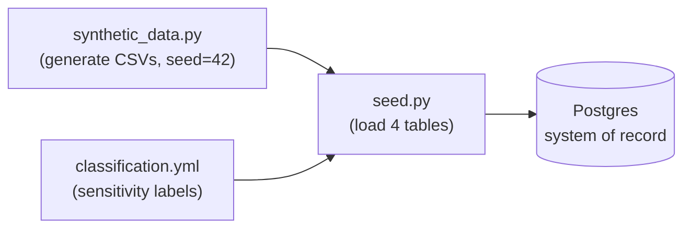

# 🌱 seeder

[Home](../../README.md) > **seeder**

> [!NOTE]
> One-shot job that builds the **synthetic** Artemis CSVs (via
> [`data/synthetic_data.py`](../../data/synthetic_data.py)), applies
> [`data/classification.yml`](../../data/classification.yml) as Postgres table/column
> comments (**classify-before-exposure**), and loads the four tables into the Postgres
> system of record. All data is synthetic — see [`docs/DISCLAIMER.md`](../../docs/DISCLAIMER.md).

## 🔁 Pipeline

The job runs the **classify-BEFORE-exposure** discipline, in order:

1. generate the deterministic CSVs via `data/synthetic_data.py` (`seed=42`);
2. apply `schema.sql` (idempotent `DROP` + `CREATE`);
3. load the four tables with proper typing;
4. stamp each table/column with its sensitivity label from `classification.yml` as a
   Postgres `COMMENT` (so the label travels with the system of record); and
5. print a row-count summary plus the known high-risk Artemis-3 rows.

> [!IMPORTANT]
> This runs as a one-shot job (compose `seeder` service / `make seed`). DAB starts only
> after it completes, so the auto-API has a populated schema to reflect.

## 📦 Tables loaded

| Table | CSV source | Shape |
| --- | --- | --- |
| `vendors` | `artemis_vendors.csv` | LFA1-style vendor master |
| `materials` | `artemis_materials.csv` | MARA-style material master |
| `purchase_orders` | `artemis_purchase_orders.csv` | EKKO/EKPO-style PO header+line |
| `supply_risk` | `artemis_supply_risk.csv` | Derived per-material risk view |

## 🗂️ Files

| File | Purpose |
| --- | --- |
| `seed.py` | Entry point: generate → apply schema → load → classify → summarize |
| `schema.sql` | Idempotent `DROP`/`CREATE` for the four tables (lowercase columns for DAB) |
| `requirements.txt` | `psycopg[binary]`, `PyYAML` |
| `Dockerfile` | Builds the one-shot job (build context is the repo root) |

> [!NOTE]
> `synthetic_data.py` and `classification.yml` live in [`data/`](../../data/) and are
> copied into the image at build time (see the `Dockerfile`).

## ⚙️ Configuration

Configured via environment variables (compose injects these):

| Variable | Default | Purpose |
| --- | --- | --- |
| `POSTGRES_HOST` | `postgres` | Postgres host |
| `POSTGRES_PORT` | `5432` | Postgres port |
| `POSTGRES_DB` | `procurement` | Target database |
| `POSTGRES_USER` | `artemis` | Connection user |
| `POSTGRES_PASSWORD` | `artemis_local_demo` | Connection password (local demo only) |
| `SYNTHETIC_SEED` | `42` | Deterministic generation seed |
| `SEED_OUT_DIR` | `/tmp/artemis_out` | Where the generated CSVs are written |

The seeder retries the Postgres connection (30 attempts, 2s apart) so it can start
alongside the database.

> [!TIP]
> Build per PRP §4 (`schema.sql`, `seed.py`, `Dockerfile`) + §7 Phase 1.
