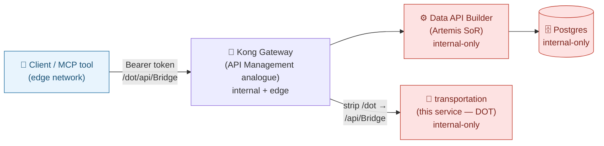
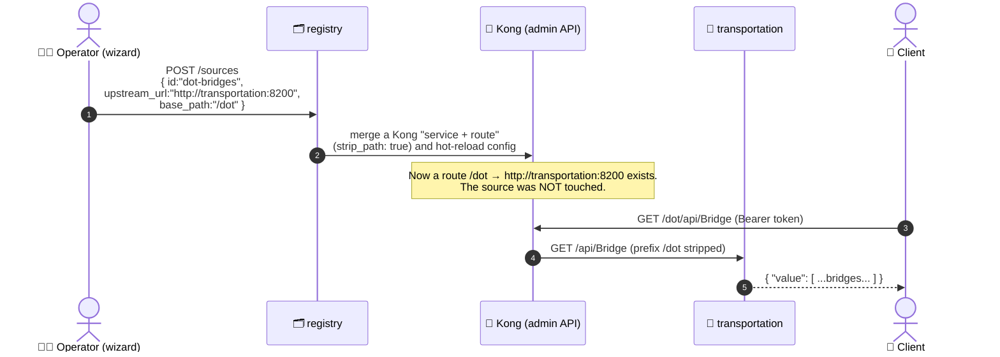

# 🌉 transportation — a second, pre-existing API you *federate*

[Home](../../README.md) > **transportation (DOT bridge-inventory source)**


> [!NOTE]
> **TL;DR — what this service is and why it exists.**
> Almost every real agency already has APIs in production. The hard part of an
> API-first data marketplace is *not* building one new API — it is **bringing the APIs
> you already have under one front door** without rebuilding or moving them. This little
> service is a **stand-in for "an API that already exists"**: a US **DOT** (Department of
> Transportation) bridge-condition dataset, exposed with the same OData-flavored REST
> shape that [Microsoft Data API Builder](../dab/README.md) produces. In the demo you
> **federate** it — publish it through the [Kong](../gateway/README.md) gateway at
> runtime — proving that a *second source* can join the marketplace **without touching
> the source itself**. All data here is **synthetic** (see
> [`docs/DISCLAIMER.md`](../../docs/DISCLAIMER.md)).

---

## 📖 Table of contents

- [Why this service exists (the enterprise story)](#-why-this-service-exists-the-enterprise-story)
- [Where it fits: the Azure-first picture](#-where-it-fits-the-azure-first-picture)
- [What "federation" means here](#-what-federation-means-here)
- [Zero-move: why this lives on the internal network only](#-zero-move-why-this-lives-on-the-internal-network-only)
- [The API surface in detail (`/api/Bridge`)](#-the-api-surface-in-detail-apibridge)
- [Worked examples: querying it through the gateway](#-worked-examples-querying-it-through-the-gateway)
- [How the code works (a guided read of `app.py`)](#-how-the-code-works-a-guided-read-of-apppy)
- [Run / build / health](#-run--build--health)
- [Gotchas & troubleshooting](#-gotchas--troubleshooting)
- [Where to next](#-where-to-next)
- [Glossary](#-glossary)

---

## 🎯 Why this service exists (the enterprise story)

When an agency decides to build a **data marketplace** — one governed place where teams
discover and consume data through APIs — the very first objection is almost always:

> *"We already have systems and APIs. Are you asking us to rebuild or migrate all of
> them?"*

The whole point of the **API-first, zero-move** pattern is that the answer is **no**.
You leave the source where it lives, keep it speaking its own dialect, and **publish a
route to it** through a single gateway that adds identity, rate-limiting, and metering.
The consumer sees one consistent front door; the source owner changes nothing.

To *show* that in a self-contained demo, we need two sources, not one:

| Source | Role in the demo | Implemented by |
| --- | --- | --- |
| **Artemis SAP procurement** | The "system of record" the demo is built around | [Postgres](../../docker-compose.yml) + [Data API Builder](../dab/README.md) |
| **DOT bridge inventory** | A *second, pre-existing* API you federate later | **this service** (`transportation`) |

The Artemis source is the headline. **This service is the proof that adding the *next*
source is cheap and non-invasive** — the part skeptical architects actually care about.

> **In plain terms:** the first source proves the pattern works. *This* source proves it
> **scales to the APIs you already own.**

> **Why this matters:** "federate what exists" is the difference between a marketplace
> that is a multi-year rebuild and one you can stand up over existing assets. This 230-line
> service is the cheapest possible illustration of that promise.

---

## ☁️ Where it fits: the Azure-first picture

This repository's **primary** story is **deploy to Azure to show the full art of the
possible**; running everything locally with `docker compose up` is the **develop/test
loop**. Each local open-source piece is a *stand-in* for a managed Azure service. Read
this service through that lens:

| Concept in this demo | Local (dev/test) | Managed Azure equivalent (the real demo) |
| --- | --- | --- |
| **The pre-existing API you federate** | this `transportation` service | a real **DAB API on [Azure Container Apps](../../infra/azure/README.md)** (e.g. a published DOT dataset) |
| The front door it is published through | **Kong Gateway OSS** | **Azure API Management** |
| Who issues/validates the caller's token | local [identity](../identity/README.md) issuer | **Microsoft Entra ID** |
| The runtime that registers the new route | local [registry](../registry/README.md) wizard | an **APIM "Add API"** operation / pipeline |

> [!TIP]
> The doc [`docs/ADD-A-SOURCE.md`](../../docs/ADD-A-SOURCE.md) explicitly supports
> swapping this local stand-in for the **real published DOT DAB app on Azure** — same
> federation step, just a different `upstream_url`. So when you demo locally you are
> rehearsing the exact motion you will perform against Azure. Nothing about the
> federation step changes; only the address of the upstream does.



> **Reading the diagram:** the client only ever talks to **Kong**. Kong is the *only*
> component that straddles both networks, so it is the *only* path to the DOT source or
> the Artemis source. The two data sources never talk to the client directly — that is
> "zero-move" enforced by the network, not by a policy document.

---

## 🔗 What "federation" means here

**Federation** = *publishing an existing, independently-owned API through the shared
gateway so consumers reach it the same way they reach everything else* — without copying
its data, rewriting its API, or coordinating a deployment of the source.

In this demo, federation is a **runtime action**, performed by the
[registry](../registry/README.md) onboarding wizard (or one `POST /sources` call). Here
is the end-to-end motion:



The key insight is in **steps 2–4**: the registry adds a Kong *route* that maps the
gateway prefix `/dot` onto the upstream `http://transportation:8200`, with
`strip_path: true` so the upstream receives its own **native** path `/api/Bridge`. The
DOT service has **no idea** it was federated — it just answers HTTP requests as it always
did. That is the whole trick, and the reason adding source #2 (and #3, and #50) is cheap.

> **In plain terms:** federation is "teach the front door a new address," not "rebuild
> the building behind the door."

> [!NOTE]
> The full, copy-pasteable walkthrough lives in
> [`docs/ADD-A-SOURCE.md`](../../docs/ADD-A-SOURCE.md). This README explains the *source*
> being federated; that doc explains the *act* of federating it.

---

## 🛡️ Zero-move: why this lives on the internal network only

Look at how this service is wired in [`docker-compose.yml`](../../docker-compose.yml):

```yaml
transportation:
  build:
    context: .
    dockerfile: services/transportation/Dockerfile
  networks: [internal]          # ← internal ONLY
  healthcheck:
    test: ["CMD-SHELL", "curl -fsS http://localhost:8200/healthz >/dev/null || exit 1"]
  profiles: [core]
```

And how the networks themselves are declared:

```yaml
networks:
  internal:
    internal: true   # no egress; postgres/dab live here, unreachable from outside
  edge:
    driver: bridge
```

The `internal: true` flag tells Docker this network has **no route to the host or the
outside world**. The `transportation` service attaches to `internal` and **nothing
else** — it publishes **no host port** (there is no `ports:` mapping for it, unlike the
gateway or the issuer). Therefore:

- You **cannot** `curl http://localhost:8200/api/Bridge` from your laptop. There is no
  port 8200 on the host. (Try it — it refuses the connection.)
- The **only** component that can reach `transportation:8200` is **Kong**, because Kong
  is the one service attached to **both** `internal` and `edge`
  (`networks: [internal, edge]`).

> **Why this matters:** "zero-move" is a *security and governance* claim — *the only path
> to the data is through the governed gateway*. In this repo that claim is **enforced by
> the Docker network topology and proven by a test**, not merely asserted in a slide.
> See [`tests/test_zero_move.py`](../../tests/test_zero_move.py), which checks that
> Postgres/DAB (and, by the same design, this source) are unreachable from the client
> network.

> [!WARNING]
> If you ever add a `ports: ["8200:8200"]` mapping to this service "to test it quickly,"
> you have **broken the zero-move guarantee** — you just opened a path to the data that
> bypasses Kong's identity, rate-limit, and metering. Don't. Reach it through the gateway
> instead (see the worked examples below).

---

## 🧩 The API surface in detail (`/api/Bridge`)

This service deliberately mimics the **OData-style REST surface** that
[Data API Builder](../dab/README.md) auto-generates, so that — from the consumer's point
of view — a federated "existing API" and the native Artemis API feel the same.

> **What is OData?** OData (Open Data Protocol) is an open standard for querying REST
> APIs using URL query parameters like `$filter`, `$orderby`, and `$select`. DAB speaks a
> variant of it. This service implements a **tiny subset** by hand so the shape matches.
> It is *not* a full OData implementation — just enough to teach the pattern.

### Endpoints

| Method & path | Purpose |
| --- | --- |
| `GET /healthz` | Liveness probe used by the Docker healthcheck. Returns `{"status":"ok","source":"dot-transportation"}`. |
| `GET /api/openapi` | A minimal, DAB-style OpenAPI document describing the `Bridge` entity. |
| `GET /api/Bridge` | The data entity. Returns `{"value": [ ...rows... ]}` and supports the OData-ish query options below. |

### Supported query options on `/api/Bridge`

| Option | Meaning | Example |
| --- | --- | --- |
| `$filter` | Keep rows matching `field op value` clauses, joined by ` and ` | `$filter=state eq 'WA' and condition_rating lt 5` |
| `$orderby` | Sort by a field; append ` desc` to reverse | `$orderby=condition_rating asc` |
| `$first` | Return only the first N rows (DAB's take/limit) | `$first=5` |
| `$select` | Return only the listed columns | `$select=bridge_id,name,condition_rating` |

Supported comparison operators in `$filter`: `eq` (equals), `ne` (not equals),
`lt` (<), `le` (≤), `gt` (>), `ge` (≥). String literals go in **single quotes**
(`'WA'`); numbers are bare (`5`).

### The `Bridge` entity (one synthetic row)

```json
{
  "bridge_id": "DOT-0001",
  "name": "Cascade River Crossing (SYNTHETIC)",
  "state": "WA",
  "year_built": 1971,
  "condition_rating": 4,
  "avg_daily_traffic": 48000,
  "deck_area_sqm": 5200,
  "status": "Structurally Deficient"
}
```

The dataset is **12 hand-written rows**, modeled on the *shape* of the US **National
Bridge Inventory** (NBI) — `condition_rating` runs 0–9 (lower is worse), and `status`
mirrors NBI categories like *Good*, *Fair*, and *Structurally Deficient*. Every `name`
carries a `(SYNTHETIC)` suffix so no one mistakes it for real infrastructure data.

> [!WARNING]
> **SYNTHETIC DATA ONLY.** These bridges, ratings, and traffic counts are invented for
> the demo. They are **not** real NBI records and must not be used for any decision. See
> [`docs/DISCLAIMER.md`](../../docs/DISCLAIMER.md).

---

## 🧪 Worked examples: querying it through the gateway

> [!IMPORTANT]
> All of these go through **Kong on port 8000**, *not* directly to the source. They
> assume you have already (a) brought the stack up and (b) **federated** the DOT source
> (the wizard step in [`docs/ADD-A-SOURCE.md`](../../docs/ADD-A-SOURCE.md), which
> registers `base_path: /dot` → `upstream_url: http://transportation:8200`). They also
> assume you have a **bearer token** from the [identity](../identity/README.md) issuer in
> `$TOKEN`.

### 1) The classic supply-chain question: "show me the worst bridges first"

```bash
curl -s -H "Authorization: Bearer $TOKEN" \
  "http://localhost:8000/dot/api/Bridge?\$orderby=condition_rating%20asc&\$first=5" | jq .
```

**Expected output (abridged):**

```json
{
  "value": [
    { "bridge_id": "DOT-0012", "name": "Cobalt Ridge Flyover (SYNTHETIC)", "state": "PA",
      "year_built": 1955, "condition_rating": 2, "avg_daily_traffic": 71000,
      "deck_area_sqm": 8200, "status": "Structurally Deficient" },
    { "bridge_id": "DOT-0003", "name": "Meridian Bay Bridge (SYNTHETIC)", "state": "FL",
      "condition_rating": 3, "status": "Structurally Deficient", "...": "..." }
  ]
}
```

**What just happened, step by step:**

1. You hit **Kong** at `/dot/api/Bridge`. Kong checked your `Authorization: Bearer`
   token (no token → `401`; over your rate limit → `429`).
2. Kong matched the route `/dot` that the registry created, **stripped** the `/dot`
   prefix, and forwarded `GET /api/Bridge?...` to `http://transportation:8200`.
3. This service parsed `$orderby=condition_rating asc` (sort ascending → worst first
   because lower ratings are worse) and `$first=5` (keep five), and returned the
   `{"value": [...]}` envelope.
4. Kong relayed the response back to you, adding a **correlation id** header so the
   request is traceable in [observability](../../docs/ARCHITECTURE.md).

> **Why this matters:** this is *the same query shape* you would run against the Artemis
> source — proving the federated "existing API" is indistinguishable from a native one at
> the consumer layer. One front door, many sources.

### 2) Filter to one state's deficient bridges, return only a few columns

```bash
curl -s -H "Authorization: Bearer $TOKEN" \
  "http://localhost:8000/dot/api/Bridge?\$filter=status%20eq%20'Structurally%20Deficient'&\$select=bridge_id,state,condition_rating" | jq .
```

**Expected output (abridged):**

```json
{
  "value": [
    { "bridge_id": "DOT-0001", "state": "WA", "condition_rating": 4 },
    { "bridge_id": "DOT-0003", "state": "FL", "condition_rating": 3 },
    { "bridge_id": "DOT-0005", "state": "MI", "condition_rating": 4 }
  ]
}
```

This shows `$filter` (string literal in single quotes) and `$select` (column projection)
working together — and confirms the federated source honors the same OData-ish options a
DAB-native source would.

### 3) Prove the source is unreachable directly (the negative test)

```bash
curl -s -o /dev/null -w "%{http_code}\n" http://localhost:8200/api/Bridge
```

**Expected output:**

```text
000
```

`000` (connection refused / could not connect) is the **success** case here: there is no
port 8200 on your host, because the source lives on the `internal`-only network. The only
way in is through Kong. That is zero-move, demonstrated in one command.

---

## 🔍 How the code works (a guided read of `app.py`)

The entire service is one file, [`app.py`](app.py) (~230 lines). Read it top to bottom:

| Lines | What it does | Why it's written this way |
| --- | --- | --- |
| 23–25 | Reads `TRANSPORT_PORT` (default `8200`); creates the FastAPI app. | Port is env-overridable but defaults to the value Kong/compose expect. |
| 28–149 | `BRIDGES` — the 12 synthetic rows, in memory. | No database needed; it is a *stand-in* for an existing API, so simplicity wins. |
| 154–181 | `_apply_filter()` — a tiny OData-ish `$filter` parser. | Splits on ` and `, regex-matches `field op value`, applies the operator. **Unparseable clauses are ignored** so a malformed query never returns `500`. |
| 184–186 | `GET /healthz`. | Matches the Docker `healthcheck` in compose so `depends_on: service_healthy` works. |
| 189–207 | `GET /api/openapi`. | A DAB-shaped OpenAPI stub so the source *looks like* a DAB endpoint to discovery tooling. |
| 210–229 | `GET /api/Bridge` — applies `$filter`, `$orderby`, `$first`, `$select` in that order. | Returns the `{"value": [...]}` envelope, exactly like DAB/OData. |

> **In plain terms:** this is intentionally the *least* impressive code in the repo. Its
> job is to be a believable "API that already exists," so the interesting work — identity,
> rate-limiting, metering, federation — happens at the **gateway**, not here.

A couple of design choices worth calling out for learners:

- **Best-effort parsing, never crash.** `_apply_filter` silently skips clauses it cannot
  parse. A stand-in source that 500s on a slightly-off query would distract from the
  federation story. The repo's coding convention is *fail-safe: services degrade
  gracefully* (see [`CLAUDE.md`](../../CLAUDE.md)).
- **The order of operations matters.** Filtering happens *before* `$first`, so `$first=5`
  means "the first 5 *matching* rows," and `$select` runs last so column projection never
  affects filtering or sorting.

---

## 🚀 Run / build / health

You normally **do not run this service by hand** — it comes up as part of the `core`
profile when you bring up the whole stack:

```bash
cp .env.example .env
make demo          # brings the full stack up healthy (see the root README)
```

To run *just this container* for local poking (note: it will be on your host only because
you are bypassing compose's internal network):

```bash
docker build -f services/transportation/Dockerfile -t dot-transportation .
docker run --rm -p 8200:8200 dot-transportation
# then, ONLY because you exposed the port yourself for dev:
curl -s http://localhost:8200/healthz
```

**Expected health output:**

```json
{ "status": "ok", "source": "dot-transportation" }
```

> [!NOTE]
> The `Dockerfile` installs `curl` purely so the **container healthcheck**
> (`curl -fsS http://localhost:8200/healthz`) can run *inside* the container. The
> dependencies are just `fastapi` and `uvicorn` (see
> [`requirements.txt`](requirements.txt)) — no database driver, because there is no
> database.

---

## 🧯 Gotchas & troubleshooting

| Symptom | Likely cause | Fix |
| --- | --- | --- |
| `curl http://localhost:8200/...` → connection refused (`000`) | The service is on the `internal`-only network with **no host port** — *by design*. | Reach it **through Kong** at `http://localhost:8000/dot/...`. The refusal is the zero-move guarantee working. |
| `GET /dot/api/Bridge` → `404` at the gateway | The DOT source hasn't been **federated** yet (no Kong route for `/dot`). | Run the wizard / `POST /sources` step in [`docs/ADD-A-SOURCE.md`](../../docs/ADD-A-SOURCE.md). |
| `GET /dot/api/Bridge` → `401` | Missing/invalid bearer token. | Get a token from the [identity](../identity/README.md) issuer and send `Authorization: Bearer $TOKEN`. |
| `GET /dot/api/Bridge` → `429` | You exceeded the per-consumer rate limit Kong enforces. | Slow down; the limit is intentional (it is a metering/abuse-control demo). |
| `$filter` seems ignored | A clause didn't match `field op value`, or a string wasn't single-quoted. | Use single quotes for strings (`state eq 'WA'`); operators are `eq/ne/lt/le/gt/ge`. Unparseable clauses are skipped silently. |
| `400 "Over-broad query blocked (OWASP API4)"` | You asked for more than 200 rows via `$first`. | This is a **gateway** guardrail added by the registry, not this service. Request `$first` ≤ 200. |

---

## 🧭 Where to next

- **[`docs/ADD-A-SOURCE.md`](../../docs/ADD-A-SOURCE.md)** — the hands-on federation
  walkthrough (the wizard, the `POST /sources` call, and pointing it at the **real** DOT
  DAB app on Azure).
- **[registry service](../registry/README.md)** — the onboarding wizard that turns this
  source into a Kong route at runtime.
- **[gateway (Kong)](../gateway/README.md)** — the front door that does identity,
  rate-limiting, metering, and the OWASP guardrails.
- **[dab service](../dab/README.md)** — the *native* DAB API for the Artemis source; this
  service deliberately imitates its OData shape.
- **[`docs/ARCHITECTURE.md`](../../docs/ARCHITECTURE.md)** — the full system picture and
  the Azure-managed mapping.

---

## 📚 Glossary

| Term | Meaning (first-use definition) |
| --- | --- |
| **DOT** | US **Department of Transportation** — the agency whose bridge data this synthetic source imitates. |
| **NBI** | **National Bridge Inventory** — the real federal dataset whose *shape* (condition ratings 0–9, deficiency categories) inspired the synthetic rows. |
| **Federation** | Publishing an existing, independently-owned API through the shared gateway so consumers reach it uniformly — **without** moving data, rewriting the API, or redeploying the source. |
| **Zero-move** | The pattern where data **never leaves** its source; the only path to it is through the governed gateway. Here it is enforced by Docker network isolation. |
| **OData** | **Open Data Protocol** — an open standard for querying REST APIs via URL options (`$filter`, `$orderby`, `$select`, etc.). This service implements a tiny subset. |
| **DAB** | **Microsoft Data API Builder** — auto-generates REST/GraphQL/OpenAPI over a database. This service imitates its surface; see [dab](../dab/README.md). |
| **Upstream** | The real address Kong forwards to after matching a route — here, `http://transportation:8200`. |
| **`strip_path`** | A Kong route setting that removes the gateway prefix (`/dot`) before forwarding, so the upstream receives its native path (`/api/Bridge`). |
| **Container Apps** | **Azure Container Apps** — the managed serverless-container runtime where the *real* DAB source would live in the Azure deployment. |

---

> [!WARNING]
> 🧪 **Synthetic data disclaimer.** Every record served by this service is invented for
> demonstration purposes and is **not** real NASA, DOT, or NBI data. See
> [`docs/DISCLAIMER.md`](../../docs/DISCLAIMER.md). ITAR/CUI-safe.
