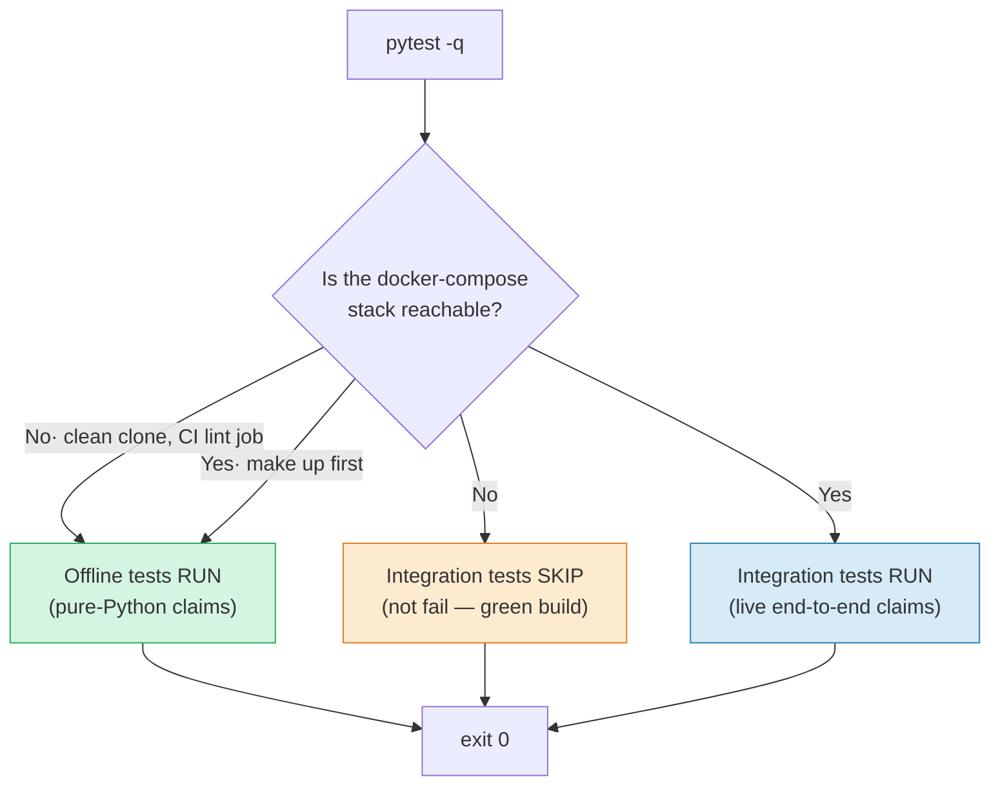
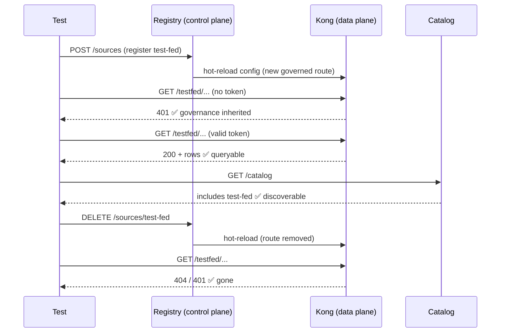
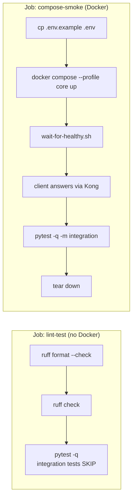

# 🧪 Tests — proving every claim the POC makes

[Home](../README.md) > **Tests**

> [!NOTE]
> **TL;DR.** This suite is the *evidence layer* of the proof-of-concept. The README,
> the slides, and the architecture diagrams all make claims — "zero-move," "the
> gateway is the only door," "confidential fields never leak," "a federated source is
> governed exactly like the built-in one." Each of those claims is backed by a test
> here. Run `pytest -q` for the fast, offline checks (they pass on a clean clone with
> no Docker); run `pytest -q -m integration` once the stack is up to exercise the live,
> end-to-end path. **Every test maps to a sentence someone could challenge — and answers
> it with code.**

> [!WARNING]
> **Synthetic data only.** Every vendor, material, price, and date these tests touch is
> fabricated (seed `42`). No real NASA procurement data is involved. See
> [`docs/DISCLAIMER.md`](../docs/DISCLAIMER.md) and [`data/README.md`](../data/README.md).

---

## 📑 Table of contents

- [Why this directory exists](#-why-this-directory-exists)
- [The big idea: two speeds of test](#-the-big-idea-two-speeds-of-test)
- [How the stack-aware skip works (`conftest.py`)](#-how-the-stack-aware-skip-works-conftestpy)
- [The claim → test map](#-the-claim--test-map)
- [Test-by-test: what each one proves and why](#-test-by-test-what-each-one-proves-and-why)
- [Running the tests (worked examples)](#-running-the-tests-worked-examples)
- [How CI runs them](#-how-ci-runs-them)
- [Gotchas & troubleshooting](#-gotchas--troubleshooting)
- [Where to next](#-where-to-next)

---

## 🎯 Why this directory exists

A demo that only *says* it is secure is a slide. A demo that *proves* it is secure is an
argument you can defend in front of a skeptical reviewer. This POC's whole pitch — an
**API-first, zero-move data marketplace** — rests on a handful of strong claims, and a
strong claim invites the question *"prove it."* This directory is the answer.

**In plain terms:** instead of trusting the documentation, you run the tests and watch
the claims hold (or fail loudly). A reviewer who doubts that "Postgres is unreachable
from the client network" can run one test and see a throwaway container *fail* to connect
to Postgres — that is far more convincing than a paragraph.

> **Why this matters (the enterprise story):** when this pattern lands in **Azure**, the
> same claims must hold against managed services — Postgres reachable only inside a VNet,
> [Azure API Management](https://learn.microsoft.com/azure/api-management/) as the one
> ingress door, [Microsoft Purview](https://learn.microsoft.com/purview/) labels enforced
> as column masking, [Microsoft Entra ID](https://learn.microsoft.com/entra/) issuing the
> tokens. The local OSS stack is the **dev/test loop**; these tests are how you keep that
> loop honest *before* you spend money standing up the cloud. Each test names the Azure
> equivalent of what it is checking, so the evidence travels with you to production.

If a term here is unfamiliar, the [concepts guides](../docs/concepts/README.md) explain
DAB, API gateways, JWT/OAuth, the lakehouse, and observability from first principles.
Terms are also defined on first use below.

---

## 🐢🐇 The big idea: two speeds of test

Every file here belongs to one of two groups. Knowing which group a test is in tells you
*when* it runs and *what infrastructure* it needs.



| Speed | Needs Docker? | What it proves | Files |
|---|---|---|---|
| 🐇 **Offline (unit)** | No | Claims provable from source files and pure Python: config parity, the no-Fabric guard, the deterministic dataset | `test_registry_config.py`, `test_no_fabric.py`, and the `test_generator_*` half of `test_supply_risk.py` |
| 🐢 **Integration (live)** | Yes — `make up` | Claims that only hold against the running stack: network isolation, 401/200/429 at the edge, field redaction in real responses, live federation, catalog discovery | `test_zero_move.py`, `test_gateway_auth.py`, `test_redaction.py`, `test_federation.py`, `test_discovery.py`, and the `test_gateway_*` half of `test_supply_risk.py` |

> [!TIP]
> **Why split them?** So `pytest -q` is *always green on a clean checkout* — a new
> contributor (or the offline CI job) gets fast feedback without booting Docker. The
> heavyweight, infrastructure-dependent proofs are tagged `@pytest.mark.integration` and
> **skip themselves** when the stack isn't there, instead of failing. You opt into them
> deliberately with `-m integration` after `make up`.

---

## 🔌 How the stack-aware skip works (`conftest.py`)

[`conftest.py`](conftest.py) is pytest's shared-fixtures file — pytest imports it
automatically for every test in this directory, so the helpers below are available
without importing them by path. It is the "is the stack alive?" detector that powers the
two-speed design.

The key piece is `stack_up()`, the probe that decides whether integration tests run:

```python
def stack_up() -> bool:
    """True when our identity issuer is healthy AND Kong is fronting the API."""
    try:
        health = httpx.get(f"{IDENTITY_URL}/healthz", timeout=1.5)
        if health.status_code != 200 or health.json().get("status") != "ok":
            return False
        edge = httpx.get(f"{KONG_PROXY}/api/Material", timeout=1.5)
        return edge.status_code == 401
    except Exception:
        return False
```

Read that second check carefully — it is doing something clever. It does **not** just
ask "is *something* listening on Kong's port?" It asks Kong for `/api/Material` *with no
token* and requires a **401 Unauthorized** back. That single line confirms two things at
once: Kong is up **and** Kong is actually enforcing auth (a naked database or a misrouted
proxy would answer 200 or refuse the connection — either way `stack_up()` returns
`False`). It deliberately avoids probing Kong's admin port so that an unrelated local
service on that port can't produce a false "stack is up."

That boolean feeds the decorator every integration test wears:

```python
requires_stack = pytest.mark.skipif(
    not stack_up(),
    reason="docker-compose stack not reachable (start it with `make up`)",
)
```

The other helpers in `conftest.py` are the vocabulary the integration tests speak in:

| Helper | What it does | Why it matters |
|---|---|---|
| `get_token(consumer="analyst")` | POSTs to the local identity issuer's `/token` and returns an RS256 bearer token for a named consumer (`analyst`, `artemis-agent`, …) | Mirrors how a real client gets a token from **Entra ID** — tests authenticate the same way a consumer would |
| `gateway_get(path, token=None, ...)` | GETs `http://127.0.0.1:8000{path}` *through Kong*, attaching `Authorization: Bearer …` if a token is given | Enforces the rule that **clients only ever talk through the gateway** — no test reaches a backend directly |
| `tcp_open(host, port)` | Raw TCP connect test | Used to reason about reachability |
| `REPO_ROOT`, `KONG_PROXY`, `IDENTITY_URL`, `CATALOG_URL`, `REGISTRY_URL` | Endpoint constants, each overridable via env var | Lets you point the suite at a remote/CI stack without editing code |

> [!NOTE]
> **Why `127.0.0.1` and not `localhost`?** The comment in `conftest.py` spells it out:
> on a box where another process is bound to the same port on IPv6 (`::1`), `localhost`
> can resolve there and give a misleading result. Pinning to the IPv4 loopback removes
> that ambiguity. (If your dev box already binds 8000/8001/8080/3000, override the
> `*_URL` env vars — see the tip in [Running the tests](#-running-the-tests-worked-examples).)

---

## 🗺️ The claim → test map

This is the heart of the suite: read it as *"the POC claims X; here is the file that
proves X."*

| # | The claim (what the POC asserts) | Test file | The assertion that backs it | Azure analogue being modeled |
|---|---|---|---|---|
| 1 | **Zero-move is real** — data has exactly one path, through the gateway | [`test_zero_move.py`](test_zero_move.py) | A container on the client (`edge`) network *cannot* TCP-connect to `postgres:5432` or `dab:5000`, *can* reach `kong:8000`, and Postgres/DAB publish **no** host ports | Postgres + DAB private inside a VNet; **APIM** the only public ingress |
| 2 | **The gateway enforces auth & quotas** — 401 / 200 / 429 | [`test_gateway_auth.py`](test_gateway_auth.py) | No/invalid token → **401**; valid token → **200** with `X-Correlation-ID`; over the rate cap → **429** with `Retry-After`; over-broad query → **400** | APIM JWT validation, rate-limit & quota policies |
| 3 | **Confidential fields never leave the SoR** | [`test_redaction.py`](test_redaction.py) | `std_unit_cost_usd`, `netpr`, `netwr` are **absent** from gateway responses; routine fields remain; redaction survives role-header spoofing | **Purview** sensitivity labels → SQL/DAB column masking |
| 4 | **Federated sources are governed identically to the built-in one** | [`test_registry_config.py`](test_registry_config.py) | A registry-built Kong route carries the *same* plugin set (`jwt`, `rate-limiting`, `pre-function`, `request-transformer`, …) as the hand-written Artemis route | APIM product/policy inheritance — no source is weaker |
| 5 | **You can add a source live, through the control plane** | [`test_federation.py`](test_federation.py) | Register a 2nd source via the registry → it's instantly governed + queryable + in the catalog → remove it → it's gone (Kong hot-reload) | APIM API import + DevPortal listing, no redeploy |
| 6 | **The marketplace is discoverable** — no tribal knowledge | [`test_discovery.py`](test_discovery.py) | `/catalog` lists the product; detail carries owner, classification, request path, sample query; the **public OpenAPI** documents every entity | APIM Developer Portal + OpenAPI |
| 7 | **No Microsoft Fabric / OneLake anywhere** (hard constraint) | [`test_no_fabric.py`](test_no_fabric.py) | Greps the whole repo: the product terms appear *only* next to an explicit "excluded, and why" marker | Azure-Gov reality: Fabric/OneLake unavailable there |
| 8 | **The headline answer is deterministic & governed** | [`test_supply_risk.py`](test_supply_risk.py) | Seed-42 generator reproduces exact counts + the Artemis-3 high-risk row; the *same* answer returns through Kong→DAB | Reproducible data product over the governed API |

---

## 🔍 Test-by-test: what each one proves and why

### 1️⃣ `test_zero_move.py` → network isolation

**The claim under test:** *"Zero-move is not a slogan. The system-of-record (Postgres)
and the auto-API ([Data API Builder](https://learn.microsoft.com/azure/data-api-builder/),
"DAB") sit only on an `internal` Docker network and publish no host ports — so the only
path from a client to the data is **through Kong**."*

It proves this four ways, and the method is the interesting part: it spins up a
**throwaway `busybox` container on the same `edge` network the clients live on** and tries
to reach each backend with `nc -z` (a TCP port probe):

```python
def test_postgres_unreachable_from_edge_network():
    assert not _connect_from_edge("postgres", 5432), "Postgres must not be reachable by clients"

def test_dab_unreachable_from_edge_network():
    assert not _connect_from_edge("dab", 5000), "DAB must not be reachable by clients"

def test_kong_is_reachable_from_edge_network():
    assert _connect_from_edge("kong", 8000), "Kong is the one path and must be reachable"
```

- **Two negatives** prove the backends are *unreachable* from where clients stand.
- **One positive** proves the gateway *is* reachable — otherwise "unreachable" would be
  trivially satisfied by a broken network.
- A fourth test, `test_postgres_and_dab_publish_no_host_ports()`, runs `docker compose
  port …` and asserts there's no real `IP:port` binding — closing the "but maybe it's
  exposed to the host" loophole.
- A fifth, `test_data_still_answers_through_the_gateway()`, confirms the data *is* still
  reachable the right way (through Kong), so isolation didn't simply break the demo.

> **In plain terms:** locking the back door only counts if the front door still works.
> These tests check both at once.

> [!NOTE]
> Because it shells out to `docker`, several tests also wear `@needs_docker` and skip if
> the `docker` CLI is missing — separate from the `requires_stack` skip.

> **Azure analogue:** in production Postgres and the DAB container have **no public
> endpoint** — they live in a VNet and only **API Management** is internet-facing. This
> test is the local rehearsal of that boundary.

---

### 2️⃣ `test_gateway_auth.py` → 401 / 200 / 429 (and a bonus 400)

**The claim under test:** *"The gateway is the governance point. Bad requests die at the
edge; good ones pass and are traceable; abusive ones are throttled."*

Each HTTP status code is its own little proof:

| Test | Sends | Expects | Why it matters |
|---|---|---|---|
| `test_no_token_is_rejected_at_edge` | No `Authorization` header | **401** | The request never reaches DAB — auth is at the door |
| `test_invalid_token_is_rejected` | `Bearer not.a.valid.jwt` | **401** | A forged/garbage token is rejected by signature check, not just absence |
| `test_valid_token_passes_with_correlation_id` | Valid RS256 token | **200** + `X-Correlation-ID` header | Legitimate traffic flows *and* is traceable end-to-end |
| `test_over_broad_query_is_blocked` | `$first=99999` | **400** | [OWASP API4:2023](https://owasp.org/API-Security/) (unrestricted resource consumption) — capped *before* DAB |
| `test_over_rate_limit_returns_429_with_retry_after` | 90 rapid requests | some **429** + `Retry-After` | Rate limiting is enforced, and clients are told when to retry |

The 429 test is worth a closer look — it deliberately bursts as a *different* consumer so
it doesn't exhaust the `analyst` quota the other tests rely on:

```python
def test_over_rate_limit_returns_429_with_retry_after():
    # Burst as artemis-agent (separate consumer) so other tests' analyst quota is intact.
    token = get_token("artemis-agent")
    ...
    assert codes[429] > 0, f"expected some 429s over the cap, got {dict(codes)}"
    assert retry_after is not None, "429 should carry Retry-After"
```

> **In plain terms:** a token is a key, the gateway is the lock, and the rate limit is the
> turnstile that stops one consumer from starving everyone else.

> **Azure analogue:** every behavior here maps to an **API Management policy** —
> `validate-jwt`, `rate-limit-by-key`, and a `<choose>` guard for over-broad queries. The
> correlation id is APIM's request-tracing header.

---

### 3️⃣ `test_redaction.py` → field-level redaction

**The claim under test:** *"Sensitivity classification is enforced, not decorative.
Columns marked **Confidential** in [`data/classification.yml`](../data/classification.yml)
— material unit cost, PO net price/value — never leave the system of record for a
marketplace consumer, even though the rows themselves come back."*

```python
REDACTED = {
    "/api/Material": ["std_unit_cost_usd"],
    "/api/PurchaseOrder": ["netpr", "netwr"],
}
```

Three tests cover the claim from three angles:

1. `test_confidential_fields_are_redacted_through_the_gateway` — the confidential columns
   are **absent** from every returned row.
2. `test_routine_fields_still_present` — redaction is *surgical*: `matnr`, `maktx`,
   `program`, `criticality`, `std_lead_time_days` are all still there. (A test that only
   checked for absence could be fooled by an empty response.)
3. `test_redaction_holds_against_role_header_injection` — the sharp one. DAB's
   StaticWebApps auth would *honor* `X-MS-API-ROLE` / `X-MS-CLIENT-PRINCIPAL` headers if
   it saw them; the test sends a forged "I am the privileged `authenticated` role" header
   and confirms the confidential column **stays redacted** — because the gateway strips
   those headers inbound.

> **In plain terms:** the redaction happens *inside* the data layer (DAB excludes the
> column for the anonymous role) — not by find-and-replace on the way out. So you can't
> trick your way past it by claiming to be someone you're not.

> **Azure analogue:** this is the DAB-native equivalent of **Purview** sensitivity labels
> driving **column-level masking** in Azure SQL — masking applied *before* exposure, not
> bolted onto the response.

---

### 4️⃣ `test_registry_config.py` → federation parity (offline)

**The claim under test:** *"When you onboard a new data source through the registry
(the control plane), the route it builds for Kong is governed **exactly as strongly** as
the hand-written first-party Artemis route. A federated source is never the weak link."*

This is an **offline unit test** — no stack needed. It imports the registry module
directly and inspects the route dict its `_kong_route_for()` builder produces:

```python
def test_jwt_source_gets_full_governance_set():
    names = _plugin_names(
        {"id": "x", "upstream_url": "http://u:1", "base_path": "/x", "require_jwt": True}
    )
    expected = {
        "correlation-id", "jwt", "rate-limiting",
        "cors", "pre-function", "request-transformer",
    }
    assert expected <= names, f"missing governance plugins: {expected - names}"
```

Its companions go further:

- `test_safety_controls_present_even_without_jwt` — even a **public** (no-JWT) source still
  gets the OWASP guard (`pre-function`) and the identity-header strip (`request-transformer`).
- `test_request_transformer_strips_identity_spoofing_headers` — the route removes
  `X-MS-CLIENT-PRINCIPAL` and `X-MS-API-ROLE` (this is *why* test #3's spoof fails).
- `test_owasp_guard_blocks_over_broad_extraction` — the pre-function Lua actually mentions
  `$first` and a `200` cap (this is *why* test #2's 400 happens).

> **In plain terms:** this is a regression guard. If someone edits the route builder and
> forgets the rate limiter on federated routes, this test fails *offline, in CI, before
> anyone deploys* — no need to boot the stack to catch the drift.

> **Azure analogue:** APIM **products** and **policy inheritance** — every API attached to
> a product inherits the product's policies, so a newly imported API can't be less
> governed than an existing one.

---

### 5️⃣ `test_federation.py` → live federation (integration)

**The claim under test:** *"You can add a source **live, through the gateway**, with no
redeploy — and it is instantly governed, queryable, and discoverable; remove it and it's
gone."*

Where test #4 checks the route *recipe* offline, this one checks the whole loop against
the running stack. A fixture registers a second source (a `transportation` upstream) via
the registry — which **hot-reloads Kong** — and always cleans it up afterward:

```python
def test_registered_source_is_governed_and_queryable(registered_source):
    # no token -> 401 at the edge (the new route inherits gateway governance)
    assert gateway_get("/testfed/api/Bridge").status_code == 401
    # with a token -> 200 + rows through Kong
    resp = gateway_get("/testfed/api/Bridge?$first=3", token=get_token("analyst"))
    assert resp.status_code == 200, resp.text
    assert resp.json()["value"], "the federated source should return rows through Kong"
```



`test_registered_source_appears_in_catalog` and `test_removed_source_is_gone` close the
discovery and teardown halves of the loop.

> **Azure analogue:** importing a new API into **API Management** (via Bicep/portal/REST),
> seeing it inherit product policies, and having it surface in the **Developer Portal** —
> all without a redeploy of the gateway itself.

---

### 6️⃣ `test_discovery.py` → catalog & OpenAPI discoverability (integration)

**The claim under test:** *"A consumer can discover the data product without insider
knowledge — its owner, classification, request path, a sample query, and a machine-
readable contract are all published."*

```python
def test_product_detail_has_owner_classification_and_path():
    product = httpx.get(f"{CATALOG_URL}/catalog/artemis-supply-risk", timeout=10).json()
    assert product["owner"]
    assert product["request_path"] == "/api/SupplyRisk"
    assert product["openapi_url"].endswith("/api/openapi")
    classification = product["classification"]
    assert classification["tables"].get("supply_risk")
    assert classification["columns"]["purchase_orders"].get("NETPR") == "Confidential"
```

- `test_catalog_lists_the_product` — `GET /catalog` includes `artemis-supply-risk`.
- The detail test (above) proves classification is *surfaced* (the same `NETPR =
  Confidential` label that test #3 enforces) — **classify-before-exposure** end to end.
- `test_openapi_discovery_documents_entities` — the OpenAPI contract is **public through
  Kong** (no token) and names every entity (`Material`, `Vendor`, `PurchaseOrder`,
  `SupplyRisk`), so schema discovery needs no tribal knowledge.

> **Azure analogue:** the **API Management Developer Portal** plus the published OpenAPI —
> self-service discovery for consumers.

---

### 7️⃣ `test_no_fabric.py` → the no-Fabric guard (offline)

**The claim under test (a hard constraint from [`PRP.md`](../PRP.md) §9):** *"Microsoft
Fabric / OneLake appear **nowhere** as a component or recommendation — they're not
available in Azure Government / GCC. The only allowed mention is an explicit 'excluded,
and why.'"*

This test greps the whole repo for the *product* terms `microsoft fabric` and `onelake`
(case-insensitive), and flags any match that is **not** within ~220 characters of an
exclusion marker (`exclud`, `not available`, `not in azure gov`, `intentionally`, …):

```python
_PRODUCT_TERMS = re.compile(r"microsoft fabric|onelake", re.IGNORECASE)
```

Two pieces of nuance make it robust rather than annoying:

- It matches only the **product** terms, so the ordinary English word "fabric"
  ("fabricated data," "integration fabric") is never a false hit.
- It **skips the meta files** that *define* the rule — `PRP.md` and `test_no_fabric.py`
  itself — because those specify the constraint rather than build a component.

> **In plain terms:** you may *explain why you excluded* Fabric; you may not *use* it.
> This test makes the docs honor that line automatically.

> **Why this matters:** **Azure Government** (the ITAR/strict-CUI target) genuinely lacks
> Fabric/OneLake. Recommending them would make the architecture undeployable for the
> exact audience the POC is aimed at — so it's enforced in CI, not left to reviewer memory.

---

### 8️⃣ `test_supply_risk.py` → the headline answer (offline + integration)

**The claim under test:** *"The mission question — *'which Critical, sole-source
Artemis-3 materials are slipping more than 30 days?'* — has a **deterministic** answer
from the seeded dataset, and the **same answer** comes back through the governed gateway."*

This file straddles both speeds, which is the lesson:

**Offline half (always runs):** `test_generator_counts_are_reproducible` regenerates the
dataset with `seed=42` and asserts exact counts; `test_generator_headline_row_present`
confirms the known high-risk Artemis-3 row exists with the expected tier/score.

```python
EXPECTED_COUNTS = {
    "vendors": 120, "materials": 600, "purchase_orders": 10000,
    "supply_risk": 600, "high_risk_materials": 148, "sole_source_materials": 177,
}
```

**Integration half (`@requires_stack` + `@pytest.mark.integration`):**
`test_gateway_supply_risk_returns_headline_row` asks the *same* question through Kong →
DAB using an OData filter, and asserts at least one matching row comes back:

```python
flt = (
    "$filter=program eq 'Artemis-3' and criticality eq 'Critical' "
    "and sole_source eq true and avg_delay_days gt 30"
    "&$orderby=risk_score desc"
)
resp = gateway_get(f"/api/SupplyRisk?{flt}", token=token)
assert resp.status_code == 200, resp.text
assert len(rows) >= 1
```

> **In plain terms:** the offline test proves the *truth* (the data deterministically
> contains the answer); the integration test proves the *delivery* (you can get that
> truth out through the governed front door). Together they prove the demo isn't smoke.

> [!NOTE]
> The headline row's exact material name is **not** hard-coded — the dataset is large
> (~10k POs) so the tests assert *behavior and counts*, which stay stable as synthetic
> material names evolve. That's a deliberate robustness choice.

---

## 🏃 Running the tests (worked examples)

### 🐇 Offline only — the default, no Docker

This is what a fresh clone runs and what the CI lint job runs. Integration tests **skip**.

```bash
# from the repo root
pytest -q
```

**Expected output (shape):**

```text
.........ssssssssssss                                         [100%]
21 passed, 12 skipped in 3.42s
```

Each `.` is a passing offline test; each `s` is a **skipped** integration test (the stack
isn't up). **A clean clone with no Docker still exits 0** — that's the design. (Exact
counts vary as tests are added.)

### 🐢 Full suite — with the live stack

```bash
# 1) bring the stack up (postgres, dab, identity, kong, catalog, mcp) and wait healthy
make up

# 2) run everything — integration tests now execute instead of skipping
pytest -q
```

Now the `s` markers become `.` as the integration tests connect to the running services.

### 🎯 Just the integration tests

Useful when you've already validated the offline half and only want the live proofs (this
is exactly what the `compose-smoke` CI job runs):

```bash
pytest -q -m integration
```

The `-m integration` selects only tests tagged `@pytest.mark.integration`. If the stack
is **not** up, they still skip (via `requires_stack`) rather than fail.

### ⌨️ Run one file or one test

```bash
pytest -q tests/test_redaction.py                                   # one file
pytest -q tests/test_zero_move.py::test_kong_is_reachable_from_edge_network  # one test
pytest -q -k "redaction or zero_move" -v                            # by keyword, verbose
```

> [!TIP]
> Pointing the suite at a **remote or remapped** stack? Every endpoint is env-overridable —
> no code edits. For example, if you remapped Kong to host port 18000:
> ```bash
> KONG_PROXY_URL=http://127.0.0.1:18000 pytest -q -m integration
> ```
> The full set is `KONG_PROXY_URL`, `KONG_ADMIN_URL`, `IDENTITY_URL`, `CATALOG_URL`,
> `REGISTRY_URL` (see [`conftest.py`](conftest.py)).

---

## 🤖 How CI runs them

[`.github/workflows/ci.yml`](../.github/workflows/ci.yml) runs the two speeds in **two
separate jobs** — a direct mirror of the two-speed design:



| Job | Runs | Proves |
|---|---|---|
| **`lint-test`** | `ruff` + `pytest -q` (offline) | Style + the pure-Python claims, fast, on every push/PR |
| **`compose-smoke`** | boots the stack, runs the client, then `pytest -q -m integration` | The live, end-to-end claims against real containers |

> [!NOTE]
> The `compose-smoke` job also runs the demo client (`client/query_supply_risk.py`) and
> greps its output for `results=<n>` and `correlation-id=` — a belt-and-suspenders check
> that the headline answer flows through Kong, independent of the pytest assertions.

---

## ⚠️ Gotchas & troubleshooting

| Symptom | Likely cause | Fix |
|---|---|---|
| Every integration test shows `s` (skipped) even after `make up` | `stack_up()` couldn't reach the issuer or Kong on the default ports | Check `docker compose ps`; if you remapped host ports, set the `*_URL` env vars (see the tip above). The dev box is known to bind 8000/8001/8080/3000. |
| `test_zero_move.py` tests skip with "docker CLI not available" | `docker` isn't on `PATH` in this shell | These tests shell out to `docker`; run from a shell where `docker version` works |
| `requires_stack` passes but `test_data_still_answers_through_the_gateway` fails | Stack is up but **not seeded** | Run `make seed` (or `make demo`, which does up + seed) so DAB has rows to return |
| 429 test is flaky / never sees a 429 | Rate-limit window reset between runs, or another consumer's quota interfered | The test bursts as `artemis-agent` to isolate quota; re-run after a few seconds so the window resets |
| Offline run fails importing `fastapi`/`yaml` in `test_registry_config.py` | Dev deps not installed | `pip install -e ".[dev]"` — though the test uses `pytest.importorskip` and should skip cleanly if they're truly absent |
| `test_no_fabric.py` fails with offenders listed | A doc introduced "Microsoft Fabric"/"OneLake" without a nearby exclusion marker | Either remove the reference or place it next to an explicit "excluded, and why" sentence within ~220 chars |

> [!WARNING]
> Integration tests have **side effects** on a live stack: `test_federation.py` registers
> and deletes a `test-fed` source (it cleans up via a fixture), and the auth/rate-limit
> tests consume real quota. Run them against a demo stack, never a shared/production one.

---

## 🧭 Where to next

- **[`../README.md`](../README.md)** — project overview and the quickstart these tests guard.
- **[`../data/README.md`](../data/README.md)** — the synthetic dataset + `classification.yml`
  that tests #3, #6, and #8 lean on.
- **[`../services/gateway/`](../services/gateway/)** — Kong config (`kong.yml`) whose plugin
  set test #4 mirrors and tests #2/#5 exercise.
- **[`../services/registry/`](../services/registry/)** — the control plane whose
  `_kong_route_for()` builder test #4 imports.
- **[`../docs/DISCLAIMER.md`](../docs/DISCLAIMER.md)** — synthetic-data & not-official notice.
- **[`../PRP.md`](../PRP.md)** — §9 hard constraints and §13 Definition of Done, the source
  of the claims this suite proves.
- **[`../docs/ZERO-MOVE.md`](../docs/ZERO-MOVE.md)** & **[`../docs/SECURITY.md`](../docs/SECURITY.md)** —
  the prose behind the proofs in tests #1 and #2/#3.
- **[`../docs/concepts/README.md`](../docs/concepts/README.md)** — first-principles guides to
  DAB, gateways, JWT/OAuth, the lakehouse, and observability.
