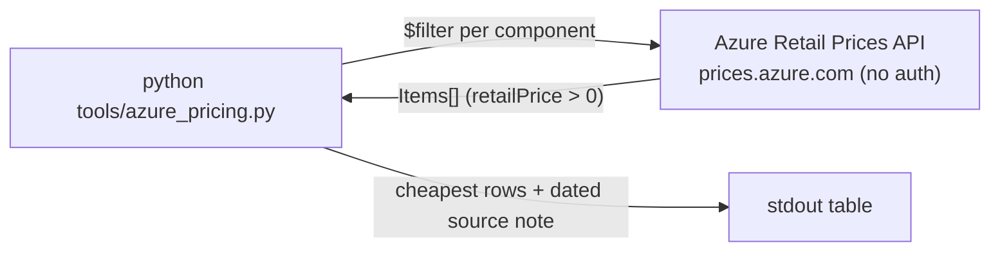

# 🛠️ tools

[Home](../README.md) > **tools**

> [!IMPORTANT]
> Every figure carries the exact dated source note:
> *"Source: Azure Retail Prices API, list price (PAYG), `<region>`, retrieved
> `<YYYY-MM-DD>`; excludes EA/MCA/commit discounts."*
> No staffing/services dollar figures appear anywhere.

`azure_pricing.py` queries the **public Azure Retail Prices API** (no auth) and prints a
dated, source-noted table of list prices for the managed Azure targets in the
deployment path. Nothing is hardcoded or invented — every price is pulled **live**.

## 💲 azure_pricing.py

Supports the *"what would this cost on Azure"* story. It maps each local POC component
to its managed Azure-Gov equivalent and fetches the cheapest live PAYG list prices.

### ▶️ Usage

```bash
python tools/azure_pricing.py [--region usgovvirginia] [--currency USD]
```

| Flag | Default | Source |
| --- | --- | --- |
| `--region` | `usgovvirginia` | env `AZURE_PRICE_REGION`, else `usgovvirginia` |
| `--currency` | `USD` | — |

> [!TIP]
> If a Government region exposes no priced meters, re-run with `--region eastus` to see
> commercial-Azure list prices. The tool degrades gracefully — it reports missing prices
> instead of failing.

### 🔁 Local component → managed Azure target

| Local POC component | Managed Azure target |
| --- | --- |
| Kong gateway | API Management (Consumption) |
| Local Postgres (system of record) | Azure Database for PostgreSQL Flexible Server |
| Data API Builder host | Azure Container Apps |
| Prometheus / Grafana | Azure Monitor |



> [!NOTE]
> Built per **PRP §3 / §9**. The POC itself runs entirely on OSS/local components; this
> pricing reference exists only for the Azure-Gov deployment path.
