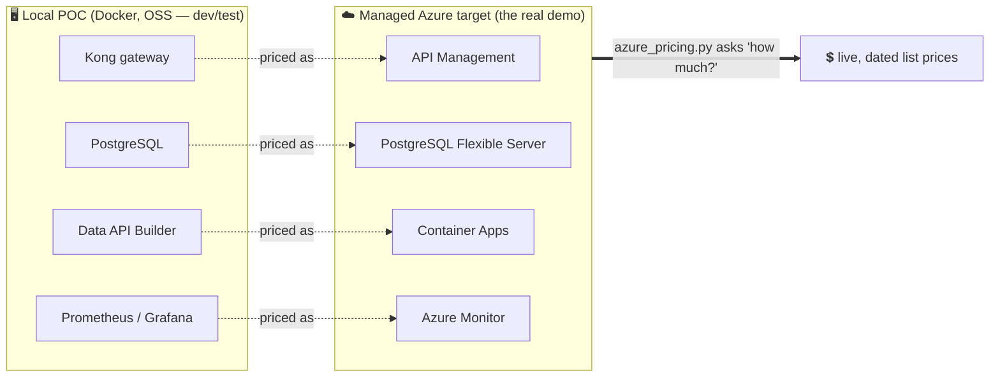
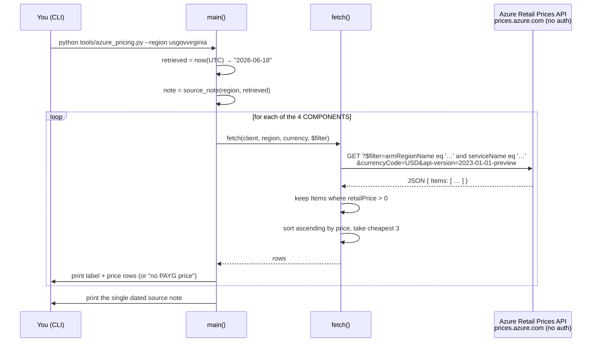

# 🛠️ tools — The Live Azure Pricing Helper

[Home](../README.md) › **tools**

> [!NOTE]
> **TL;DR** — When someone in a meeting asks *"OK, but what would this cost on Azure?"*,
> you do **not** want to read a number off a six-month-old slide. This folder holds one
> small script, [`azure_pricing.py`](azure_pricing.py), that calls Microsoft's **public,
> no-authentication** Azure Retail Prices API **live** and prints today's list prices for
> the four managed services this proof-of-concept (POC) would map onto in Azure. Every
> number it prints is stamped with the region and the date it was retrieved, so the figure
> is always defensible. **Nothing is hardcoded, nothing is invented.**

---

## 📑 Table of contents

- [Why this tool exists](#-why-this-tool-exists)
- [The vocabulary you need first](#-the-vocabulary-you-need-first)
- [The Azure-first story: local OSS → managed Azure](#-the-azure-first-story-local-oss--managed-azure)
- [How to run it (worked example)](#️-how-to-run-it-worked-example)
- [What the output means, line by line](#-what-the-output-means-line-by-line)
- [The dated-source discipline (the most important part)](#-the-dated-source-discipline-the-most-important-part)
- [How it works under the hood](#-how-it-works-under-the-hood)
- [Gotchas & troubleshooting](#-gotchas--troubleshooting)
- [Where to next](#-where-to-next)

---

## 🤔 Why this tool exists

A proof-of-concept like this one has two jobs. The first is to *work* — and it does,
entirely on free, open-source software (OSS) on your laptop via `docker compose up`. The
second, and the one decision-makers actually care about, is to answer **"what would the
production version cost in Azure?"**

That second question is a trap if you answer it badly. Cloud list prices change. A figure
you copied into a slide last quarter may be wrong today, and if a reviewer catches one
stale number, they stop trusting *all* of them. The hard constraint baked into this
project (see [`PRP.md`](../PRP.md) §9) is therefore blunt:

> **Azure pricing is live + dated, never invented.**

`azure_pricing.py` is how that constraint is honored. Instead of a human typing prices
into a document, the script fetches them from the authoritative source at the moment you
run it and prints them with a provenance stamp. The cost story becomes *reproducible*:
anyone can re-run the command and get the current number, with the exact source spelled
out.

> [!IMPORTANT]
> **Why this matters (the enterprise story):** in a federal / regulated setting,
> "where did this number come from?" is not rhetorical — it is an audit question. A figure
> that carries its own dated source survives that question. A figure on a slide with no
> provenance does not. This tool is a small piece of code doing a governance job.

---

## 📖 The vocabulary you need first

This document assumes you have never touched Azure billing. Here are the only terms you
need; each is defined again in the project [Glossary](../docs/GLOSSARY.md) if you want more.

| Term | In plain terms |
| --- | --- |
| **Azure Retail Prices API** | A public web endpoint (`https://prices.azure.com/api/retail/prices`) that returns Microsoft's *published* list prices as JSON. **No login, no API key, no Azure subscription required** — you can `curl` it from anywhere. |
| **List price / PAYG** | "Pay-As-You-Go" — the standard, undiscounted, walk-up price. It is the *fairest* number to quote because it makes no assumption about discounts a specific customer may or may not have. |
| **EA / MCA / commit discounts** | Enterprise Agreement / Microsoft Customer Agreement / commitment-based discounts. Real customers often pay **less** than list. The tool deliberately **excludes** these so the quoted number is a conservative ceiling, not a guess about someone's contract. |
| **Region** | A physical Azure datacenter location, named by its `armRegionName` (e.g. `usgovvirginia`, `eastus`). Prices differ by region. The POC defaults to a **US Government** region because that is the target deployment posture. |
| **SKU / meter** | A SKU ("Stock Keeping Unit") is a specific billable variant of a service; a *meter* is the thing that counts your usage of it. One service has many meters (per-hour, per-GB, per-million-calls…). |
| **OData `$filter`** | OData is an open standard for querying over HTTP. A `$filter` is a query expression — e.g. `serviceName eq 'API Management'` — that narrows the results to just the rows you want. The tool builds one of these per component. |

> [!TIP]
> **In plain terms:** the Retail Prices API is like a vending machine's posted price list,
> readable by anyone without buying anything. This tool walks up to it, reads four specific
> prices, and writes down the date it read them.

---

## 🧭 The Azure-first story: local OSS → managed Azure

The whole POC is built on the principle that **each local open-source component is the
dev/test stand-in for a managed Azure service.** You run the OSS stack locally to develop
and demo cheaply; you deploy the managed equivalents to Azure for the real thing. The
pricing tool only cares about that *right-hand column* — the managed services you would
actually pay for.

These four mappings are defined directly in the code, in the `COMPONENTS` list of
[`azure_pricing.py`](azure_pricing.py):

| Local POC component (what runs in Docker) | Managed Azure target (what the tool prices) | `serviceName` queried |
| --- | --- | --- |
| 🚪 **Kong** gateway | **Azure API Management** (Consumption tier) | `API Management` |
| 🗄️ **PostgreSQL** (the system of record) | **Azure Database for PostgreSQL** Flexible Server | `Azure Database for PostgreSQL` |
| 🔌 **Data API Builder** host | **Azure Container Apps** | `Azure Container Apps` |
| 📊 **Prometheus / Grafana** | **Azure Monitor** | `Azure Monitor` |

> [!NOTE]
> Every component query also pins `priceType eq 'Consumption'`, so the tool only returns
> **usage-based** meters — the pay-for-what-you-use prices, not reserved-capacity or
> savings-plan rows. That keeps the quoted figures comparable across all four services.



> [!TIP]
> **Where to see the full mapping:** this four-row table is the *cost* slice of a much
> bigger picture. The complete local-OSS-to-Azure-managed mapping (gateway → APIM,
> JWT issuer → Microsoft Entra ID, DAB → Container Apps, `classification.yml` → Microsoft
> Purview, Prometheus/Grafana → Azure Monitor + Sentinel, lakehouse → Azure Databricks +
> Unity Catalog) lives in [`docs/AZURE-DEPLOYMENT.md`](../docs/AZURE-DEPLOYMENT.md).

---

## ▶️ How to run it (worked example)

The tool has zero setup beyond the project's Python dependency `httpx`, which is already
installed if you have run the stack. From the repository root:

```bash
python tools/azure_pricing.py
```

That single command, with no flags, queries the **US Government Virginia** region
(`usgovvirginia`) in **USD** — the defaults. You can override either:

```bash
python tools/azure_pricing.py --region eastus --currency USD
```

| Flag | Default | Where the default comes from |
| --- | --- | --- |
| `--region` | `usgovvirginia` | Environment variable `AZURE_PRICE_REGION` if set, otherwise the literal `usgovvirginia` (see `main()`). |
| `--currency` | `USD` | Hardcoded default in the argument parser. |

### Expected output (shape)

Because the prices are fetched live, the exact numbers will differ on the day you run it.
The **shape** of the output is stable and looks like this:

```text
Azure managed-target pricing - region 'usgovvirginia', USD
(reference for the Azure-Gov deployment path; the POC itself runs on OSS/local)

- API Management (gateway <-> Kong)
          0.000000 USD / 1M API Calls      Consumption Gateway API Calls
          ...

- PostgreSQL Flexible Server (system of record)
          0.020600 USD / 1 Hour            B1ms vCore
          ...

- Container Apps (Data API Builder host)
          0.000003 USD / 1 Second          vCPU Active Usage
          ...

- Azure Monitor (metrics <-> Prometheus/Grafana)
          0.258000 USD / 1 GB              Data Ingestion
          ...

Source: Azure Retail Prices API, list price (PAYG), usgovvirginia, retrieved 2026-06-18; excludes EA/MCA/commit discounts.
```

> [!WARNING]
> The numbers shown above are **illustrative placeholders to teach you the layout** — they
> are not quotes. The only numbers you should ever cite are the ones *your own run* prints,
> with *that run's* date in the source note.

---

## 🔍 What the output means, line by line

Walking through the example above teaches you exactly what each part is doing and why.

1. **The header** (`Azure managed-target pricing - region 'usgovvirginia', USD`) echoes
   back the region and currency so the reader of the output is never guessing which market
   the prices describe. The parenthetical reminds everyone that *the POC runs on OSS* — the
   prices are for the would-be Azure deployment, not for running the demo.

2. **Each component block** starts with `- <label>`, then prints up to **three** rows —
   the **cheapest three** matching meters, sorted ascending by price. Showing the cheapest
   few (rather than one row, or all of them) gives a realistic "floor" for that service
   without drowning the reader in dozens of SKUs.

3. **Each price row** has four fields:
   `   0.020600 USD / 1 Hour    B1ms vCore`
   - the **retail price** (right-aligned, six decimal places — cloud unit prices are often
     tiny fractions of a cent);
   - the **currency**;
   - the **unit of measure** (`unitOfMeasure`) — *what you are paying per*: an hour, a
     gigabyte, a million calls;
   - the **meter name** — *which specific thing* this price is for.

   > **Why six decimals?** A Container Apps vCPU-second can cost a few millionths of a
   > dollar. Round it to cents and it reads as "$0.00", which is useless. Full precision
   > keeps tiny-but-real unit prices honest.

4. **The source note** prints **once, at the end**, covering every figure above it. That
   is the dated provenance stamp — the next section is entirely about it.

---

## 🔒 The dated-source discipline (the most important part)

This is the heart of the tool and the reason it exists. Every run ends with **exactly**
this sentence, assembled by the `source_note()` function:

```text
Source: Azure Retail Prices API, list price (PAYG), <region>, retrieved <YYYY-MM-DD>; excludes EA/MCA/commit discounts.
```

Read that sentence as a contract with whoever sees the number. It promises five things:

| Clause | What it guarantees the reader |
| --- | --- |
| **Source: Azure Retail Prices API** | The figure came from Microsoft's authoritative public price feed, not from a person's memory or a slide. |
| **list price (PAYG)** | It is the standard walk-up price — no assumptions baked in about any customer's contract. |
| **`<region>`** | Prices vary by region; this names the exact market quoted. |
| **retrieved `<YYYY-MM-DD>`** | The date is filled in at runtime from the current UTC date (`datetime.now(_dt.UTC)`), so the stamp is always "when this was actually fetched" — never a date someone typed. |
| **excludes EA/MCA/commit discounts** | The number is a **conservative ceiling**. A real customer likely pays the same or less, never more — so quoting it can't overstate savings. |

> [!IMPORTANT]
> **Why the date is generated, not typed:** a human-typed date can lie (copy-paste from an
> old doc, a typo, wishful rounding). A date generated from the system clock at the moment
> of the HTTP call cannot drift from reality. That tiny detail — `retrieved` is computed,
> not authored — is what makes the whole figure auditable.

> [!NOTE]
> **No dollars for people.** A second half of the same hard constraint: there are **no
> staffing or professional-services dollar figures anywhere** in this repo. The tool
> prices *infrastructure meters only*. Labor estimates are exactly the kind of invented,
> unverifiable number this discipline is designed to keep out.

---

## ⚙️ How it works under the hood

The script is intentionally small (~110 lines) and has no dependencies beyond `httpx`.
Here is the full request lifecycle for one component.



The key implementation choices, and the reasoning behind each:

- **One filtered query per component.** `fetch()` prepends `armRegionName eq '<region>'`
  to each component's `$filter` and adds `currencyCode` and `api-version` as query params.
  Filtering server-side means the API returns only the relevant rows, not the entire price
  book.
- **`retailPrice > 0` guard.** The feed sometimes includes `0.0` placeholder rows (free
  tiers, deprecated meters). Those are dropped so a misleading "$0.00" never surfaces as
  the cheapest price.
- **Cheapest three, sorted ascending.** `items.sort(key=lambda it: it["retailPrice"])`
  then `[:limit]` (default `limit=3`) gives a small, honest "entry-level" view of each
  service's cost.
- **Graceful degradation, never a crash.** This is a recurring project value: services
  *degrade*, they don't fall over. If an HTTP error occurs, `fetch()` prints
  `! query failed (…); skipping` to **stderr** and returns an empty list — the run
  continues. If a whole region exposes no priced meters, the tool still prints the source
  note and then a clear hint to re-run against `eastus`. It always exits `0`.
- **Pinned API version.** `API_VERSION = "2023-01-01-preview"` is sent on every call so
  the response schema (`Items[]`, `retailPrice`, `unitOfMeasure`, `meterName`) is stable
  and the parser never has to guess.

> [!TIP]
> **In plain terms:** the script asks the price list four polite questions, ignores the
> "free" noise, keeps the three cheapest real answers to each, and signs every batch of
> answers with the date and source. That's the whole tool.

---

## 🧯 Gotchas & troubleshooting

| Symptom | Cause | What to do |
| --- | --- | --- |
| `No priced SKUs returned …` for a Government region | Some SKUs are simply not offered (or not yet priced) in `usgovvirginia`. This is **expected**, not a bug. | Re-run with `--region eastus` to see commercial-Azure list prices. The tool prints this hint for you. |
| `! query failed (…); skipping` on stderr | A transient network/HTTP error reaching `prices.azure.com`. | Check connectivity / proxy and re-run. One failed component never aborts the others. |
| Numbers differ every time you run it | **Working as designed** — prices are fetched live. | If you need a frozen snapshot, capture the full stdout (it already contains the dated source note) rather than editing numbers by hand. |
| A row shows a unit you don't recognize (e.g. `1 Second`) | Container Apps and similar services bill on very fine-grained meters. | Read the `unitOfMeasure` column carefully before multiplying — "per second" and "per hour" are wildly different scales. |
| You want a region that returns nothing at all | The `armRegionName` may be misspelled. | Use exact ARM region names (`usgovvirginia`, `eastus`, `westeurope`, …), not display names ("US Gov Virginia"). |

> [!WARNING]
> This script is a **list-price reference, not a cost estimate.** It prints *unit* prices.
> Turning unit prices into a monthly bill requires multiplying by your expected usage
> (calls/month, vCore-hours, GB ingested), which depends on your workload and is out of
> scope for this tool. For sizing, use the official
> [Azure Pricing Calculator](https://azure.microsoft.com/pricing/calculator/).

---

## 🧭 Where to next

- 📄 **[`PRP.md`](../PRP.md) §9** — the hard constraint this tool enforces, in the project's own words.
- ☁️ **[`docs/AZURE-DEPLOYMENT.md`](../docs/AZURE-DEPLOYMENT.md)** — the full local-OSS → managed-Azure mapping and the end-to-end deployment narrative.
- 🏛️ **[`docs/APIM-EDITION.md`](../docs/APIM-EDITION.md)** & **[`docs/APIM-CAPABILITIES.md`](../docs/APIM-CAPABILITIES.md)** — why API Management (the priced gateway) is the Azure equivalent of Kong.
- 📚 **[`docs/GLOSSARY.md`](../docs/GLOSSARY.md)** — every term above, defined once and cross-linked (see the *Azure Retail Prices API* and *OData* entries).
- 🏗️ **[`docs/ARCHITECTURE.md`](../docs/ARCHITECTURE.md)** — where these four components sit in the overall zero-move design.

---

> [!NOTE]
> **Synthetic-data notice.** This repository is a **self-contained demo built on synthetic
> data** — it contains no real NASA, agency, or customer data. See
> [`docs/DISCLAIMER.md`](../docs/DISCLAIMER.md). The pricing figures this tool prints are
> **real, live Azure list prices**; the *application* data the POC serves is fabricated.
